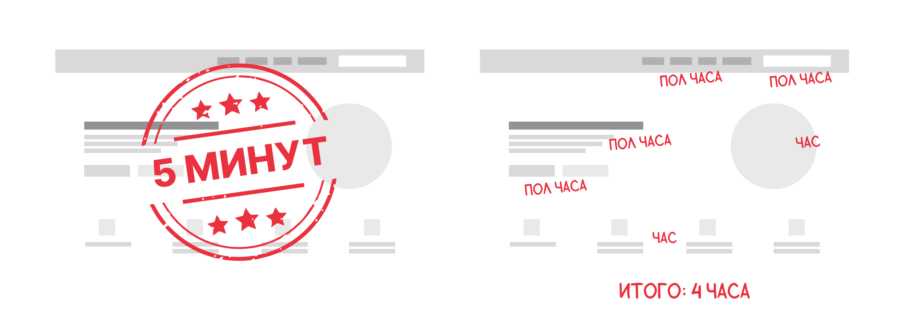
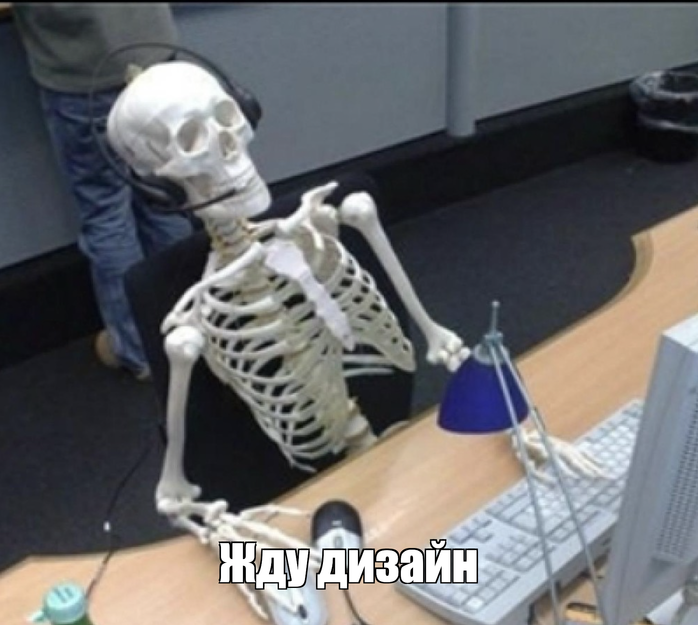

# Как оценивать задачи и подружиться с дедлайнами

Правильная оценка задач - один из важных аспектов, определяющих успех в работе над проектом.

Всем привет! Меня зовут Маргарита, я UI/UX дизайнер в компании Tourmaline Core. В этой статье решила поделиться своим опытом, набитыми шишками и успешными практиками, и разобраться, что нужно учесть при оценке времени выполнения задачи.

Статья будет полезна как начинающим дизайнерам, так и другим специалистам, сталкивающимся с горящими дедлайнами и проблемами в оценке задач.

## Оценка задачи исполнителем

Перед дизайнером поставили задачу и на ее выполнение дали пару часов. Однако, когда он начал разбираться, оказалось, что работы намного больше, чем ожидалось, и за отведенное время ее не сделать. Почему так произошло? 

Со стороны задача часто может казаться намного проще, чем на самом деле, особенно если ее ставит человек, который не знаком с подводными камнями и сложностями, которые могут возникнуть. Именно поэтому оценку времени на выполнение задачи должен давать дизайнер, который будет над ней работать и который представляет, из чего будет состоять процесс и сколько времени он может занять, а не менеджер, разработчик или кто-то ещё. 

Также не стоит забывать о том, что каждый работает в своем темпе. Одна и та же задача у двух специалистов может занять разное количество времени из-за различного опыта, скорости работы и навыков. Поэтому даже самый опытный коллега не сможет оценить  сроки выполнения конкретной задачи точнее, чем сам исполнитель.

## Декомпозиция объемных задач

Первый проект, над которым я работала, был корпоративным сайтом австралийской (да, сходу начала с иностранцев) компании. Оценивалась задача примерно так: «Нууу задача большая, займет, наверное, месяца полтора». На самом деле, для меня задача была чем-то большим, непонятным и необъятным. В итоге я наугад назвала, как мне казалось, довольно длительный срок на ее выполнение, но в этой оценке не было ничего общего с действительностью. Сайт был очень объемным и работы по дизайну заняли чуть больше двух месяцев. Увеличение сроков повлияло на работу всей команды.

Избежать такой ситуации поможет декомпозиция большой задачи на маленькие подзадачи. Например, разбить сайт на страницы, страницы на блоки, сложные блоки на компоненты, ~~компоненты на пиксели~~ и оценить их по отдельности. Чем лучше получится декомпозировать задачу, тем проще будет реалистично ее оценить.

  

## Выполнение задачи на время

В начале своего дизайнерского пути я столкнулась с трудностью оценки новых задач, с которыми раньше у меня не было опыта. Я не могла приблизительно определить, сколько времени займет выполнение этих активностей. В то время я нашла для себя небольшую хитрость, которая помогла мне справиться с этой проблемой. 

Представим, что нашему дизайнеру необходимо оценить время, требуемое на создание дизайна формы на сайте, но у него нет опыта работы с формами. Хитрость заключается в том, чтобы засечь время и сделать маленькую часть задачи, например, дизайн одной кнопки. Так ему будет легче понять, сколько времени затрачивается на эту маленькую часть работы. А из таких частей и состоит вся форма. 

Иногда задача может быть гораздо сложнее приведенного выше примера, а времени на попытку реализовать ее нет. В таком случае полезно представить последовательность шагов, по которым будет выполняться задача, и подумать, может ли где-то возникнуть непредвиденная проблема, сделать дополнительный ресерч. Также полезно провести аналогию с похожими задачами и вспомнить, сколько времени они обычно занимали.

  

## Идеальные условия

Частая ошибка, которую я совершала при оценке задач - это оценка работы в идеальных условиях. Возьмем, к примеру, задачу создания внутренней страницы сайта. Дизайнер уже учел все предыдущие шаги, разбил задачу на подзадачи, оценил, сколько времени займет дизайн, и выделил целый день на эту активность. Однако, приступив к работе, он понял, что идей совсем нет, нужно проводить ресерч, искать удачные решения, отрисовывать разные варианты. День прошел, а дизайнер сделал только наброски секции.

Что пошло не так? Во время оценки дизайнер подумал о том, сколько времени займет дизайн определенных компонентов. Однако, он не учел того, что может зайти в тупик во время работы и остаться без идей. Иногда требуется больше времени, чтобы подумать над решением, попробовать разные варианты, выкинуть неудачные и оставить хороший, поискать вдохновение, ответить на сообщения коллег, подключиться на созвон, навернуть бутер с колбасой, в конце концов. Практически никогда не бывает идеальных стерильных условий для выполнения задачи, поэтому в оценке полезно учитывать дополнительное время, которое может потребоваться для поиска решения.

## Время на ревью

Работая в команде, дизайнер часто проходит ревью коллег. Ментор, который проверяет качество работы и вносит правки, разработчик, который проверяет дизайн на реализуемость. В этот момент важно планировать и оценивать не только свое время, но и время коллег. У них также есть свои дедлайны, сроки, оценки и приоритетные задачи. Ещё этот обед их!

Представим, что дедлайн по сдаче дизайна наступает во вторник вечером. Дизайнер выполняет задачу во вторник в 16:00 и радуется тому, что все успел. Наступает время ревью, а у коллеги есть более приоритетные задачи, и посмотреть дизайн он сможет только в среду днем. В среду коллега сделал ревью и выяснилось, что нужно внести правки. Казалось бы, работа была выполнена во вторник вечером, но сдать ее можно будет только в четверг. 

Очень важно закладывать запас времени в оценки, чтобы успеть получить ревью, не отрывая коллегу от его задач, и спокойно внести правки.

## Время на правки

Возможно, это один из самых важных моментов при оценке выполнения работ по дизайну. Этот пункт напрямую связан с идеальными условиями. Довольно редко клиент принимает дизайн с первого раза без каких-либо правок. Доработка шрифта, исправление текста, изменение яркости цветов - все это требует дополнительного времени, которое важно учесть при оценке. Запас времени на правки позволит внести изменения и уложиться в сроки заказчика. Если работа будет принята с первого раза, выполненные раньше дедлайна задачи станут приятным бонусом для заказчика.

  

## Переработка

Самый болезненный пункт, с которым я боролась дольше всего. Когда появляется ощущение, что не получается выполнить задачу в срок, так и хочется задержаться на работе подольше, чтобы поработать еще и доделать запланированное. Сначала кажется, что дополнительное рабочее время поможет выполнить задачу вовремя. На самом деле все работает совсем наоборот. Чем больше переработок, тем больше накапливается усталость, задача начинает надоедать, нет сил и мотивации. Работа идет медленно, с кучей ошибок в придачу, успевать получается всё меньше и переработок становится всё больше. Получается замкнутый круг: больше перерабатываешь — больше устаешь — хуже работаешь — меньше успеваешь — ~~плачешь по ночам~~. 

Дизайнер, который научился сохранять баланс работы и отдыха, выполняет задачи заряженным и энергичным. Это помогает ему достигать успеха и укладываться в сроки.

  

## Передержка задачи

Бывает так, что задача уже вроде выполнена, но внутренний перфекционист находит новые мелочи, за которые хочется зацепиться и исправить. Дизайнер продолжает шлифовать работу до идеального состояния и в итоге «передерживает» задачу. Глаз замыливается, и вносятся одни и те же правки по кругу. Затянутый процесс работы может неоправданно увеличить время выполнения задачи, а дизайнер рискует ухудшить то, что и так уже хорошо работает. 

Если дизайн уже отвечает всем поставленным требованиям и ожиданиям заказчика, это верный сигнал того, что нужно остановиться и передать его в разработку. В нашей практике, если команда понимает, что кто-то уже передерживает задачу, мы стараемся довести работу до точки и отдать на согласование, даже если хочется внести дополнительные правки.

  

## Распыление

У многих начинающих дизайнеров возникает желание добавить в дизайн сразу все крутые идеи и тренды, которые только можно встретить на сайтах. Однако, такое стремление может привести к нежелательному распылению и затянутым срокам выполнения проекта. Чтобы избежать этих проблем, важно начать работу над дизайном с показа заказчику нескольких возможных направлений работы. Это позволит на начальном этапе отсечь лишние варианты, сфокусироваться на одном решении и прорабатывать его, а остальные идеи отложить для следующих проектов. Ну или фиг с ними.

## Реальная оценка

При оценке проекта мы часто стесняемся называть реальное время выполнения, из-за возможной негативной реакции заказчика или коллеги. Беспокойство дизайнера-стесняшки о том, что его могут рассматривать как плохого специалиста, заставляет его занижать оценку до «стандартного» уровня. В результате дизайнер не успевает сдать работу в срок и разочаровывает заказчика. 

Чтобы не допустить такую ситуацию, крайне важно честно оценивать время выполнения и называть реальную оценку, даже если она неудобная. Сделать этот шаг менее болезненным поможет подробное объяснение заказчику, из каких этапов состоит процесс работы и почему он занимает столько времени. Если дизайнер не может сразу предоставить оценку, необходимо честно об этом сказать и попросить время на изучение задачи, как уже упоминалось в предыдущих разделах этой статьи.

## Понимание задачи

Одним из самых неприятных моментов в моей работе стал дизайн презентации для немецкой компании. Из-за моей неопытности на тот момент, этап сбора требований был проведен очень поверхностно. Поскольку у заказчика было очень мало времени на коммуникацию, он прислал мне заполненный бриф, составленный другим дизайнером. Я не настояла на более детальном разборе задачи и ориентировалась на бриф при ее выполнении. На демонстрации заказчик озвучил огромное количество правок. После обсуждения выяснилось, что я просто не попала в нужный ему стиль, а информация брифа оказалось устаревшей и неактуальной. 

Этот опыт показал мне, насколько важно тщательно разобраться в поставленной задаче и убедиться, что видение дизайнера совпадает с видением клиента. Это поможет избежать постоянных переделок и правок, которые только увеличивают время и объем работы.

## Время на коммуникацию

Отдельная статья расходов, связанная с оценкой задачи, это коммуникация. В нашем случае этот аспект был не набитой шишкой, а успешной практикой, которую нам удалось применить при оценке дизайна корпоративного сайта нашей компании. Мы заложили в оценку 30% от общего времени, необходимого для выполнения проекта, на коммуникацию, которая включает в себя внутренние созвоны и общение с командой, согласование дизайна с клиентом и работу с обратной связью. Это дополнительное время оказалось очень полезным и позволило нам завершить работу вовремя.

## Итог

Оценка времени выполнения задач является неотъемлемой частью процесса разработки и играет важную роль в достижении успеха проекта. Как дизайнер я столкнулась с множеством трудностей и совершила кучу ошибок при оценке задач. Однако благодаря полученному опыту и практике я научилась применять эффективные подходы, которые помогают мне укладываться в дедлайны и достигать лучших результатов.

Рекомендации, представленные в этой статье, помогут рассмотреть задачу с различных сторон, более точно оценить ее и избежать множества ошибок. Следуя этим пунктам, вы сможете снять с себя значительную долю беспокойства и стресса, создать комфортный рабочий процесс и оправдать ожидания заказчика, что приведет к большему успеху вашего проекта.

____

Автор: Шур Маргарита

Вычитка и фидбек: Магденко Юлия, Адищев Алексей, Ядрышникова Мария