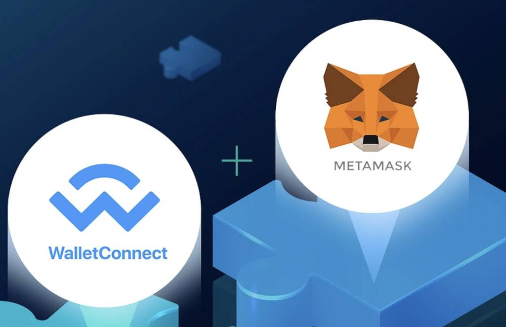
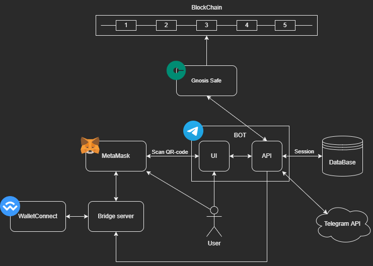
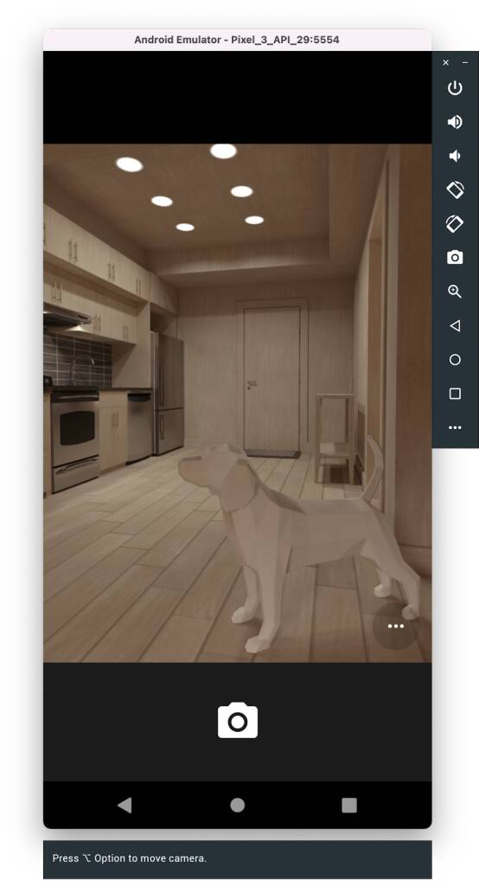
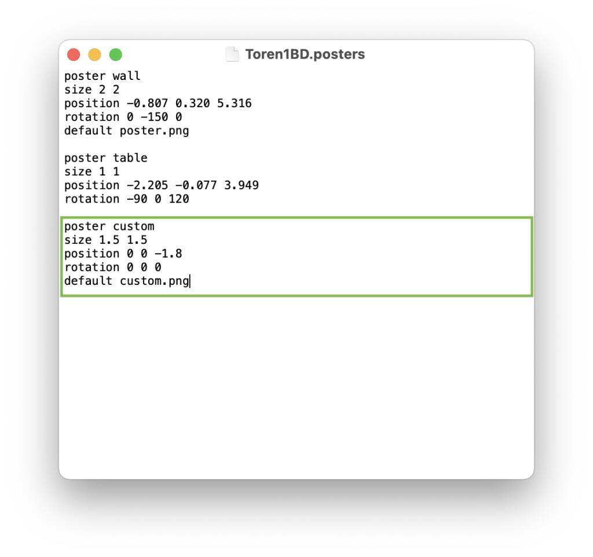
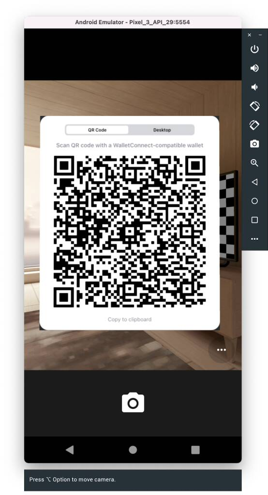
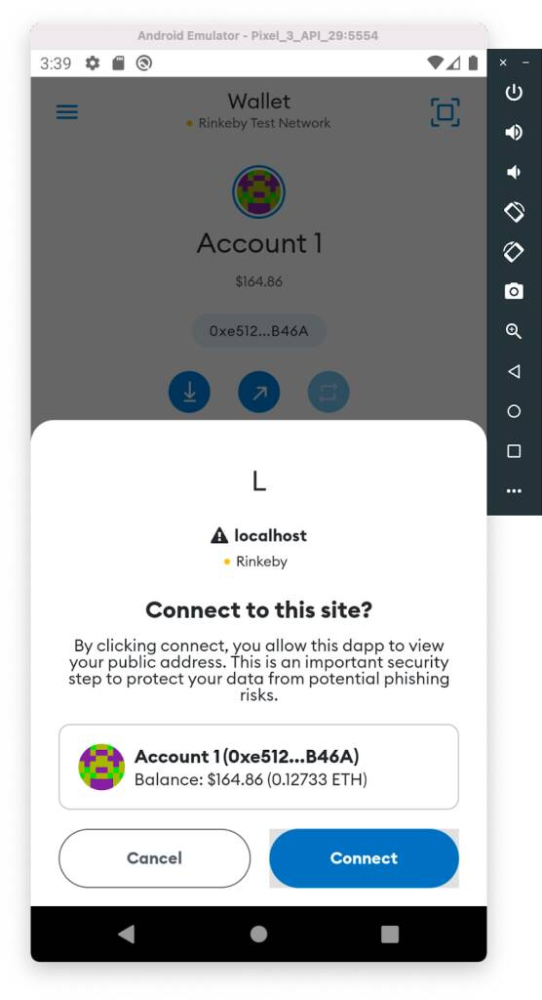
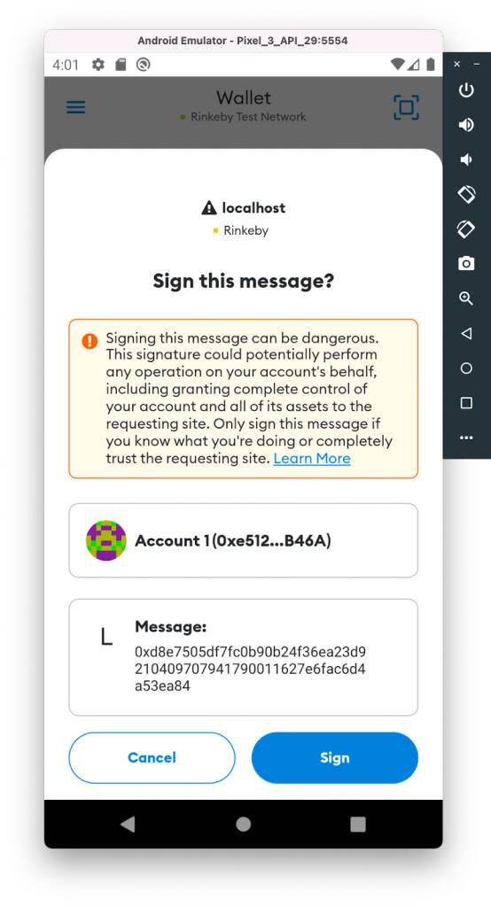
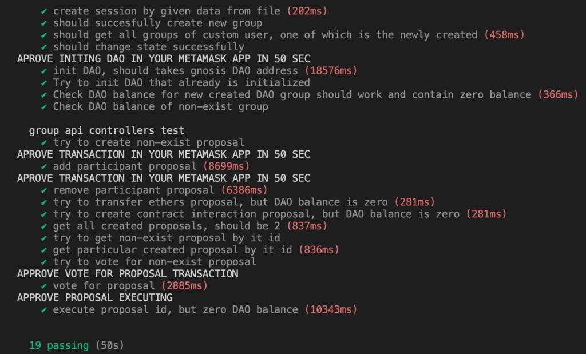
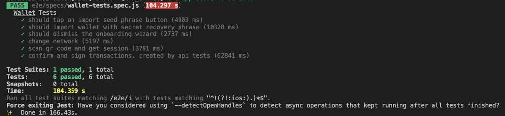

# E2E Testing of Connection between DApp and Metamask Mobile App using WalletConnect 

## Introduction

Application testing with end-to-end tests is quite popular nowadays. This type of testing allows you to evaluate an application’s performance from the user side. That is why the company I work for integrates this kind of testing in our projects.

In the summer of 2022 we were developing a blockchain application. My task was to perform E2E-testing of Decentralized App (DApp). But we faced a problem - there were no ready-made solutions for end-to-end DApp testing. This article will tell you about the way we solved this problem.




Hi there! My name is Elijah and I am a QA-Engineer at Tourmaline Core. I am involved in setting up testing processes at all levels. In this article I want to tell you about the problems I encountered on one of my projects, how I solved them and what the result was.

The task of the project my team worked on was to develop a Telegram bot to interact with Gnosis Safe. Gnosis Safe is a secure way to manage cryptocurrency funds. Also, Gnosis safe is a system that allows you to create DAO (Decentralized Autonomous Organisation). The service allows its participants to manage the organization by means of proposals, where the implementation of each proposal is determined by collective voting, without a central governing body. So, any user within this system can create a proposal to add a new member to the DAO or execute a smart contract method that other DAO members vote for. When the number of voters crosses a certain threshold, a transaction is created and executed in the blockchain. The bot consists of a [Web App](https://core.telegram.org/bots/webapps), received commands are  processed with a custom API, and integration with the Metamask mobile app is configured using WalletConnect. The Metamask app is used to confirm or reject a transaction, and WalletConnect connects our app to the crypto wallet.

Before I start, let me describe how the user interacts with the DAO in Gnosis Safe using a bot.
1. Create a Telegram group and add our bot there
2. Complete all steps for DAO initialization (the user follows the instructions)
3. Open the bot’s UI
4. Using Metamask, scan the generated QR code
5. Approve connection request in Metamask
6. Chose any action in the bot’s UI (for example, transfer ethers from our DAO account to another)
7. Open Metamask and confirm the transaction in the pop-up window

As a result, we developed a bot with its own GUI and an API for it. The API receives requests from the UI to create and execute proposals in Gnosis Safe, which in turn interacts with the DAO that was created in it. The picture shows the scheme of interaction of services in the project:



For me (as for many people, probably) it all looks like a labyrinth which you are scared, though intrigued, to step into. My responsibility was to create automated tests to check the connection of our application to Metamask via WalletConnect protocol and to check the possibility of creating transactions after that. That is, I needed to go through all the stages of user interaction with our application - from scanning a QR-code to a successful connection, after which it would be possible to send requests and see notifications.

> But there is a problem with blockchain apps - not many people test them. Also, using the Metamask mobile app instead of the browser extension made it even more difficult.

I started looking for solutions, and here my googling, which usually does not go beyond the first page, reached the fifth, but it did not yield any results. I found neither articles, nor clear examples, nor any worthwhile tools for my task. All I had were questions from fellow QA’s. That is why I decided to implement my own solution. I identified 2 main factors that led me to develop my solution:

- The Metamask API does not allow establishing a connection using WalletConnect through the mobile app. Therefore, there is no other way to do this rather than scanning a QR code. This meant that there was no way around it without working with the UI. 
- Lack of E2E frameworks for our task. There are Synpress and Dappeteer (extensions for the popular Cypress and Puppeteer), but they are designed for testing the interaction of DApp with MetaMask as a browser extension, not for the mobile application.

So, we decided to use a smartphone emulator to install the Metamask app on it and interact with it using the Detox library.

## Starting to set up a project:

We cloned [metamask-mobile](https://github.com/MetaMask/metamask-mobile) repository. First thing we wanted to do was launch the project locally and see how E2E-tests that had already been written by developers on the Detox framework worked. For this purpose, there were instructions in the repository that we needed to analyze to see if we fit the system requirements and what we needed to install. We immediately saw that the application could only run on MacOS or Linux.

Now we could start installing and setting up the project. First we needed to choose which mobile operating system it would run on. We chose Android because we had experience with it. We installed Android Studio IDE, and created an emulator of Google Pixel 3 according to the instructions. The readme did not specify what version of the API should be used. We got it working on version 29. On more recent versions, Detox could not interact with the interface elements in the application.

After that we executed all yarn scripts from readme. Next, you should be able to run Metamask in the emulator as a react-native application using the command yarn start:android. But by running the command to run the Detox tests yarn test:e2e:android we got errors. To make things work properly, we had to make some changes to the [packages](https://github.com/TourmalineCore/Metamask.DetoxTests/pull/1/files#diff-7ae45ad102eab3b6d7e7896acd08c427a9b25b346470d7bc6507b6481575d519) and [startup scripts](https://github.com/TourmalineCore/Metamask.DetoxTests/pull/2/files#diff-3d64996115d0ac3b74e36f57ce6b00d6b4982614c41b1ed39eab8ef43b2e9a2b).

Now, finally, we could begin to redesign the tests to suit our needs: remove all the test cases and leave the one related to authorization into the wallet. And now to fully cover the flow we needed to add:

1. Clicking the button to scan the QR code
2. Waiting for the QR code to be scanned and the connection notification to appear
3. Clicking the approve button to connect to our DApp
4. Launching API tests
5. Waiting for notifications about transactions created by API queries
6. Clicking the button to confirm these transactions

Implementing some of the items required creating a separate project. For example, I had to make a screenshot with Cypress and write tests on the API to be able to scan the QR code. But first things first.

## Scanning QR code:

The QR code is scanned with a special scanner inside the Metamask app. This scanner uses a smartphone camera to read. But how will it look in the emulator? Android Studio developers made a virtual scene, like an emulation of real interaction with the real world. It looks like a game: you are in a certain apartment, you can walk around it, you can turn the camera around. In the emulator settings, you can add your images to special templates in the apartment, such as the board. This can be useful for scanning QR images.



I was wondering how to scan the image of QR-code, which I placed in advance on one of the templates, in automatic mode without my participation? And I came across a very simple solution.

- In the Library / Android / sdk / emulator / resources folder there is a file called Toren1BD.posters. It stores information about the location of templates in space, in place of which you can insert your images.
- Open this file and add the following lines:

- Rename the QR code image to **custom.png** and place it in the directory with this file

Now when you open the camera, you have the image that you want to scan.



But how can we automatically get a screenshot of a QR code from our app? This is where Cypress comes to our rescue. We can create one small test that will take a screenshot of the required component with the QR-code image:

```javascript
const QR_CODE_SELECTOR = '.walletconnect-modal__base';
 
describe('Qr-code screenshot test', () => {
 
 it('take qr-code screenshot', () => {
   cy.visit('http://localhost:3000');
   cy.contains('Connect').click();
   cy.get(QR_CODE_SELECTOR).screenshot('qrcode');
  });
});
```

Screenshots are saved in the _/screenshots_, from where we will use scripts to retrieve, rename, and move them to a folder with placeholders. The code to scan a QR code can be found in the [repository](https://github.com/TourmalineCore/DAO-service.Api-service-tests).

Now, right after the screenshot, we need to move the resulting image into the _/resources_ directory. For this, Cypress has plugins that modify or extend its internal behavior (e.g., the _after:screenshot_ event). Plugins are added through the ` setupNodeEvents(on, config)` function. There we add listeners that trigger the specified events and execute the instructions described inside. 
First of all, let's write a script that moves the screenshot to the directory we want:

```bash
#!/bin/bash
 
CYPRESS_DIRECTORY="$HOME/Documents/dao-api-tests"
RESOURCES_DIRECTORY="$HOME/Library/Android/sdk/emulator/resources"
 
# move and renamed qr-code image in resource directory
cd $CYPRESS_DIRECTORY/cypress/screenshots/login.spec.cy.js
mv qrcode.png $RESOURCES_DIRECTORY/custom.png
```

Then we add the `setupNodeEvents` function to the Cypress configuration file **cypress.config.js**, and in it we add the event that runs the script after the screenshot.
> **IMPORTANT**: If you have a Cypress version lower than 10.0, the plugins are added in the **index.ts** file of the _plugins_ directory.

``` javascript
const { exec } = require('child_process');
 
module.exports = defineConfig({
 
  e2e: {
    /*
    some configs
    */
    setupNodeEvents(on, config) {
      on('after:screenshot', (details) => {
        exec('sh moveScreenshot.sh');
      });
    },
  }
});
```

Okay, let's say we scanned the code and established a connection. What's the next step? The next step is to get the session data that the DApp receives. Later on, the session will be needed by the API service to send requests.

## Receiving the session:

As I mentioned earlier, WalletConnect establishes a connection between the two nodes - the DApp and the user's crypto wallet (Metamask in our case). After pressing the "Connect" button, the app displays a QR code, which must be scanned by the Metamask app. This is how the wallet is connected to the app. Metamask scans the QR code, decrypts the connection request data and shows this request data to the user. The user can then reject or approve the connection.



When a successful connection is made, a session is created. With a session, Metamask will be able to receive notifications inviting you to sign or reject a transaction created with the DApp. In our case you need to save the session in the database by calling the API method. This is necessary for the Metamask app to receive push notifications to sign transactions.

Successful login and refresh requests will return JSON in the following form:
```json
{
    "userId": 123456789,
    "session": {
        "connected":true,
        "accounts":["0x2D0805dB07BED54AFC3EBED54AFC3EBED54AFC3E"],
        "chainId":4,
        "bridge":"https://g.bridge.walletconnect.org",
        "key":"4aeb243c3ec2aa1739ad7def514aeba43a20ab117a354cdaf8f04aeb6e4aeb32",
        "clientId":"acd8a6e0-403a-403a-403a-17105368cc9e",
        "clientMeta":{
            "description":"DAO telegram bot",
            "url":"http://localhost:3000",
            "icons":["https://walletconnect.org/walletconnect-logo.png"],
            "name":"DAO"
        },
        "peerId":"56ea8258-6480-6480-6480-194b062944c1",
        "peerMeta":{
            "description":"MetaMask Mobile app",
            "url":"https://metamask.io",
            "icons":["https://raw.githubusercontent.com/MetaMask/brand-resources/master/SVG/metamask-fox.svg"],
            "name":"MetaMask",
            "ssl":true
        },
        "handshakeId":5678123456781234,
        "handshakeTopic":"2996df1f-6a42-6a42-6a42-78bb145cb858"
    }
}
```
So, every time we start Metamask in the emulator, we need to establish a connection between the wallet and the service in order to automate requests sending. That is, a new session must be saved each time you start tests. We have added a simple implementation (dao-service-stub) of the UI to display the QR code to the [repository](https://github.com/TourmalineCore/DAO-service.Api-service-tests). In the code you can find the onConnect event handler. In it we will receive the session after the connection is confirmed in Metamask. Next, we need to pass the session to the API. To do this, we call the save session endpoint.

``` javascript
axios.post(`${BASE_URL}/walletConnectSessions`, connector.session, {
       headers: { 'TelegramData': JSON.stringify(telegramData) }
     });
```
Here TelegramData is an object:

``` json
{
  "query_id":"AAE3SfY-AAAAADdJ9j4QITp1",
  "user":"{\"id\":1056327991,\"first_name\":\"Ivan\",\"last_name\":\"Ivanov\",\"username\":\"Ivanchelo\",\"language_code\":\"en\"}",
  "auth_date":"1658988403",
  "hash":"6f19e07c5fa68c540d55403bc475df4358ad04a8d532e1913260e9228241d5b3"
}
```

It is worth remembering that the API must be running. We also run it using a script before launching Cypress to scan the code. After a successful connection, the session is saved in the database.

## API-tests:

To be able to verify the success of the WalletConnect connection and the functionality of the requests, it is important to run E2E API tests. Their goal is to go through the basic flow from creating and initializing a DAO, to creating transactions that interact with Gnosis Safe. All requests must be accompanied by a notification inviting you to sign or reject the transaction in the Metamask application. After confirmation, the transaction goes to the blockchain, and its response comes to our API service using WalletConnect.

To write API tests, we chose Pactum JS because it is a simple but powerful tool. We chose Mocha as our test runner.

If the response is not received in 3 seconds, any request is failed. You need to know this, because the test that creates the transaction will simply not have enough time. So you need to change the timeout value to 50 seconds, which is how long it takes on average to get a response. 
Here is an example of code that increases the timeout of a request: 

Add a _request_ module:

``` javascript
const { request } = require('pactum');
```

Then add the following line anywhere before the tests:

``` javascript
request.setDefaultTimeout(50 * 1000); // 50 sec delay while user signed transaction
```

An example of one of the DAO initialization requests:

```javascript
it('init DAO, should takes gnosis DAO address', async () => {

  const requestBody = {
    "groupId": mockGroupId,
    "owners": mockParticipantsList,
    "threshold": 1
  };

  console.log("APROVE INITING DAO IN YOUR METAMASK APP IN 50 SEC")

  await spec()
    .post(`/groups/initDao`)
    .withHeaders('telegramData', JSON.stringify(mockPersonalTelegramData))
    .withJson(requestBody)
    .expectStatus(201)
});
```

After sending a request in tests (for example, to transfer tokens) we will see a pop-up window in the emulator asking us to sign the message:



Now any test will wait 50 seconds for a response. We ended up with end-to-end API tests that emulate a basic user flow: create a group, initialize a DAO, create a proposal, vote for a proposal, etc. You can see the code for the tests in the  [repository](https://github.com/TourmalineCore/DAO-service.Api-service-tests/tree/master/test).



Now all blockers are resolved and we can move on to our main goal: writing an E2E test, which will put everything together.

## Detox-tests:

What is left is to refactor the Detox tests for our task. The application itself is written in React Native, which uses a component structure. Therefore, we need to find the components we need:

- button to open the camera to scan the QR code
- connection confirmation modal window and its approval button
- modal window to confirm the transaction and its approval button
- message confirmation modal window and its approval button

We add an additional testId props to the components (if it was missing), for easy interaction with them in the tests. Changes can be seen in the [repository](https://github.com/TourmalineCore/Metamask.DetoxTests/pull/5).

Next, we add clicking the appropriate buttons. To do this, we used test helpers already written by Metamask developers, such as `waitAndTap`: 

``` javascript
static async waitAndTap(elementId, timeout) {
   await waitFor(element(by.id(elementId)))
     .toBeVisible()
     .withTimeout(timeout || 8000);
 
   return element(by.id(elementId)).tap();
 }
```

Example of use:

``` javascript
const SIGNATURE_CONFIRM_BUTTON = 'request-signature-confirm-button';
await TestHelpers.waitAndTap(SIGNATURE_CONFIRM_BUTTON);
```

Our tests are almost ready. It remains to spice up our main flow with the above solutions, so that the entire work cycle is not blocked.

# Bash scripts:

The last step is to run all the tests as a pipeline. To do this, we wrote bash scripts. With their help we start the main (parent) flow of the Detox test and, parallel to it, the child flows: scanning the QR code and sending requests via API.

I have singled out three necessary scripts:

1. A script that runs UI, API, and Redis to store sessions 
``` bash
#!/bin/bash
 
API_DIRECTORY="$HOME/Documents/dao-api-service"
METAMASK_DIRECTORY="$HOME/metamask-mobile"

# get the database up
cd $API_DIRECTORY
docker-compose up -d
 
# run UI and API
cd $METAMASK_DIRECTORY
npm run all-for-tests
```

_docker-compose up -d_ launches containers with the database, and _npm run all-for-tests_ runs several npm scripts in parallel, in this case running the UI and API.

``` json
"run-api": "cd $HOME/Documents/dao-api-service && yarn start:dev",
"run-ui": "cd $HOME/Documents/dao-api-tests/dao-service-stub && npm start",
"all-for-tests": "npm-run-all --parallel run-ui run-api"
```

2. Script to remove an old screenshot from directories and run Cypress test making a screenshot of a QR code

```bash
#!/bin/bash
 
QR_CODE_DIRECTORY="$HOME/Library/Android/sdk/emulator/resources"
CYPRESS_DIRECTORY="$HOME/Documents/dao-api-tests"
 
# clear qrcode in resources directory
cd $QR_CODE_DIRECTORY
rm custom.png

# clear qrcode in cypress directory
cd $CYPRESS_DIRECTORY/cypress/screenshots/login.spec.cy.js
rm qrcode.png
 
# make a screenshot of qrcode by cypress
cd $CYPRESS_DIRECTORY
npx cypress run --headless --browser chrome
```

3. Script to run API tests
```bash
#!/bin/bash
 
APITEST_DIRECTORY="$HOME/Documents/dao-api-tests"
 
# run API-tests
cd $APITEST_DIRECTORY
npm test
```

These bash scripts will be run in parallel with the start of Detox. To do this, in the main test file _e2e/specs/**transactions-test.spec.js**_ in the Metamask project we connect the `exec` method from the `child_process` module. It creates a shell and executes the command passed to it:

```javascript
import { exec } from 'child_process';
```

First run the `exec('./scripts/prepare-services.sh')` script to run the API and UI. Then `exec(‘sh ./scripts/scan-qr-code.sh’)` to cut the QR code and move it into the background of the emulator camera and send the session. After that, Detox tests are performed - to scan the code, tests to create a new account, and so on. The next step is to run the script to run the API tests — `exec('sh ./scripts/run-api-tests.sh')`. At the same time, for all phases of the Detox tests, delays and methods by which to test the rendering of the required components in the interface (pop-ups, buttons, and so on) are specified. Setting delays is not the best option, but in this case it is probably the only way to perform this kind of testing and avoid some flakiness.

Below is the code that allows you to use Detox to confirm a request to sign a transaction created on the API side:

```javascript
const SIGNATURE_MODAL = 'signature-modal';
const SIGNATURE_CONFIRM_BUTTON = 'request-signature-confirm-button';
const TRANSACTION_MODAL = 'txn-confirm-screen';
const TRANSACTION_CONFIRM_BUTTON = 'txn-confirm-send-button';

it('confirm and sign transactions, created by api tests', async () => {

  TestHelpers.delay(5000);
  exec('./scripts/start-api.sh');

  // 1st of 5 transactions
  await TestHelpers.checkIfVisible(TRANSACTION_MODAL);
  await TestHelpers.waitAndTap(TRANSACTION_CONFIRM_BUTTON);

  // 2nd of 5 transactions
  await TestHelpers.checkIfVisible(SIGNATURE_MODAL);
  await TestHelpers.swipe(SIGNATURE_MODAL, 'up', 'fast');
  await TestHelpers.waitAndTap(SIGNATURE_CONFIRM_BUTTON);

  // 3rd of 5 transactions
  await TestHelpers.checkIfVisible(SIGNATURE_MODAL);
  await TestHelpers.swipe(SIGNATURE_MODAL, 'up', 'fast');
  await TestHelpers.waitAndTap(SIGNATURE_CONFIRM_BUTTON);

  // 4th of 5 transactions
  await TestHelpers.checkIfVisible(SIGNATURE_MODAL);
  await TestHelpers.swipe(SIGNATURE_MODAL, 'up', 'fast');
  await TestHelpers.waitAndTap(SIGNATURE_CONFIRM_BUTTON);

  // 5th last transactions
  await TestHelpers.checkIfVisible(TRANSACTION_MODAL);
  await TestHelpers.waitAndTap(TRANSACTION_CONFIRM_BUTTON);
  });
```

## Summary:

Now, alongside the Detox parent thread, which interacts with the user interface, a child process - a test to get a screenshot of a QR code - is launched. This thread has enough time to execute completely before scanning begins. The API tests are launched after a QR code is scanned and a WalletConnect session is successfully received. All that remains is to wait for the notifications to appear and for them to be approved. Interaction with the application and reaction to notifications takes place in the main flow of the Detox tests.

The solution is not entirely obvious and may seem as not very elegant. But with this approach, we can collectively run tests to automate the entire user flow in applications where third-party mobile apps and web services are used together.



We have posted our solution in the repository with startup instructions - [API-service](https://github.com/TourmalineCore/DAO-service.Api-service); [tests](https://github.com/TourmalineCore/DAO-service.Api-service-tests) on screenshot and API; [Detox tests](https://github.com/TourmalineCore/Metamask.DetoxTests). 

I hope you will find this article useful.