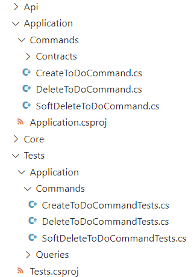
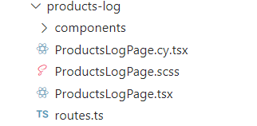
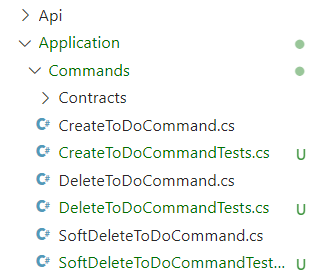

# How to make unit-testing in . NET easier and more fun?


Writing tests is not always the most exciting thing to do. If you don't follow TDD, you must have faced such problems as lack of tests, their small number or outdated versions. But why does it happen? Let's find out.

In Tourmaline Core we create an xUnit project for tests on the backend if we write in C#. We write tests on all layers of the application: API, Application, DataAccess and Core (also known as Domain), if there is logic described in the model. To somehow structure everything, we recreate these layers in the project with tests, placing everything into folders with appropriate names:




The first problem that this approach causes is duplication. We need to completely repeat the folder structure of the project. This is inconvenient, and it is too time-and labor-consuming to do it in every project. 

The second problem is that these tests are simply not visible. The project with tests lies at the bottom, and once written tests are forgotten and don’t get updated when needed. For example, in the process of refactoring a class that has tests has been renamed or even moved to a new place in the folder hierarchy. And if you forget to make similar naming and hierarchy changes in the project with tests, that code will become deprecated.  

So how can we improve the process of adding new tests and updating old ones?

On the frontend these problems have already been solved:
- the structure is not duplicated (only the name of the component is repeated in the test filename);
- test files are always visible - they are placed right next to the component.




In the above example tests for `ProductsLogPage.tsx` are in the same folder and named the same way, but with a different test extension, in this case `cy.tsx`.
We thought what if we could implement this approach on the backend as well? Let's try it.

The first thing we noticed is that we don’t need a separate xUnit project with tests to run them. It is quite enough to install the testing libraries into the project with the functionality and run tests with the `dotnet test` command. This command will run all the tests found in the solution (and thus in all layers of the application). This will play to our advantage.

We copied the tests from a separate project and put them next to the classes, just like on the frontend:




For those who like clean builds, there is still a lot of work to be done with this solution... The application is to be released on the prod someday, but we have both testing libraries and the tests themselves there. It seems that we don't need them in a production build, because we run tests only manually or in a pipeline before building the image for deployment. And with this thought in mind, we started looking for a way to remove all unnecessary things from the prod build to declutter it.

## Docker Ignore
The most obvious solution is to use the `.dockerignore` file to exclude test files from the build:

```yaml
# other ignored folders and files
*Tests.cs
# other ignored folders and files
```
But the pitfall here is that the testing libraries will remain in place and occupy space. 

We have calculated the size of the build with additional packages: 
- xUnit library size - 30.91 KB;
- Moq library size - 815.29 KB;
- Microsoft.NET.Test.Sdk library size - 33.5 KB.

We can leave the libraries as they don't overload the image too much. 
This option is for you if you don't want to complicate things.

## ItemGroup and Condition
But we decided to go further and found an interesting feature that is hidden in the `.csproj` project file. It is the `Condition` parameter that we need to specify in the `ItemGroup` block. This way we will create a certain rule to include or not to include the libraries specified inside `ItemGroup` into the project. By the way, this way you can exclude test files from the build without using `.dockerignore`.

To implement this solution, we created a variable `EXCLUDE_UNIT_TESTS_FROM_BUILD` and specified it as `ARG` in the Dockerfile.

```xml
<!-- Condition for excluding packages for testing -->
<ItemGroup Condition=“‘$(EXCLUDE_UNIT_TESTS_FROM_BUILD)’ != ‘false’”>
	<PackageReference Include=“xunit” Version=“2.4.1” />
	<PackageReference Include=“Moq” Version=“4.16.1” />
	<PackageReference Include=“Microsoft.NET.Test.Sdk” Version=“17.10.0” />
</ItemGroup>
<!-- Condition to exclude test files -->
<ItemGroup Condition=“‘$(EXCLUDE_UNIT_TESTS_FROM_BUILD)’ == ‘true’”>
	<Compile Remove=“**/*Tests.cs” />
</ItemGroup>
```

Why do we use **ARG rather than ENV**? We are excluding packages and/or files from the **build**, hence the variable should work exactly as an argument to the build (`docker build`), and we can take its value from the environment variables installed on the host machine. **ENV** only applies when we need the value at application runtime (`docker run`).

```bash
FROM mcr.microsoft.com/dotnet/aspnet:8.0 AS base
WORKDIR /app

FROM mcr.microsoft.com/dotnet/sdk:8.0 AS build
ARG EXCLUDE_UNIT_TESTS_FROM_BUILD=${EXCLUDE_UNIT_TESTS_FROM_BUILD}
# other Dockerfile lines…
RUN dotnet build "./example.csproj" \
-o /app/build /p:EXCLUDE_UNIT_TESTS_FROM_BUILD=$EXCLUDE_UNIT_TESTS_FROM_BUILD

FROM build AS publish
ARG BUILD_CONFIGURATION=Release
ARG ASPNETCORE_ENVIRONMENT=Production
RUN dotnet publish "./example.csproj" \
-o /app/publish /p:UseAppHost=false \
/p:EXCLUDE_UNIT_TESTS_FROM_BUILD=$EXCLUDE_UNIT_TESTS_FROM_BUILD
# other Dockerfile lines…
```

## Delete test files inside Dockerfile
You can exclude test packages from the build only through `Condition` in `.csproj` file, but you can also exclude test files from the build in a third way - we will use the `EXCLUDE_UNIT_TESTS_FROM_BUILD` variable for the build in the same way. But at first we will copy all the test files into the container. After that we can find the test files in the `/src` folder and delete them. This can be done in Dockerfile using the `RUN` block, which knows how to handle a conditional statement:

```bash
# Delete the test files if the argument is set to true
RUN if [ “$EXCLUDE_UNIT_TESTS_FROM_BUILD” = “true” ]; then \
        find /src -type f -name '*Tests.cs' -exec rm -f {} +; \
    else \
        echo “Skipping unit test removal”; \
    fi
```

## Results
In the end, we found three ways to remove unnecessary packages and files from the prod build (this feature may be useful not only in the described case). Also, we changed the folder architecture and now the test files will be placed next to the classes being tested. 

This approach will help you not to forget to update the test after you update a functionality, or remind you that there are still no tests for a class. And it’s simply more convenient.

In our opinion, the neatest, most convenient and concise solution is to exclude test packages and test files by using the `Condition` parameter in the `.csproj` file to control the contents of the build with just one variable.
