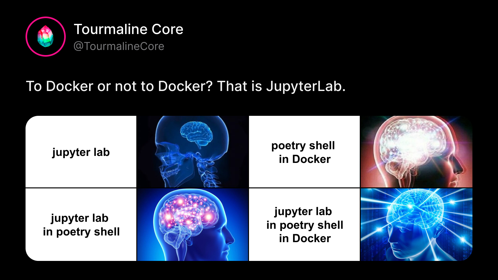

# To Docker or not to Docker? That is JupyterLab

<p align="center">
  
</p>

Working in Jupyter notebooks is an essential part of our ML department's process of research and experiments. But what environment should be used for launching these notebooks? In our practice we use two approaches: running notebooks in a Docker container or in a local isolated Poetry environment.

### What this article is about and who it is for

In this article we’ll build a simple setup for local isolated ML experimentation in JupyterLab piece by piece.  
It is suitable for small and medium-sized projects where there is no need to utilize servers with huge resource capacity yet and local machines of team members suffice the project’s needs.

When building a setup, we are also guided by these reasonings:

- We need our experiments to be reproducible on the infrastructure level: it needs to be clear what package versions were used, which OS the experiments were run on and that we’ll get the same results if we run the code in the same conditions. Setting and logging parameters in the code itself (e.g. random_state) is out of this article’s scope.  
- We need experiments’ dependencies to be isolated from a PC’s global environment.

### Why isolating environments for Jupyter experiments is important

Quite often, during initial research, hypothesis testing and performance checking of code blocks, different ML models require different versions of the same dependency.  
To avoid having to install all these versions globally and then puzzle over how to fix all emerging conflicts, you can isolate the experiment environment from your global one. Then in case of any issues you can just recreate the Poetry environment or switch to another one without littering global dependencies.

## Package manager
Both of the approaches are based on [Poetry](https://python-poetry.org/) – dependency management tool for Python projects. Why Poetry? It automatically resolves conflicts between dependencies and ensures build repeatability with *pyproject.toml* and *poetry.lock* files. And it simply works great.

>***pyproject.toml***  – project configuration file, where all its metadata (name, version, authors, e.t.c.) is set and its required dependencies are defined. 

>***poetry.lock*** – special file that is automatically generated by Poetry. It “locks” precise data about installed dependencies including transitive ones (dependencies’ dependencies).

Basic **pyproject.toml** for running JupyterLab should look like this:

```toml  
[tool.poetry]  
package-mode = false

[tool.poetry.dependencies]  
python = "3.11.11"  
jupyterlab = "^4.0.0"  
jupyter = "^1.1.1"  
```

You can create pyproject.toml by running this command and fill out the attribute fields following instructions in the terminal:

```bash  
poetry init  
```

You can also create and fill out the file manually or copy and paste an existing one from some other repository, e.g. our repo with pre-configured jupyter setup (link at the end of the article).

As for **poetry.lock**, if it hasn’t been generated yet, you can create it with the following command in your project’s terminal:

```bash  
poetry lock  
```

Of course, these commands will only work if you have Poetry installed globally or if you’re working in a Docker container with pre-installed Poetry.

You can find out more about Poetry and its features in its [documentation](https://python-poetry.org/).

What about other experiment dependencies? As it’s been mentioned, different experiments may require different versions of the same package. That’s why we use the approach where we initially add only the dependencies that tend to be repeated from experiment to experiment. For example, torch or scikit-learn.

To add dependencies to Poetry, you can use:  
```bash  
poetry add <package>  
```

[PyPI](https://pypi.org/) is a default package source but it can be changed if needed. This command also supports adding git-dependencies. You can read about these features and about how to add a particular specific package version in this [part of documentation](https://python-poetry.org/docs/cli/#add).

We prefer installing all other dependencies that are only used in individual notebooks directly in each new experiment notebook, most often using *pip*. It’s simple and you can see which package version is installed in cell outputs, which meets the objective of experiments’ reproducibility.

OK, using Poetry as the main package manager. But what approach should be used for isolating experiment environments?

## Isolating with Docker

In general, we use Docker containers to isolate environments for experiments. We create an image from an existing one with Python of the version we need, then inside the image install Poetry and all the necessary dependencies from **pyproject.toml** including jupyter and jupyterlab. And then run the created container, which also launches a Jupyter environment. 

Dockerfile that we use for this purpose looks something like this:

```dockerfile
# python version corresponds to the one required in pyproject.toml  
FROM python:3.11.11-slim

ENV PYTHONFAULTHANDLER=1  
ENV PYTHONUNBUFFERED=1  
ENV PYTHONDONTWRITEBYTECODE=1

WORKDIR /workspace

RUN apt-get update   
   # https://packages.debian.org/ru/sid/python3-dev  
   && apt-get install -y --no-install-recommends python3-dev   
   && python -m pip install --upgrade pip   
   && pip install poetry==2.1   
   && pip install ipykernel

COPY pyproject.toml poetry.lock ./

RUN poetry config virtualenvs.create false   
   && poetry install --no-interaction --no-ansi

CMD ["jupyter-lab","--ip=0.0.0.0","--no-browser","--NotebookApp.token=''","--NotebookApp.password=''","--allow-root"]  
```

Note that Dockerfile includes copying **poetry.lock** into the image. If you don’t have that file generated at this point, you can:

- remove **poetry.lock** from COPY line and generate it inside the container after it starts,
- copy **poetry.lock** from our repository with jupyter setup that is linked at the end of the article. Keep in mind that if your **pyproject.toml** differs in any way from the one in this repo, this option isn’t for you as poetry.lock probably won’t include relevant dependencies, which will cause a conflict.

This approach of isolating with Docker has several advantages:

- you only need to have Docker installed globally, all the other dependencies are installed inside a container,
- unified environment among project members, no matter their OS,
- it’s easy to “reset” an environment and recreate it again if needed (e.g. if something goes wrong when installing packages in a Jupyter notebook). To do that, you can just delete or relaunch your container.


In this approach we usually also use docker-compose. It’s mostly needed to control the amount of resources that a container can use (CPU, RAM). If no limits to resource usage have been set in docker-compose.yml, resources are limited by global Docker settings. Also, docker-compose can be used to enable container’s access to GPU with a couple of lines.  
Usually docker-compose.yml for a project looks like this:

```yaml  
services:  
 project-name-notebooks:  
   container_name: project-name-notebooks  
   ports:  
     - 4321:8888 # external port (4321) can be any port you want
   volumes:  
     - .:/workspace  
   build: .   
   deploy:  
     resources:  
	      limits:  # optionally set depending on your jupyter needs 
          cpus: '7'  
          memory: 12G  
     reservations: # you can give the container access to the GPU (if there is CUDA) 
		    devices:  
        - driver: nvidia  
          count: 1  
          capabilities: [gpu]  
```

Container with JupyterLab starts with this command executed in the project’s directory:

```bash  
docker compose up --build -d project-name-notebooks  
```

If you don't have GPU on your device, the container won't be built and won't start. If that's your case, everything must work fine after deleting `reservations` section from docker-compose.yml.

Once the container has started, you'll be able to access the JupyterLab environment by going to this link in your browser: [http://localhost:4321](http://localhost:4321).

## Isolating with Poetry

There is a scenario when working from a Docker container isn’t an option for us. Unfortunately, MPS (Metal Performance Shaders) technology, which is necessary to be able to use GPUs on Mac devices of M-series, [cannot be integrated in Docker containers](https://github.com/pytorch/pytorch/issues/81224). So in these circumstances, when we, however, can’t manage without using GPU resources, we have to run Jupyter locally from a Poetry environment. In this case Poetry is used as both a package manager and a way of isolating the project’s dependencies.

Firstly, before launching anything, you have to make sure that you have installed the required Python version (according to **pyproject.toml**) on your device and Poetry is also installed globally. There is a [guide](https://python-poetry.org/docs/) in Poetry’s documentation on how to do that.

Being in the same directory as **pyproject.toml** file, run this command in the terminal:

```bash  
poetry install  
```

That makes Poetry automatically create and activate an isolated environment, where it installs all the required dependencies. Now you can run JupyterLab from the created Poetry environment with this command:

```bash  
poetry run jupyter lab   
```

The obvious main disadvantage of such an approach is the necessity to install both Python and Poetry locally and moreover, sometimes different projects require different versions of both. And in case of any issues, you can’t fix dependency or cache errors in Jupyter notebooks with one container recreation command – you have to remove the environment and create a new one (which is not so difficult but still requires more effort than with a Docker container). Also, you can’t limit resource usage in a Poetry environment, it uses everything that is available on a device.

You can read more about managing Poetry environments (how to activate them, create with different Python versions, remove) [here](https://python-poetry.org/docs/managing-environments/).

## Where to launch from?

So, based off our experience, the approach with running a Jupyter environment from a Docker container is preferred because in this case you only need to have Docker installed on your device to work on experiments. Plus, it’s easy to control resource usage and such an environment can be reproduced the same way among all project’s team members regardless of their operating systems.

Local launch from a Poetry environment is a necessary measure, which (fingers crossed) will disappear in the future when MPS becomes available in Docker containers. Its cons include a necessity to install Poetry and Python and lack of complete experiment reproducibility as results may vary a little depending on team members’ operating systems. But there is an advantage unavailable with the Docker approach: an ability to use MPS for project’s members with Mac devices of M-series. 

It’s good to note that maintaining both isolation methods doesn’t require any additional steps: both Docker container environments and local Poetry environments use the same **pyproject.toml** and **poetry.lock** files for dependency management. 

Of course, there are alternative options for setting up experiment environments. For example, Conda is often used but it doesn’t enable sharing environments between project’s members. Some prefer to use Kubeflow that can be deployed to a server allowing users to utilize its resources in addition to basic environment management functionality.

But our approach requires fairly simple tools which makes the entry threshold lower. Besides, this experiment setup is enough for a lot of ML-related tasks, especially coupled with powerful PCs.

And how do you manage local environments for experiments? We’d love to read about it in the comments and learn from your experience :) 

Our repository with the setup:   
[https://github.com/TourmalineCore/TourmalineCore.Articles.Examples.simple-jupyter-setup](https://github.com/TourmalineCore/TourmalineCore.Articles.Examples.simple-jupyter-setup)

Authors: Snezhana Lazareva, Maria Yadryshnikova  
Proofreading and feedback: Alexandr Shinkarev, Vladimir Gubin
Design: Margarita Popova  
