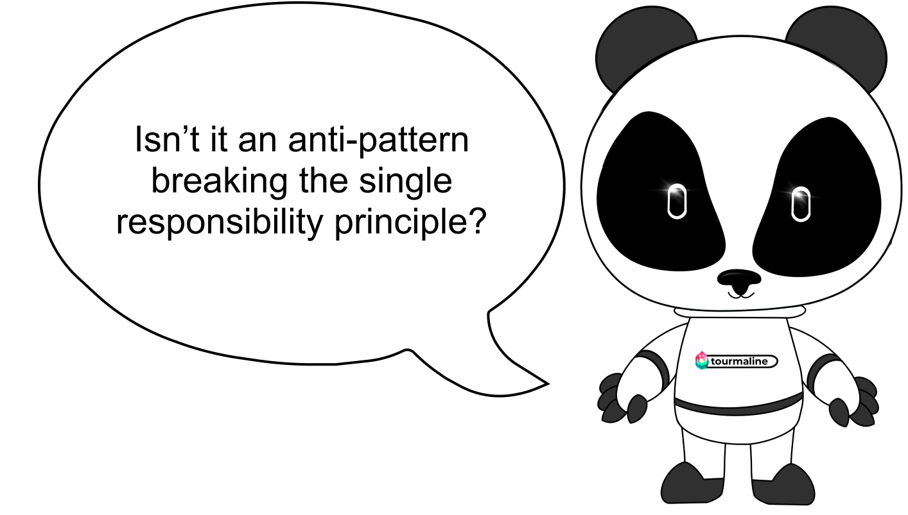
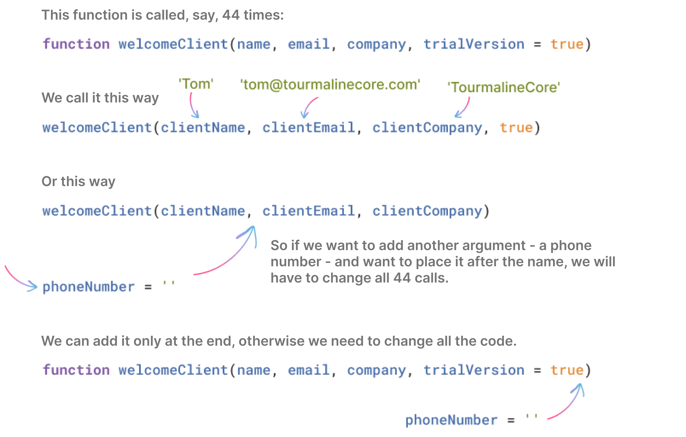
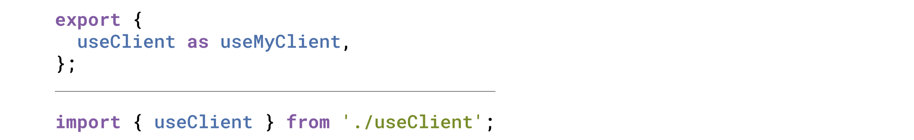
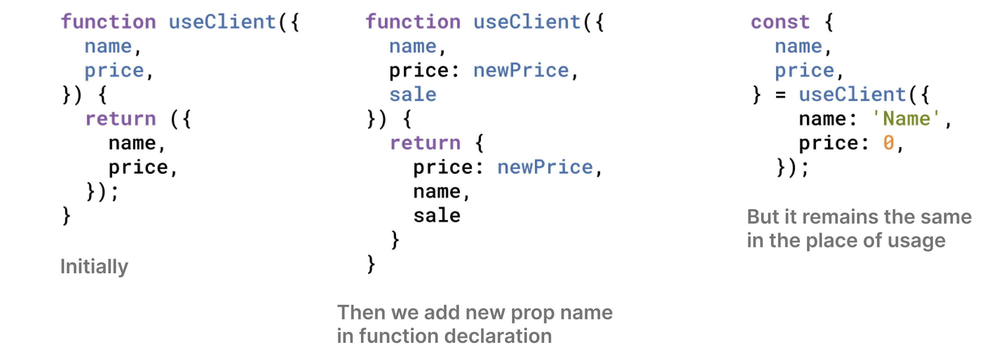
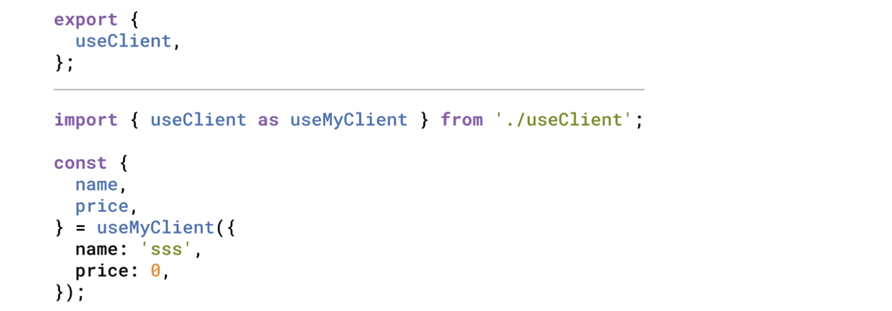

# React: революция использования фигурных скобочек

Well, **react**. We use so much of everything because it just happened that way historically: we write functions backwards (first we declare, then call them). We wrap everything in arrow functions and constants where a named function would be enough. The list goes on and on.

In this article, I'd like to discuss a few habits that we all have but should probably reconsider.

Let's start with a custom hook that needs to return a result, specifically a couple of values. A classic example would be a hook to request data over the network and track whether this request is in progress so that a loader could be added to the page.

```javascript
function useClient(clientId) {
  const [loadedClient, setLoadedClient] = useState(null)
  const [isLoading, setIsLoading] = useState(false)

  useEffect(() => {
    const loadClient = async () => {
      try {
        setIsLoading(true)
        const clientData = {} // actual data loading call goes here
        setLoadedClient(clientData)
      }
      finally {
        setIsLoading(false)
      }
    }

    loadClient()
  }, [clientId])

  return [loadedClient, isLoading]
}
```

So we call it this way:

```javascript
const [loadedClient, isLoading] = useClient(clientId)
```

Or maybe this way:

```javascript
const [client, isClientLoading] = useClient(clientId)
```

<p>
  
</p>


Or we make a mistake and write something like this:

```javascript
const [isLoading, loadedClient] = useClient(clientId)
```

It seems that here we follow the useState pattern, which returns an array of a value and a function to update this value, and then we destructure the array and get everything by index, giving any names we want, that’s cool.

**Why was it supposed to do this for useState?**

Because it is a universal library function. Clients call it in their specific cases and want to give various, useful, descriptive names.

**So what does it have to do with our custom useClient hook?**

We follow someone else's convention, because everyone does it, this is the react way and all that.

But do we need this flexibility in terms of naming the results of this function? And but for TypeScript, what will help us suspect something is wrong? And if we search for all usages with a full search on the project without using helpful IDE features, how many will we find if everyone calls it whatever they want?

I have a simple proposal. Why don’t we return an object, not an array. In this case, the last line in the hook will be the following:

```javascript
return { loadedClient, isLoading }
```

<p>
  
</p>

And here’s how we’ll use it: 

```javascript
const { loadedClient, isLoading } = useClient(clientId)
```

Or this way:

```javascript
const { isLoading, loadedClient } = useClient(clientId)
```

But this will be no longer possible, and maybe even a linter or something will tell us about an error here:

```javascript
const { loading, c } = useClient(clientId)
```

### The main takeaways:

1. The change in the code is minimal and does not affect the solution complexity.

2. Relatively high type safety of our code.

3. All the same goodies of destructuring, only not on arrays, but on objects.

4. You can safely refactor the code: rearrange the returned properties inside the hook and in places of usage. After all, the order is no longer important, unlike array destructuring.

Let's move on to a more or less **immutable rule:**: if only one thing is exported from a module, we should use the default export.


<p>

</p>

That’ the way it can look in the module:

```javascript
export default function myFancyFunction() {}
```

Or:

```javascript
function myFancyFunction() {}
export default myFancyFunction
```

Or this way:

```javascript
const myFancyFunction = () => {}
export default myFancyFunction
```

And if we try to use such a module somewhere, we will most likely write something like this:

```javascript
import myFancyFunction from './my-fancy-function'
```

And if a person hates us, they will import like this:

```javascript
import myFancy from './my-fancy-function'
```

<p><p align="right">
  
</p>

In general, it should already be clear where we are going. Just the same as in the first example: we return something that can be called by a client by any name. And if we are not developing an npm package, but working within a single repository, is this what we want? That kind of flexibility?

Perhaps it is time to trample on the postulate that using default export for a single-function module is a must.

**Named export, your time has come!** Let's use you always.

In this case we get:

```javascript
export {
  myFancyFunction,
}

function myFancyFunction() {}
```

<p align="right">
  
</p>

And we’ll import this way:

```javascript
import {
  myFancyFunction,
} from './my-fancy-function'
```

**Here's the thing:**  if you always use named exports, then adding a new function exported from a module is essentially free of charge.

<p>
  
</p>

And we are also gradually moving to multi-line destructuring. When one thing goes on its own line and **invariably** ends with a comma. But what for? After all, a comma  is redundant for the last element. In general, with multi-line destructuring, you get more lines of code.

<p align="right">
  
</p>

**Note:** VSCode has a strange behavior - the default export is not always renamed normally by the IDE. Maybe we have something wrong, or maybe it is just more difficult to do something for default exports. No problems with named ones have been noticed so far.

<p>
  
</p>

There are a couple of reasons to follow this particular rule anywhere there is object destructuring or something of the kind, like in the case of named imports:

1. Clean commit history in Git when you need to add a new property or export a new function.

2. You can create new code based on the old one faster than ever. Copy the previous line, and voila, here’s the same new one, just rename it.

<p align="right">
  
</p>

**What else can we add to this feast of curly braces?** Let's add the [RORO](https://www.tinyblog.dev/blog/2020-07-13-javascript-roro-pattern/) pattern (Request Object Response Object). In other words, we always pass arguments as an object, even for one parameter. And always return the result as an object.

<p>
  
</p>

____

### Let's try to combine everything we had in our custom hook and see what we get

```javascript
export {
  useClient,
}

function useClient({
  clientId,
}) {
  const [loadedClient, setLoadedClient] = useState(null)
  const [isLoading, setIsLoading] = useState(false)

  useEffect(() => {
    const loadClient = async () => {
      try {
        setIsLoading(true)
        const clientData = {} // actual data loading call goes here
        setLoadedClient(clientData)
      }
      finally {
        setIsLoading(false)
      }
    }

    loadClient()
  }, [clientId])

  return {
    loadedClient, 
    isLoading,
  }
}
```

And the usage:

```javascript
import {
  useClient,
} from './useClient'

const {
  loadedClient,
  isLoading,
} = useClient({
  clientId,
})
```

____

### Conclusions

In general, turns out the article is not about React at all. This approach is applicable to any ES6+ code written in JavaScript. It's just easier to illustrate the value using React custom hooks as an example.

We ourselves use this approach everywhere (okay, we'll start soon). There is one reasonable exception regarding the Response Object from the RORO pattern. It seems that it doesn't always make sense to wrap everything in an object - for example, is it worth doing this for functions that return true/false flags? Perhaps this is too much:

```javascript
const {
  areTheyNuts,
} = areTheyNuts()
```

<p align="right">
  
</p>

As for always returning objects as function results, we haven't made a final decision. Perhaps it's worth practicing the extreme option on a small project, when we always return an object, and then the team can decide whether this option suits them or not.

If you strictly follow this way:

1. People might not understand. It seems to be very different from what people repeat in their code like a mantra.

<p align="center">
  
</p>


2. It won’t be scary to extend the function signature by adding a new argument. You do not have to turn over all the code. And even a new argument with a default value will not be a problem, unlike passing arguments one by one, when all arguments with a default value must come at the end.

Before:

<p align="center">
  
</p>

Now:

Here we can substitute a new argument in the middle and won’t need to change anything. We can add it wherever we want - no need for a fixed order, as when passing multiple arguments.

```javascript
function welcomeClient({
  name,
  phoneNumber = '',
  email,
  company,
  trialVersion = true,
})
```

And we call it this way:

```javascript
welcomeClient({
  name: 'Tom',
  phoneNumber: '+79876543210',
  email: 'tom@tourmalinecore.com',
  company: 'Tourmaline Core',
})
```

3. Extending the module export is yet again easy, none of its clients will need an update. The import will look the same as before.

4. The history in Git will look neat and concise. Only the line that was actually changed will be highlighted, i.e. the line with the new result property/input parameter object property or the new export/import function.

5. It seems (not sure) that IDEs work better with renaming object properties and module export functions when using this approach. Although VSCode sometimes stops halfway and this is not what you want.

<p align="center">
  
</p>

<h6> <b>Case 1.</b> If we rename a function in the module from which it is exported, this does not affect its usage in any way; it still has the same name as before the renaming.</h6>


<p align="center">
  

<h6> <b>Case 2.</b> If we rename an object property during destructuring.</h6> 


<p align="center">
  
</p>

<h6> <b>Case 3.</b> If we rename a function in the place where it is imported, this does not affect its name in the module from which it is exported.</h6>

It's a backwards compatible change, but usually we need to rename everything at once, which is inconvenient.

**P.S.**: By the way, if you use ESLint or Prettier, no miracle will happen, the proposed multi-line formatting is still not implemented. A great candidate for contribution, at the time of publication only about 6 years have passed
https://github.com/prettier/prettier/issues/2550.

<p align="center">
  
</p>
____

Автор: Aleksandr Shinkarev 

Proofreading and feedback: Ekaterina Chekina, Andrey Yasnovsky, Maria Yadryshnikova 

Design: Anastasia Kovylyaeva, Anastasia Tupikina