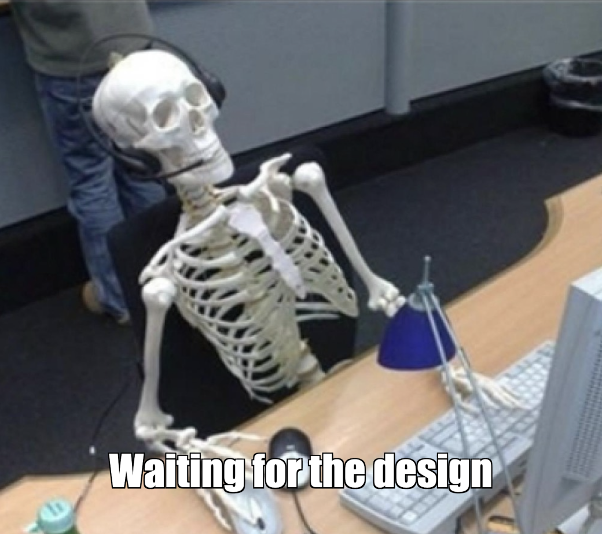

# How to Estimate Tasks and Make Peace with Deadlines

Correct task estimation is a crucial aspect of a project's success.

Hello everyone! My name is Margarita, I am a UI/UX designer at Tourmaline Core. In this article, I decided to share my experience, my takeaways and successful practices, and figure out what needs to be taken into account when estimating the time it takes to complete a task.

The article will be useful for both aspiring designers and other specialists who face burning deadlines and problems in estimating.

## Estimation by the person who will do the job

Imagine a designer was given a task and a couple of hours to complete it. But when they started digging into it, it turned out there was much more work than expected, and it it was impossible to complete it in the allotted time. Why did it happen? 

From the outside, a task can often seem much simpler than it actually is, especially to a person not familiar with pitfalls and potential setbacks. This is why the estimate should be done by the designer who will work on the task and who has an idea of the process and how much time it may take, and not by a manager, developer, or anyone else.

We should also bear in mind that everyone works at their own pace. The same task may take two specialists a different amount of time since their experience, work speed, and skills are also different. Therefore, even the most experienced colleague will not be able to estimate the effort more accurately than the person who will do the actual job.

## Decomposition of large tasks

The first project I worked on was a corporate website for an Australian company. The task was estimated something like: "Wow, this is a large task, it will probably take about a month and a half." In fact, to me the task looked immense and incomprehensible. As a result, I randomly named what seemed to be a fairly long time enough for its completion, but this estimate had nothing to do with reality. The site was very large and the design stage took over two months. Such deadline extension affected the work of the entire team.

Decomposing a large task into small subtasks will help to avoid such situations. You can break a website into pages, pages into blocks, complex blocks into components, ~~components into pixels~~ and estimate them separately. The better you decompose the task, the easier it will be to realistically estimate it.

  

## Completing a task on time

At the beginning of my design journey, it was difficult to estimate new tasks that I had had no experience with. I could not even roughly estimate how much time they would take. At that time, I found a little trick that helped me. 

Let's imagine you need to estimate the time required to create a form for a website, but have no experience working with forms. The trick is to note the time and design a small part, for example, a button. This way you'll be clear on the effort needed for this small part of work. And such parts make up the entire form.

Sometimes a task can be much more complex than that, and there is no time to try to implement it. In this case, it is useful to imagine the sequence of steps necessary to complete the task, think about potential problems that can arise, and do additional research. It is also useful to compare it with similar tasks and recall how much effort they usually took.

  

## Ideal conditions

A frequent mistake I made was estimating work under ideal conditions. Let's take, for example, creating an internal page of a website. The designer had taken into account all the previous steps, broken the task into subtasks, estimated how long the design would take, and allocated a whole day for this activity. But when they took to work, they faced the lack of ideas, needed to conduct some research to look for good solutions, and make sketches of possible options. A day passed, and the designer made sketches of only one section.

So what went wrong? When estimating, the designer thought only about certain components and how long they would take. They did not foresee a dead end and lack of ideas. Sometimes it takes a lot of time to think about a solution, try different options, throw out poor ones and keep a good one, look for inspiration, respond to colleagues' messages, join a call, eat a sandwich, after all. There are almost never ideal, sterile conditions for a task, so it makes sense to factor in some extra time in your estimate.

## Time for review

When we work in a team, other people review our work - a mentor who checks the quality of work and makes edits, or a developer who checks the design for feasibility. So it is important to plan not only your time, but also the time of your colleagues. They also have their own deadlines, timeframes, estimates, and priorities. And that lunch of theirs!

Let's imagine there is a task with the deadline on Tuesday evening. The designer completes the work on Tuesday at 4:00 PM and is happy to have managed to do everything on time. Now it's time for the review, but the reviewer has a higher-priority task, and will only find time on Wednesday afternoon. On Wednesday, after the review it will turn out certain edits are necessary. It would seem that the work was completed on Tuesday evening, but in reality it can only be submitted on Thursday.

Don't forget to include some time buffer in your estimates to get a review and make your edits without any rush.

## Time for edits

This is one of those critical points when estimating design and it is directly related to ideal conditions. Clients almost never accept designs right away without any edits. Such tweaks as finding a different font, correcting the text, changing the brightness all require extra time, which needs to be taken into account. This extra time for edits will allow you to make changes without disrupting the client’s deadlines. And if your work happens to be accepted right away, you will only make the client happy completing everything before the deadline.

  

## Overtime

The most painful point, which I struggled with the longest. When you get the feeling of being behind schedule, you want to stay at work longer to catch up on the task. At first, it seems that overtime will help you complete the task as planned. In fact, everything works quite the opposite. The more you overwork, the more fatigue accumulates, the more you hate the task, and finally there is no energy and motivation left. Your work slows down, you make mistakes, manage to do less and less while overtiming  more and more. It turns out to be a vicious circle: the more you overtime - the more tired you get - the worse you work - the less you accomplish - ~~the more you cry at night~~. 

A designer who has learned to maintain the balance between work and rest is charged and energetic to deliver high-quality work and meet deadlines.

  

## "Overbaking" the task

It happens that a task has already been completed, but the inner perfectionist finds new little things to pick at, polishing and as a result, "overbaking" the task. The eye becomes blurry, and the same edits are made in a circle. This eats up extra time for no good reason, and the designer risks making things worse.

If the design already meets all the client’s expectations, this is a sure sign that it’s time to stop and move it on to the development. In our practice, if the team understand that someone is keeping the task for too long, we try to bring the work to the point and submit it for an approval, even if we are tempted to tweak it further.

  

## Spreading yourself too thin 

Often beginning designers want to pack their designs with all the cool ideas and trends at once. However, it can steal the focus and disrupt the project deadlines. Not to let this happen, it is worth showing the client several possible directions upfront. This way you will cut off unnecessary options at the initial stage, focus on one solution, and put off the rest of the ideas for future projects. Or just throw them away.

## Real estimates

When estimating a project, we often feel uneasy to reveal the real effort it requires, anxious to get a negative reaction from the client or colleagues. A self-conscious designer can underestimate the required effort feeling insecure that someone will consider them a poor specialist. As a result, the designer does not deliver the work on time and disappoints the client.

To avoid it, make sure to honestly estimate the effort and name real numbers, even if it makes you uncomfortable. To make this conversation less stressful, explain in detail to the client the stages of work and why it takes so much time. If you cannot immediately provide an estimate, just tell them honestly and ask for extra time to figure things out.

## Understanding the task

One of the most unpleasant cases in my career was designing a presentation for a German company. As I was inexperienced at the time, I didn’t make the adequate effort to gather requirements. Since the client had very little time for communication, he sent me a brief prepared by another designer. I didn't insist on a more detailed analysis and focused on the brief he’d sent me. During the demo, the client asked for a huge number of edits. As it turned out, I simply did not hit the style he needed, and the information in the brief was outdated and irrelevant.

This case demonstrated to me how important it is to gain an in-depth understanding of the task at hand. Make sure that your vision coincides with your client's vision to avoid never-ending edits.

## Time for communication

Сommunication is a whole separate expense item on our list. Blissfully, we didn’t bump our heads on it, but on the contrary, made it a successful practice. When estimating the design of our company's corporate website, we added 30% of the total time for communication, including calls with the team, coordinating the design with the client, and working with the feedback. This additional time turned out really helpful to complete the work on time.

## Conclusion

Estimation is an integral part of the development process that determines the success of a project. As a designer, I have faced many difficulties and made many mistakes when estimating tasks. However, thanks to the experience and practice, I have learned to apply effective strategies that help me meet deadlines and achieve better results.

The tips I gave in this article will help you look at tasks from different angles, estimate them more accurately, and avoid many mistakes. Follow them, and you will relieve yourself of a significant share of anxiety and stress, create a comfortable workflow and meet your client’s expectations, which will lead to greater success of your project.

____

Author: Margarita Shur

Proofreading and feedback: Yulia Magdenko, Alexey Adishchev, Maria Yadryshnikova