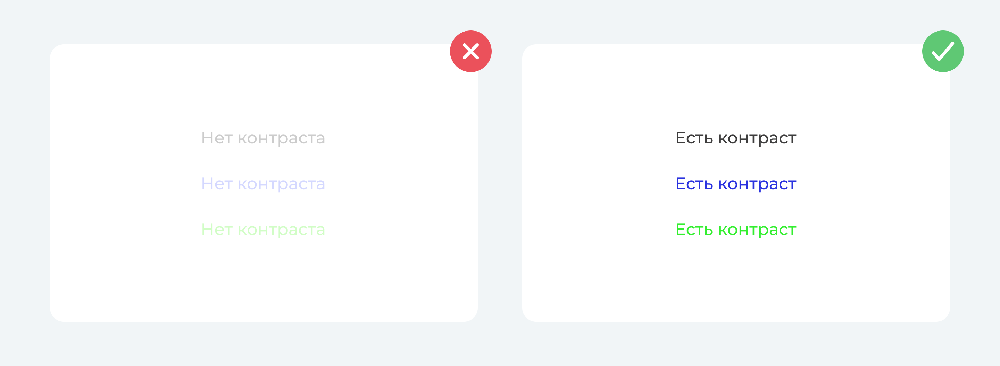

# Чек-лист для улучшения презентации

Недавно наши ребята выступали на конференции, к которой нужно было подготовить красивую презентацию. Мы решили поделиться советами, как собрать весь материал воедино и красиво его оформить, чтобы зрителю было проще воспринимать информацию и слушать самого спикера. Статья будет особенно полезна начинающим дизайнерам, менеджерам и всем, кто сталкивается с трудностями при подготовке презентации для выступления.

## ⭘ Элементы расположены по сетке и направляющим

Сетка и направляющие определяют закономерность расположения элементов на слайде и помогают правильно организовать пространство. Также эти инструменты облегчают выравнивание контента, что придает дизайну чистоту и профессиональный вид.

  

## ⭘  На слайде только важная информация

Слайды с большими абзацами текста очень утомительно читать и сложно воспринимать. Излишняя информация будет только рассеивать внимание слушателей, есть риск того, что посыл слайда не будет донесен. Вместо подробного текста лучше оставлять на слайде ключевую информацию, которая будет поддерживать ваше выступление.

  

## ⭘  Соблюдена контрастность шрифта

Контрастность шрифта играет важную роль в читаемости слайда и удобстве восприятия текста. Убедитесь, что между текстом и фоном сохраняется высокая контрастность, это обеспечит комфортное чтение и повышение скорости восприятия информации.

  

## ⭘  Использованы схемы там, где говорится о сложном

Чтобы сделать презентацию более наглядной, запоминающейся и интересной, на слайде рекомендуется размещать визуальные элементы, такие как изображения, видео, схемы, графики, диаграммы и таблицы. Везде, где это возможно, лучше заменить текст на схему - это привлечет больше внимания и облегчит восприятие. Визуализация информации является важным аспектом, поскольку аудитории будет намного проще понимать и усваивать информацию.

  

## ⭘  Соблюдена консистентность в оформлении

Не менее важное правило при оформлении хорошей презентации - согласованность элементов и слайдов друг с другом или консистентность. Например, если на одном слайде к заголовку применили стиль текста, то и на другом слайде нужно применить тот же самый стиль. Если один слайд оформлен в серо-синих цветах, то и другой слайд должен быть оформлен в этих цветах. Слайды могут отличаться друг от друга по наполнению, структуре и композиции, но их должны связывать общие элементы, которые обеспечат единообразие всей презентации. Консистентность придаст презентации профессиональный вид и позволит аудитории сохранить внимание на выступлении, не отвлекаясь на постоянные изменения в стиле презентации.

  

## ⭘  Применено правило внешнего и внутреннего

Правило внутреннего и внешнего, которое [описал](https://bureau.ru/soviet/20140818/) Артём Горбунов, поможет вывести вашу презентацию на новый уровень. Соблюдая это правило - сделав внутренние отступы меньше внешних, например, межстрочный интервал текста (внутренний отступ) меньше отступа от заголовка до текста (внешний отступ), вы сможете сделать слайд аккуратным и легко считываемым. Информация будет хорошо восприниматься зрителем и его внимание будет направлено на содержание. 

  

## ⭘  Элементы расположены композиционно верно

Неправильная композиция может сделать презентацию менее привлекательной, усложнить восприятие и понимание информации, а также рассеять внимание зрителей. 

Существует много правил, которые могут улучшить композицию слайда. В этом пункте мы хотим поделиться правилом, которое больше других помогло нам разобраться, как грамотно размещать элементы на слайде. Это принцип якорных объектов, который [описал](https://bureau.ru/soviet/20140324/) Артём Горбунов. Принцип заключается в том, что любой якорный объект должен располагаться в одном из углов или в центре своего прямоугольника. Также якорные объекты можно привязать к одной из сторон прямоугольника. 

  

## ⭘  Использованы картинки только хорошего качества

Изображения на слайдах могут сделать презентацию более интересной и наглядной, однако очень важно позаботиться об их качестве. Низкое разрешение картинок и искаженное соотношение сторон могут негативно сказаться на презентации, сделать ее неаккуратной и испортить впечатление от выступления. Особенно заметно это будет на больших экранах, где будут хорошо видны детали. Добавляйте в презентацию высококачественные изображения и графику, тогда презентация приобретет профессиональный и аккуратный вид.

Отдельно хочется сказать про использование векторной графики. Если изображение можно передать в векторном формате, например, дизайн интерфейса, простую иллюстрацию, кусок кода или логотип, лучше это сделать в векторном формате, тогда вам точно не придется беспокоиться о потере качества.

  

## ⭘  Расставлены акценты

Акценты в правильных местах создают иерархию на слайде, это помогает улучшить восприятие информации и читаемость слайда. Также с помощью акцентов можно управлять вниманием зрителя и выделять ключевую информацию. Проще всего расставить акценты с помощью цвета, размера, стилей текста.

  

## ⭘  Выбраны простые шрифты

Для основного текста лучше выбрать простые хорошо читаемые шрифты без засечек, так аудитории будет легче воспринимать информацию и фокусироваться на вашем выступлении. Если хочется поэкспериментировать со шрифтом, это можно сделать на заголовке.

  

## ⭘  Скриншоты хорошо проработаны

Добавляя в презентацию скриншоты, сделанные на скорую руку, вы рискуете сделать презентацию неаккуратной, а также не донести важную информацию до аудитории. Обрезав лишние элементы, например, фон вокруг важного контента на скриншоте, вы улучшите композицию картинки и сделаете слайд более привлекательным.

  

Надеемся, что эти советы помогут вам в оформлении презентаций!!

В следующей части мы расскажем вам про видео - как правильно и красиво добавлять видео вставки в презентацию, а также как настроить удобный переход от видео к следующему слайду.

____

Автор: Шур Маргарита

Вычитка и фидбек: Ядрышникова Мария, Магденко Юлия

Оформление: Ковыляева Анастасия