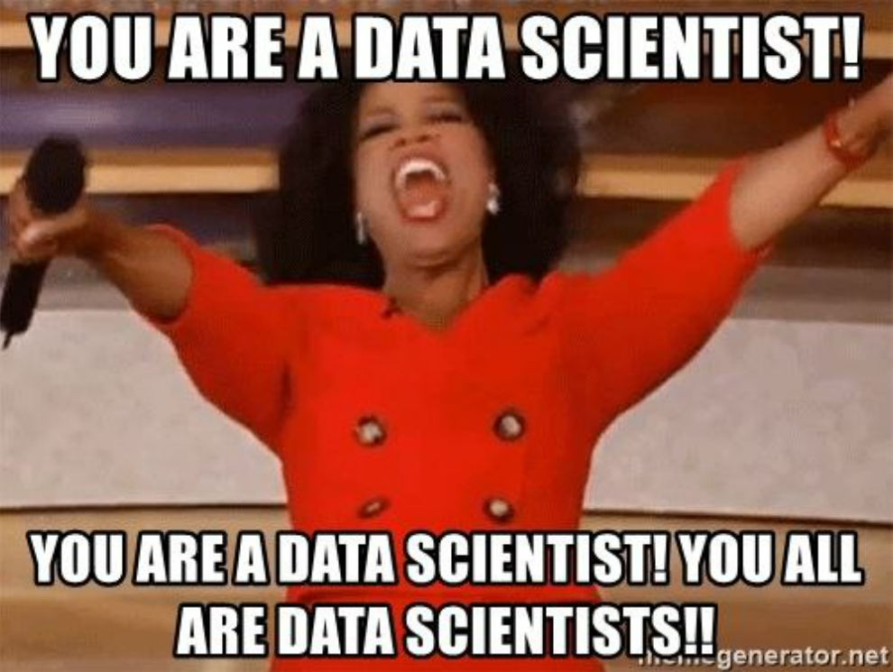
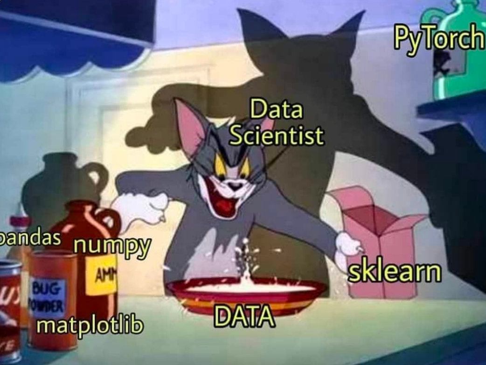
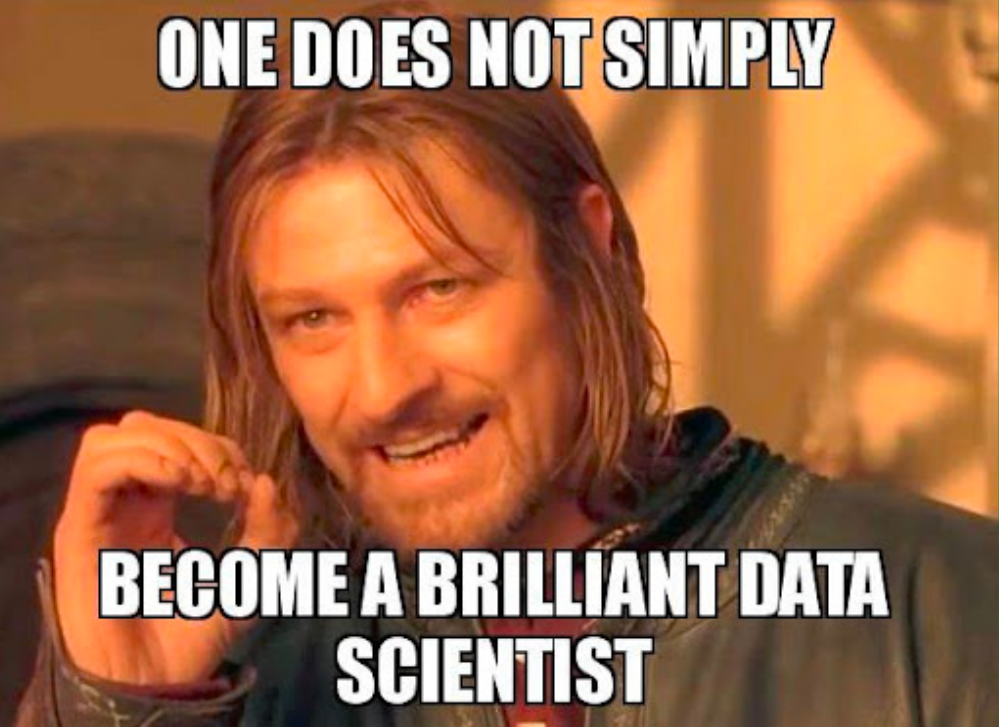
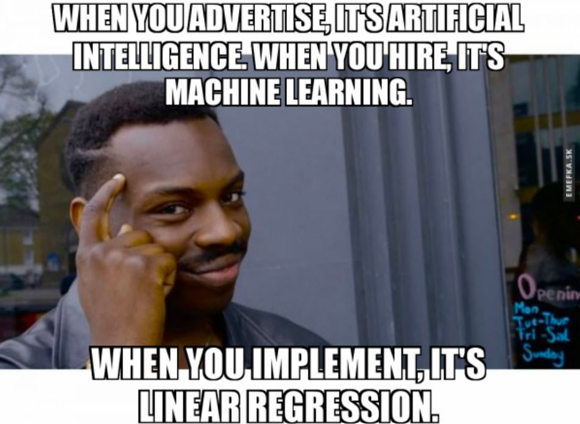

# Почему Data Science не для вас?

  

Data Science сейчас во многом благодаря активному маркетингу становится очень популярной темой. Быть датасаентистом – модно и, как говорят многие рекламки, которые часто попадаются на глаза, не так уж и сложно. Ходят слухи, что работодатели стоят в очереди за возможность взять человека с курсов. Получить оффер на работу крайне легко, ведь в ваши обязанности будет входить требование данных от заказчика (как обычно говорят, чем больше данных – тем лучше) и закидывать их в искусственный интеллект, который работает по принципу черного ящика. Кстати, еще и платят немереное количество денег за всё это. 

**Спойлер:** это не так.

В этой душераздирающей статье решили попробовать отговорить людей, которые готовы оставить кучу денег за курсы по Data Science, браться за это дело, а может быть и помочь определиться с тем, что на самом деле стоит сделать, чтобы встать на путь истинный.

### Обзор понятий

И начнем, пожалуй, с того, что может быть вам и не очень-то нужно быть датасаентистом. Есть много направлений, поди попробуй разберись. Датасаентист, дата аналитик, дата инженер… Часто бывает, что всех этих людей гребут под одну гребенку, и совсем не разделяют их обязанностей. Разберемся, что это за звери такие и с чем их едят. 

***Дата аналитики*** обычно заняты тем, что получают данные и пытаются найти в них закономерности. Эти люди отвечают на вопросы бизнеса: что, почему, как, как сделать лучше, а еще вот можете на график посмотреть. Аналитики чаще контактируют с другими людьми: чтобы выстроить правильную коммуникацию в команде и правильно описать и презентовать результаты своего анализа. Ваши друзья здесь: мат.статистика, python/R, SQL, платформы типа PowerBI/Tableau/Qlik и прочее необходимое для визуализации результатов. Также необходимо глубокое понимание области, в которой вы проводите анализ.

***Дата инженеры*** же заняты поставкой данных и их хранением. Эти люди настраивают хранилища, заставляют данные сопоставляться между собой и быть пригодными к использованию. Создание пайплайна обработки и архитектуры данных  – вот их задача. 

***Датасаентисты*** – более расплывчатое понятие. Сначала они анализируют данные, на которых дальше строится предобработка. В предобработку входит очистка от выбросов, заполнение пропущенных значений, трансформация, нормализация и еще куча всякого разного. И после всего этого датасаентисты  обучают модели, которые будут давать какой-то предикт. От этих ребят нужен тот самый «искусственный интеллект» (кстати, стоит убрать из своего лексикона эти слова на собеседовании, расскажем дальше, почему). Здесь надо знать и уметь в машин и дип лёрнинг, опять таки уметь в матстат и обработку того, что вы видите, понимать предметную область, уметь продумать, какие данные нужны для обучения и составить ТЗ по их сбору. Будет большим плюсом понимание того, на каких машинах модели, которые вы собираетесь обучать, будут запускаться. 

Хороший доклад на тему того, чем заняты разные люди из разных ветвлений размытого понятия data scientist, есть по [ссылке](https://www.youtube.com/watch?v=lDkTNURDIaY).

У описанных направлений совершенно разные ключевые навыки и компетенции. Чем больше компания, тем вероятнее, что в ней есть разделение на эти направления. Но если вы с курсов решили устроиться в стартап, где есть биг дата, но особо нет людей на эту биг дату, тогда вашим ключевым навыком должно быть умение выживать. Именно здесь обычно нужен Data Scientist, который на все руки мастер. Готовы ли вы к этому?

## Почему всё-таки Data Science не для вас?

1. Data Science – для усидчивых. Над одной и той же задачей придется сидеть очень долго. Пока найдешь все необходимое в данных, пока найдешь оптимальный способ обработки данных, пока погрузишься в область, пока переберешь все модельки, которые могут потенциально хорошо решить эту задачу… А еще надо дождаться, пока модель обучится - это ж целая вечность пройдет! Потом еще выясняется, что у модели метрики недостаточно хорошие, и весь этот путь нужно пройти заново, но с новыми идеями. 

    Хватит ли вам умения занять себя другими делами во время обучения модели? Вряд ли проджект будет в восторге, если узнает, что несколько дней вы пили кофе, пока модель обучалась. Хватит ли вам терпения перебирать идеи до тех пор, пока точность модели не достигнет нужного бизнесу числа?

2. Математика останавливается не на 2+2 и даже не на интегралах. Вам точно понадобятся знания по мат.статистике, линейной алгебре, теории вероятностей. Нет, вам не хватит встроенных в библиотечки функций. Может быть для какого-то поверхностного анализа и составления простецкой модели – да, но чтобы лучше анализировать огромные массивы данных, в математике действительно нужно разбираться.

3. Вам нужно знать Python/R/Scala или еще что-то, на чем вы соберете ваше решение. Вы не бэкенд-разработчик, но вам нужно приготовить умную штуку, которую можно будет встроить в прод. Нужно будет составлять POC-шки, функции предобработки данных, которые затем будет имплементировать бэкенд-разраб. Необходимо уметь общаться с бэкендерами на их языке, если им понадобится помощь при внедрении вашего решения.

4. Еще немного о встраивании модели в прод: вам нужно интересоваться тем, на каком железе будет запущена модель. Ну не получится запустить трансформер на сервачке заказчика с двумя ядрами и без малейшего признака GPU. А решение, которое работает на вашем компе и не работает на устройствах клиента не будет принято и, соответственно, оплачено.

5. Нужно знать фреймворки, которые приняты в команде. Если вы до этого делали fit на керасе, а потом внезапно пришли в команду, которая работает на pytorch, уйдет много времени на обучение работе с новыми инструментами.

    Справедливости ради, вряд ли вас возьмут на работу со стеком, в котором у вас нет опыта, но на всякий случай лучше задавать этот вопрос на первых этапах собеседования.

6. По ходу проектирования решения нужно будет использовать огромное количество, библиотек и лучше знать как ими пользоваться до начала работы над проектом. Или же уметь быстро ориентироваться в документации, а в процессе только добирать необходимое. Обучаться всему и сразу плохая идея.

  

7. Вам нужно уметь использовать тулзины, которые тесно связаны с разработкой моделей. Модели и данные нуждаются в версионировании. В этом могут помочь DVC, MLflow или, например, Weights&Biases. А еще модели нужно сервить. В этом случае могут быть пригодны TorchServe или Tensorflow Serving. А может быть вам нужно будет написать свою обвязку вокруг модели, чтобы ее можно было быстро потестить. Этот зоопарк огромен. Нужно выбрать из него именно те вещи, которые вам помогут, и учиться ими пользоваться.

8. Нужно уметь не только чистить данные, но и размечать их, когда вам не дали нормальной разметки, искать, какие данные можно добавить к выданному заказчиком датасету, если его явно не хватает.

9. Важной частью вашей работы будет общение с бизнесом для того, чтобы точно определить цель того, что вы делаете, и не сделать того, что не нужно. Иногда заказчики дают расплывчатое ТЗ, внимательно вчитываясь в которое вы обнаружите, что заказчик хочет всё и сразу, но при этом непонятно зачем. Поэтому нужно будет суметь задать такие вопросы, которые прояснят, что действительно требуется от вас, или суметь сократить скоуп работ до реально реализуемого.

10. Если проджект где-то там пообещал нереальные сроки для выполнения вашей задачи, нужно вовремя суметь сказать, что пятилетку за три года – не получится. Нельзя просто так взять и выстроить радужные мечты вокруг того, как быстро вы сможете сделать задачу. А с вас точно потребуют сроки, в которые будет необходимо уложиться.

    Вопрос оценки времени на реализацию – очень сложен. Здесь важно не только правильно декомпозировать задачу, но и добиться понимания от вышестоящих людей, почему эта задача не может быть реализована в очень сжатые сроки. Так что составляем план, и его придерживаемся. А если что-то выходит из-под контроля срочно трубим о том, что ничего не успевается и с этим надо что-то делать.

11. А еще вам самим придется составлять ТЗ по данным, которые вы хотите получить. Из нашего опыта, чаще приходят заказчики, которые не понимают, что вам от них нужно и в каком объеме. Будьте готовы отвечать на вопрос сколько и каких данных вам надо, вникать в задачу на этапе обсуждения проекта и предполагать, какие кейсы могут возникать в вашей задаче. Также количество размеченных данных, следует запрашивать в таком объеме, который сможет удовлетворить заказчика. Если вы потребуете терабайты размеченных данных, а другой исполнитель скажет, что ему хватит пары гигов, то выберут скорее его, а не вас, просто потому что разметка данных стоит немалых денег. А ответ «чем данных больше – тем лучше» никого не устроит.

12. Data Science – не только про генерацию красивых картинок и красивой музыки без помощи человека. Частый запрос бизнеса – проанализировать информацию о клиентах. Из этой бизнес-задачи может вытекать DS-задача, которая вам не понравится. Например, выстроить контекстную рекламу так, чтобы новые покупатели приобрели товар подороже, или завысить цену продукта в соответствии с предполагаемым уровнем дохода покупателя. Будет ли такая задача вписываться в ваши моральные рамки? Возможно, у вас будет опция отказаться от задач, которые не подходят вашему пониманию хорошо-плохо.Но бывает и так, что вас не спрашивают. Конечно, вопрос, стоит ли работать с компанией с которой у вас разное понимание границ не в плоскости data science, а скорее в общем. Но будьте готовы к тому, что в data science часто встает вопрос этики использования данных, и эта этика зафиксирована в достаточно размытом формате.

Вы можете сказать, что на самом деле многие навыки из этого списка входят в программу популярных курсов. Да, это так. Но дадут ли вам необходимое количество разнородных задач, которые присутствуют в реальном мире? Насколько смешанные, странные и неполные данные будут присутствовать в этих задачах? Требования от заказчиков в реальном мире будут сильно сложнее, чем обычно определяют на курсах. На курсах вам создадут рафинированную среду, в которой все понятно, четко и ясно определено в требованиях и точно опирается на предыдущий опыт из лекций. К сожалению, на работе будет не так. Придётся ловить на лету и определять, как действовать, очень быстро. Так что наше мнение: пойти на курсы, чтобы стать датасаентистом, недостаточно. 

Иметь высшее образование, кстати, тоже. Знаем, бывали. Даже если ваша вышка с уклоном в дата саенс, по факту, она часто дает не сильно больше курсов. Не спорим, есть разные университеты, но, по нашему опыту, вам там дадут примерно такую же базу, как и на курсах, только чуть более разностороннюю (и то не факт). Но все-таки, это обучение длится подольше, и скорее всего, информации вы впитаете побольше. Еще и курсы по философии и экологии подкинут :)

Важное качество в профессии датасаентиста – способность постоянно учиться, находить для себя новые задачи и расти на этом практическом опыте. А еще постоянно следить за событиями в сфере, потому что кажется, что она обновляется чаще и кардинальнее, чем другие сферы IT. Поэтому специализированные курсы – это хорошо, высшее образование – тоже, но важно понимать, что это ещё далеко не всё, это только начало длинного и тяжелого пути.

  

## Cекция "вопрос-ответ" в лучших традициях пиар-страниц курсов

1. Датасаенс – это весело?

Конечно! Но только если вы действительно упороты и любите искать что-то странное и копаться в куче данных, чтобы в итоге делать штуку, которая будет помогать бизнесу в реальных задачах с большой точностью. Но будьте готовы и к не самым веселым моментам: на этом самурайском пути много препятствий. В каком-то смысле, датасаенс – это образ жизни, при котором нужно всегда держать руку на пульсе и интересоваться происходящим в области. Став датасаентистом однажды, больше уже не сможешь смотреть на все эти умные штуки как на абсолютную магию.

  

2. Я математик по образованию и по желанию и очень хочу в DS. Получится?

Отличная база. Математика как основа – это очень хорошо. Но вам еще очень многое придется освоить. Удачи вам в этом нелегком пути!

3. А я вот из программиста решил переквалифицироваться в датасаентиста, каковы шансы?

Вам будет тяжело. Шанс есть всегда, но это будет очень сложный путь. На нашем опыте, понять программирование для человека с математическим бэкграундом проще, чем программисту математику. Мы все проходили курс по высшей математике в универе и помним матешу со школы, но это не тот уровень, который будет требоваться на месте работы.

4. А почему вы говорите, что искусственного интеллекта сейчас не существует?

Искусственный интеллект – интересное понятие. Этим термином внезапно стало принято называть всё, что может делать что-то за человека. Но до «интеллекта» там далеко. Да данный момент то, что мы называем ИИ, это алгоритмы, которые могут решать узконаправленную задачу. Распознавание лиц? Детекция объектов? Генерация контекстной рекламы? Интеллектуальный анализ данных? Все это узконаправленные сферы. Разве мы можем назвать калькулятор искусственным интеллектом? Ну, это вряд ли. Хотя он также решает узконаправленную задачу – решение математических уравнений. А пару столетий назад это казалось задачей искусственного интеллекта. В целом, можно сказать, что ИИ существует, но в очень примитивном виде. Его эволюцию можно сравнить в эволюцией человека. На ранних стадиях задачи человека также были узконаправленными и примитивными, но человек эволюционировал. Так же можно предположить и с ИИ, он может эволюционировать. И не обязательно базой для «прогрессивного ИИ» будут нейронные сети.

  

## Подведем итоги

* Data Science – это профессия с высоким порогом входа. Нужно многое знать, нужно многое уметь. Если вы хотите в IT, и вам кто-то сказал, что через дата саенс это сделать проще, чем через другие профессии, то не слушайте этого человека. Обратите внимание на другие возможные варианты входа в IT, например, верстку или ручное тестирование. 

* Data Science – это не только про построить предсказывающую модель в jupyter-notebook и отдать ее дальше. Скорее всего, вам придется делать сильно больше этого функционала.

* В работе с данными есть разные ветвления профессий, например, инженер данных или аналитик данных. Для них требуются иные навыки. Может быть, если ваше желание именно работать с данными, вам стоит посмотреть на эти специализации.

* Data Science – про постоянное обучение и слежение за новыми разработками в этой сфере. Держать руку на пульсе – это один из ключевых навыков датасаентиста.

* Курсов, на которых вам за несколько месяцев дают всё необходимое для профессии – не существует. Вам могут дать базу, но стоит ли эта база тех денег, которые за нее просят, это спорный вопрос.

* Есть множество курсов по DS, которые находятся в открытом доступе абсолютно бесплатно, и дают примерно тот же материал, что и дорогостоящие. А практические задачи можно найти на kaggle. Кстати, там же есть и решения других людей, которые могут вам помочь обучиться и понять, как же все-таки делать лучше. Рассмотрите этот вариант. Возможно, в будущем мы сделаем статью-сборник с такими материалами, а пока посоветуем отличный [ресурс](https://ods.ai/) для начала обучения.

____

Автор: Ядрышникова Мария