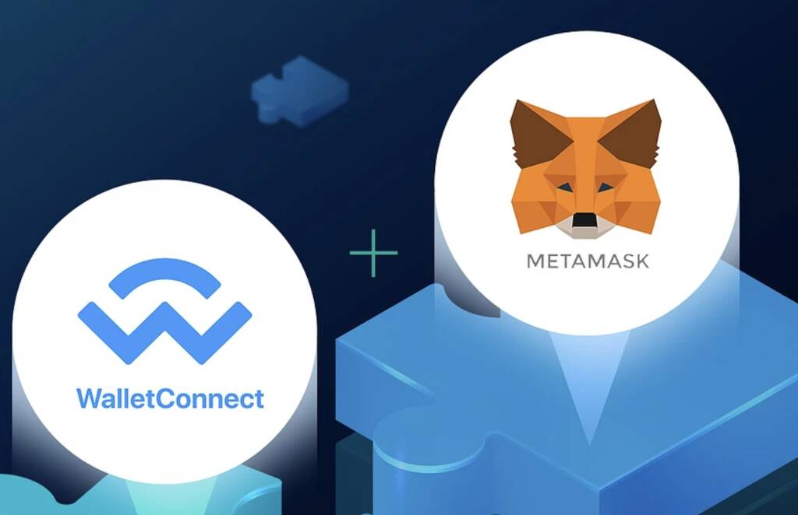
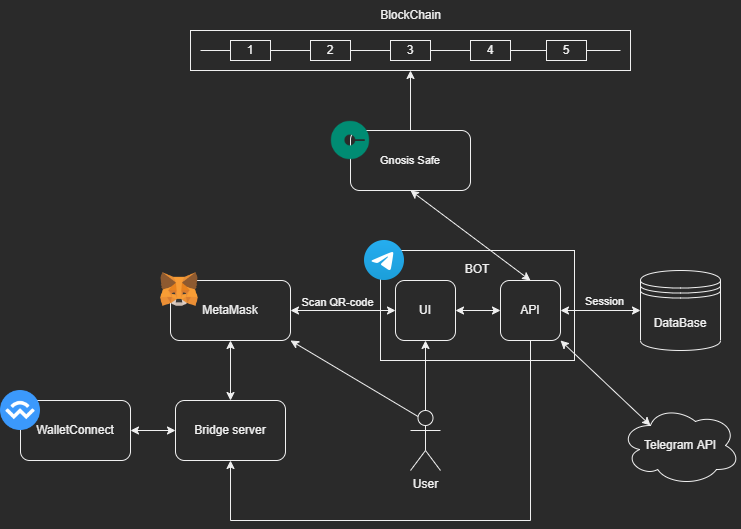
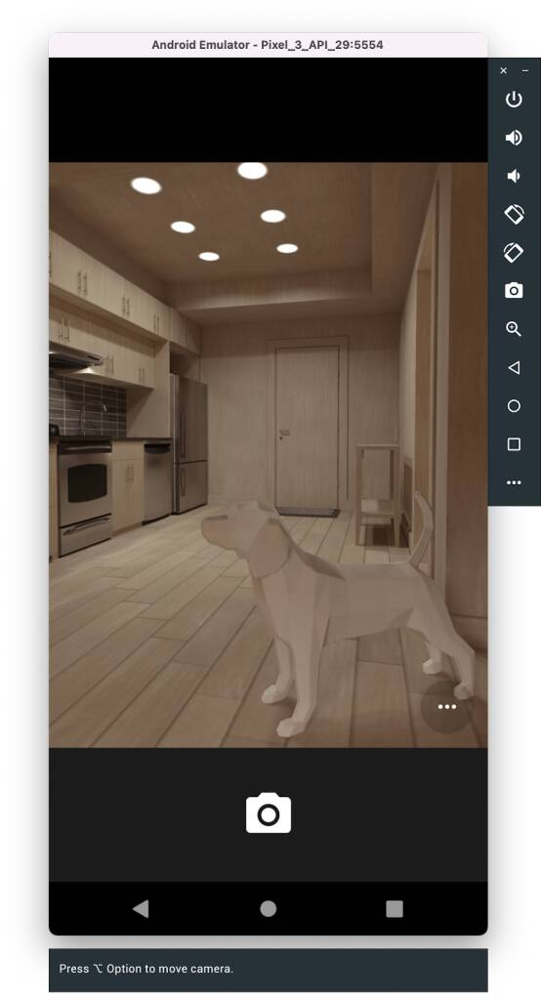
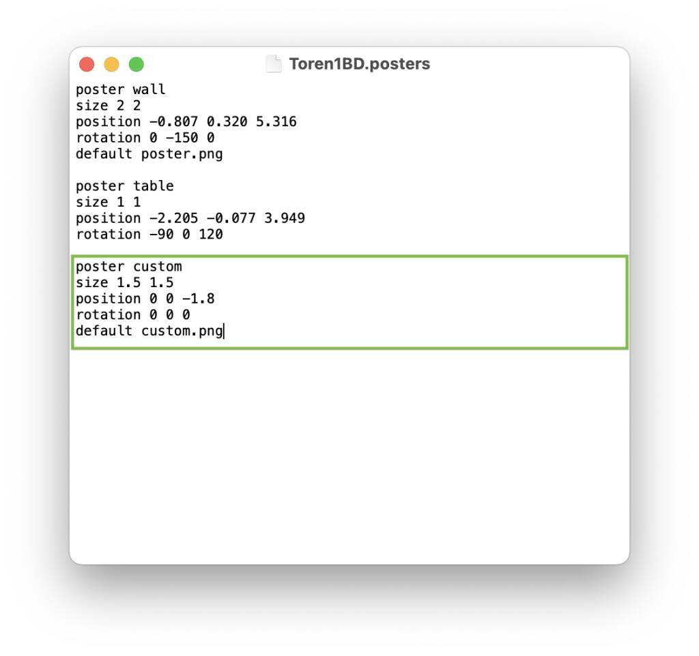
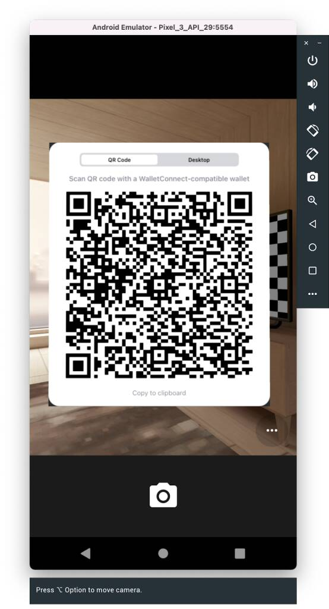
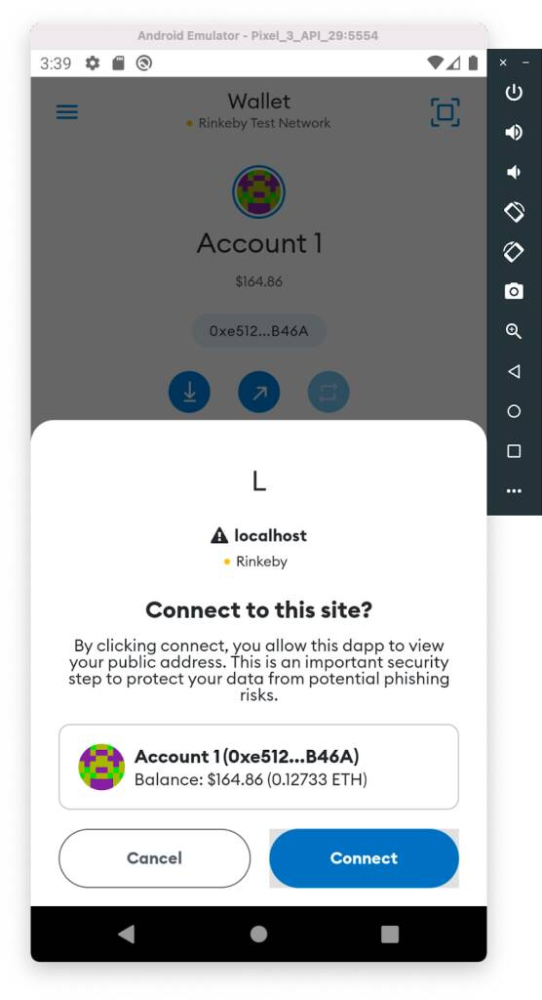
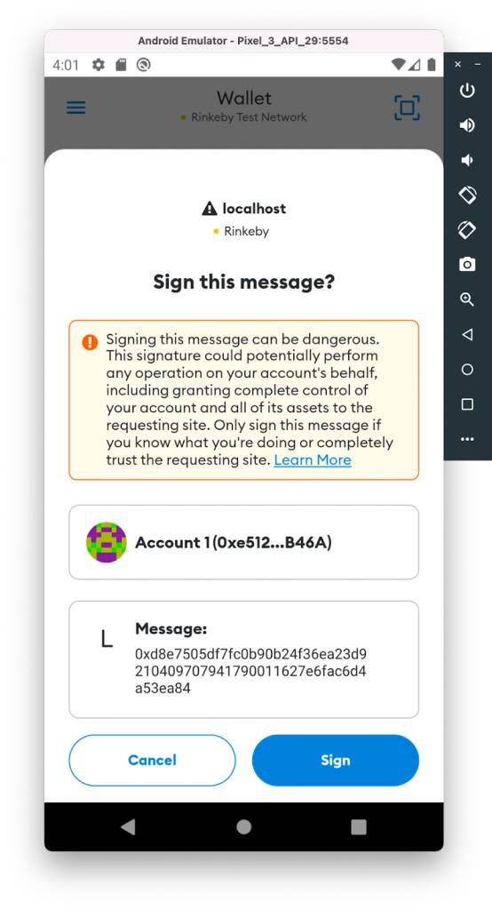
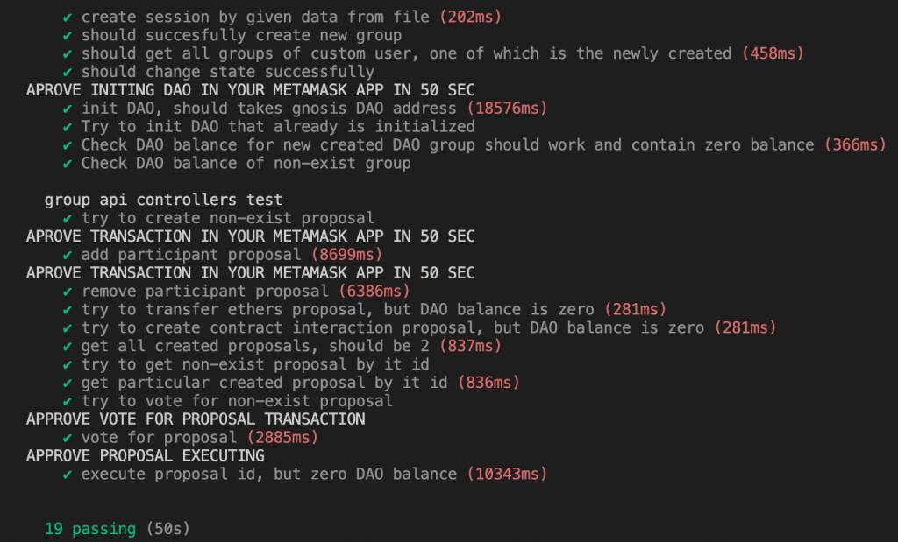
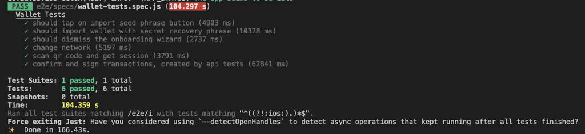

# E2E-тестирование подключения по WalletConnect между DApp и мобильным приложением Metamask

## Вступление

Тестирование приложений через сквозные (end-to-end) тесты сейчас довольно популярно. Этот вид тестирования позволяет оценить работоспособность приложения со стороны пользователя. Поэтому компания, в которой я работаю, внедряет этот вид тестирования в проекты.

Летом 2022 года мы разрабатывали блокчейн приложение. Моя задача заключалась в проведении end-to-end тестирования DApp [Децентрализованное приложение — приложение, которое базируется на технологии блокчейн совместно с механизмом распределенного выполнения необходимых инструкций]. Но мы столкнулись с проблемой - готовых решений для проведения end-to-end тестирования DApp нет. Эта статья о том, как мы решали эту проблему.




Задачей проекта, над которым мы работали, была разработка Telegram-бота для взаимодействия с Gnosis Safe. Gnosis Safe  является безопасным способом управления криптовалютными средствами. Также, Gnosis Safe - это система, позволяющая создавать DAO (децентрализованная автономная организация). Сервис позволяет ее участникам управлять организацией с помощью proposal (предложений), где выполнение каждого пропозала определяется коллективным голосованием, без центрального органа управления. Так, любой пользователь внутри данной системы может создать proposal на добавление нового участника DAO или выполнения метода смарт-контракта, за который голосуют другие участники DAO. Когда количество проголосовавших переходит некий порог, то в блокчейне создается и выполняется транзакция. Бот состоит из [Web App](https://core.telegram.org/bots/webapps). Для обработки полученных команд разработан API и настроена интеграция с мобильным приложением Metamask при помощи WalletConnect. Приложение Metamask используется для подтверждения или отклонения транзакции, а WalletConnect обеспечивает подключение нашего приложения к криптокошельку.

Для начала немного расскажу, как происходит взаимодействие пользователя с DAO в Gnosis Safe с помощью бота.
1. Создаем группу в Телеграме и добавляем туда бота
2. Выполняем все шаги для инициализации DAO
3. Открываем UI в боте
4. С помощью приложения Metamask сканируем сгенерированный QR-код
5. В приложении Metamask подтверждаем запрос на подключение
6. Выбираем нужное действие в UI бота (например, перевод эфира со счета нашего DAO на другой счет)
7. Открываем приложение Metamask и во всплывающем окне подтверждаем транзакцию

В результате был разработан бот с собственным графическим интерфейсом и API для него. API получает запросы от UI на создание и выполнение пропозалов в Gnosis Safe, который в свою очередь и взаимодействует с DAO, который был в нем создан. На рисунке изображена схема взаимодействия сервисов в проекте.



Для меня (как и для многих, пожалуй) это дебри, в которые погружаться страшно, но интересно. От меня требовалось создать автоматизированные тесты для проверки подключения нашего приложения к Metamask по протоколу WalletConnect и проверки возможности создания транзакций после этого. То есть нужно пройти все этапы взаимодействия пользователя с нашим приложением - от сканирования QR-кода, до успешного коннекта, после которого можно отправлять запросы и видеть уведомления.


> Но с приложениями на блокчейне есть проблема - их мало кто тестирует через сквозные тесты, так как для этого имеется мало подходящих опциональных инструментов. В нашем случае проблемой стало использование мобильного приложения Metamask, вместо браузерного расширения.

Я начал искать решения и здесь мое гугление, которое обычно не заходит дальше первой страницы, дошло до пятой, но результата так и не дало. Я не нашёл ни статей, ни наглядных примеров, ни стоящих инструментов под свою задачу. Всё что было, это вопросы от таких же тестировщиков. Поэтому я решил реализовать свое решение. Я выделил 2 основных фактора, которые привели меня к разработке своего решения:

- API Metamask не предоставляет возможность установить соединение с помощью WalletConnect через мобильное приложение. Поэтому иным способом, кроме как сканировать QR-код это не сделать. Это означало, что без работы с пользовательским интерфейсом не обойтись.
- отсутствие E2E-фреймворков под нашу конкретную задачу. Есть Synpress и Dappeteer (по сути, расширения для популярных Сypress и Puppeteer), но они предназначены для тестирования взаимодействия DApp с MetaMask в качестве браузерного расширения. А у нас, напомню, работа идет только с мобильным приложением.

Поэтому было принято решение использовать эмулятор смартфона для установки на него приложения Metamask и взаимодействовать с ним используя библиотеку Detox.

## Начало настройки проекта:

Мы клонировали себе репозиторий [metamask-mobile](https://github.com/MetaMask/metamask-mobile). Сперва, хотелось все это запустить у себя на машине и посмотреть, как работают сквозные тесты, которые уже были написаны разработчиками на фреймворке Detox. Для этого в репозитории есть инструкция, которую в первую очередь нужно проанализировать, чтобы понять, подходим ли мы по системным требованиями и что нам понадобится установить. Сразу видим, что приложение можно запустить только на MacOS или Linux.

Теперь можно начать установку и настройку проекта. Сейчас нам нужно выбрать на какой мобильной операционной системе оно будет запускаться. Мы выбрали Android, т.к. имели опыт работы с ним. Ставим Android Studio IDE, и согласно инструкции создаем эмулятор Google Pixel 3. В ридми не указано какую версию API нужно использовать, у нас все заработало на версии 29. На более свежих версиях Detox не мог взаимодействовать с элементами интерфейса в приложении.

После этого нужно выполнить все yarn команды из ридми. Далее можно запускать Metamask в эмуляторе как обычное react-native приложение с помощью команды yarn start:android. Однако, выполнив команду для запуска Detox тестов yarn test:e2e:android мы получили ошибки. Для того, чтобы всё правильно заработало, пришлось внести некоторые изменения в [пакеты](https://github.com/TourmalineCore/Metamask.DetoxTests/pull/1/files#diff-7ae45ad102eab3b6d7e7896acd08c427a9b25b346470d7bc6507b6481575d519) и [скрипты запуска](https://github.com/TourmalineCore/Metamask.DetoxTests/pull/2/files#diff-3d64996115d0ac3b74e36f57ce6b00d6b4982614c41b1ed39eab8ef43b2e9a2b).

Наконец, можно было начать переделывать тесты под себя: удалить все тестовые кейсы и оставить один, связанный с авторизацией в кошелек. Для полного покрытия нужного нам сценария осталось добавить:

1. Нажатие на кнопку сканирования QR-кода
2. Ожидание сканирования QR-кода и появления уведомления о подключении
3. Нажатие на кнопку одобрения подключения к нашему DApp
4. Запуск API-тестов
5. Ожидание появления уведомлений о транзакциях, созданных API запросами
6. Нажатие на кнопку подтверждения этих транзакций

Для реализации некоторых пунктов понадобилось сделать отдельный проект; для сканирования QR-кода пришлось делать скриншот при помощи Cypress, а на API написать тесты. Но обо всем по порядку.

## Сканирование QR кода:

QR-код сканируется с помощью специального сканера внутри приложения Metamask. Этот сканер использует камеру смартфона для считывания. Но как это будет выглядеть в эмуляторе? Разработчики Android Studio это предусмотрели и сделали виртуальную сцену, как бы эмуляцию реального взаимодействия с внешним миром. Выглядит это будто в игре: вы находитесь в некой квартире, можете по ней ходить, вертеть камерой. В настройках эмулятора можно добавлять свои изображения на специальные темплейты, находящиеся в квартире, например, на доске. Это может пригодиться для сканирования QR-изображений.



Я задался вопросом - как в автоматическом режиме без моего участия отсканировать изображение QR-кода, которое я заранее поместил на одном из темплейтов? И наткнулся на очень простое решение. 

- В папке _Library / Android / sdk / emulator / resources_ есть файл под названием *_Toren1BD.posters_*. В нем хранится информация о местоположении темплейтов в пространстве, на место которых можно вставлять свои изображения.
- Этот файл нужно открыть и добавить туда следующие строчки:

- Переименовать снимок QR-кода в **custom.png** и поместить в директорию с этим файлом

Теперь при открытии камеры у нас появляется изображение, которое мы хотим отсканировать.



Но как мы можем автоматически получать скриншот QR-кода с нашего приложения? Тут к нам на помощь приходит Сypress. Можно создать один небольшой тест, который сделает снимок нужного нам компонента с изображением QR-кода:

```javascript
const QR_CODE_SELECTOR = '.walletconnect-modal__base';
 
describe('Qr-code screenshot test', () => {
 
 it('take qr-code screenshot', () => {
   cy.visit('http://localhost:3000');
   cy.contains('Connect').click();
   cy.get(QR_CODE_SELECTOR).screenshot('qrcode');
  });
});
```

Скриншоты сохраняются в папке _/screenshots_, откуда мы в дальнейшем при помощи скриптов будем их доставать, переименовывать и перемещать в папку с плейсхолдерами. Код для сканирования QR-кода можно найти в [репозитории](https://github.com/TourmalineCore/DAO-service.Api-service-tests).

Также, сразу после скриншота, нам бы сразу хотелось перетащить получившееся изображение в директорию _/resources_. Для этого, в Cypress есть плагины, изменяющие или расширяющие его внутреннее поведение, к примеру эвент _after:screenshot_. Добавление плагинов происходит через функцию ` setupNodeEvents(on, config)`, в которую мы добавляем слушателей, которые триггерятся на заданные ему события и выполняют инструкции, описанные внутри. Прежде всего, напишем скрипт, который переносит скриншот в нужную нам директорию:

```bash
#!/bin/bash
 
CYPRESS_DIRECTORY="$HOME/Documents/dao-api-tests"
RESOURCES_DIRECTORY="$HOME/Library/Android/sdk/emulator/resources"
 
# move and renamed qr-code image in resource directory
cd $CYPRESS_DIRECTORY/cypress/screenshots/login.spec.cy.js
mv qrcode.png $RESOURCES_DIRECTORY/custom.png
```

И потом добавим функцию `setupNodeEvents` в файл конфигурации Cypress **cypress.config.js** и в нее эвент, запускающий скрипт после скриншота.
> **ВАЖНО**: Если у вас версия Cypress ниже 10.0, то добавление плагинов происходит в файле **index.ts** директории _plugins_.

``` javascript
const { exec } = require('child_process');
 
module.exports = defineConfig({
 
  e2e: {
    /*
    some configs
    */
    setupNodeEvents(on, config) {
      on('after:screenshot', (details) => {
        exec('sh moveScreenshot.sh');
      });
    },
  }
});
```

Хорошо, допустим мы отсканировали код и установили соединение. А что дальше? Следующим шагом нам нужно получить данные о сессии, которые получает наш DApp. В дальнейшем, сессия будет нужна нашему API-сервису для отправки запросов.

## Получение сессии:

Как было сказано ранее, WalletConnect устанавливает связь между двумя узлами - DApp и криптокошельком пользователя (в нашем случае Metamask). Когда пользователь нажимает на кнопку “Connect” в приложении, отображается QR-код, который нужно сканировать приложением Metamask для подключения кошелька к приложению. Metamask сканирует QR-код и расшифровывает данные запроса на соединение и показывает данные этого запроса пользователю. Далее пользователь может отклонить или одобрить установление соединения.



В случае успешного подключения, создается сессия. Благодаря сессии, Metamask сможет получать уведомления с предложением подписать или отклонить транзакцию, созданную с помощью DApp. В нашем случае требуется сохранять сессию в базе данных через вызов API метода. Это необходимо для того, чтобы при подписании транзакции отобразить запрос в приложении Metamask. Для этого сохраненная сессия используется в  провайдере, который предоставляет WalletConnect.

Успешные запросы на логин и рефреш вернут JSON в следующем виде:
```json
{
    "userId": 123456789,
    "session": {
        "connected":true,
        "accounts":["0x2D0805dB07BED54AFC3EBED54AFC3EBED54AFC3E"],
        "chainId":4,
        "bridge":"https://g.bridge.walletconnect.org",
        "key":"4aeb243c3ec2aa1739ad7def514aeba43a20ab117a354cdaf8f04aeb6e4aeb32",
        "clientId":"acd8a6e0-403a-403a-403a-17105368cc9e",
        "clientMeta":{
            "description":"DAO telegram bot",
            "url":"http://localhost:3000",
            "icons":["https://walletconnect.org/walletconnect-logo.png"],
            "name":"DAO"
        },
        "peerId":"56ea8258-6480-6480-6480-194b062944c1",
        "peerMeta":{
            "description":"MetaMask Mobile app",
            "url":"https://metamask.io",
            "icons":["https://raw.githubusercontent.com/MetaMask/brand-resources/master/SVG/metamask-fox.svg"],
            "name":"MetaMask",
            "ssl":true
        },
        "handshakeId":5678123456781234,
        "handshakeTopic":"2996df1f-6a42-6a42-6a42-78bb145cb858"
    }
}
```
Таким образом, при каждом новом запуске Metamask в эмуляторе для автоматизации отправки запросов нам нужно каждый раз устанавливать соединение между кошельком и сервисом. То есть каждый запуск нужно сохранять новую сессию. В репозитории мы добавили простейшую реализацию (_dao-service-stub_) UI для отображения QR-кода. В коде можно найти обработчик события onConnect. В нем мы будем получать сессию после того, как в Metamask подтверждено подключение. Далее, нам нужно передать сессию в API. Для этого вызываем эндпоинт сохранения сессии.

``` javascript
axios.post(`${BASE_URL}/walletConnectSessions`, connector.session, {
       headers: { 'TelegramData': JSON.stringify(telegramData) }
     });
```
Здесь TelegramData представляет из себя объект:

``` json
{
  "query_id":"AAE3SfY-AAAAADdJ9j4QITp1",
  "user":"{\"id\":1056327991,\"first_name\":\"Ivan\",\"last_name\":\"Ivanov\",\"username\":\"Ivanchelo\",\"language_code\":\"en\"}",
  "auth_date":"1658988403",
  "hash":"6f19e07c5fa68c540d55403bc475df4358ad04a8d532e1913260e9228241d5b3"
}
```

При этом стоить помнить, что API должен быть запущен. Его мы тоже запускаем с помощью скрипта перед запуском Cypress для сканирования кода. После удачного подключения сессия сохраняется в базе данных.

## API-тесты:

Чтобы была возможность проверить успешность подключения по WalletConnect и работоспособность запросов, важно запустить E2E API-тесты. Их цель пройти базовый флоу от создания и инициализации ДАО, до создания транзакций, взаимодействующих с Gnosis Safe DAO. Запросы на перевод токенов, на добавление сотрудников в DAO и так далее, должны сопровождаться получением уведомлений с предложением подписать или отклонить транзакцию в приложении Metamask. После подтверждения транзакция идет в блокчейн, а ее ответ приходит в наш API-сервис, за счет того же WalletConnect.

Для написания тестов на API мы выбрали Pactum JS, так как это достаточно простой, но мощный инструмент. Раннером тестов выбрали Mocha.

Если ответ не был получен за 3 секунды, то любой запрос падает. Это нужно учитывать, ведь любому тесту, создающему транзакцию, попросту не хватит этого времени. Так что необходимо изменить значение тайм-аута до 50 секунд - именно столько времени в среднем хватает на получение ответа. 
Вот пример кода, который увеличивает тайм-аут запроса:

Добавить модуль _request_:

``` javascript
const { request } = require('pactum');
```

А затем добавить следующую строчку в любом месте перед тестами:

``` javascript
request.setDefaultTimeout(50 * 1000); // 50 sec delay while user signed transaction
```

Пример одного из запросов на инициализацию DAO:

```javascript
it('init DAO, should takes gnosis DAO address', async () => {

  const requestBody = {
    "groupId": mockGroupId,
    "owners": mockParticipantsList,
    "threshold": 1
  };

  console.log("APROVE INITING DAO IN YOUR METAMASK APP IN 50 SEC")

  await spec()
    .post(`/groups/initDao`)
    .withHeaders('telegramData', JSON.stringify(mockPersonalTelegramData))
    .withJson(requestBody)
    .expectStatus(201)
});
```

После отправки в тестах запроса, например, для перевода токенов мы увидим в эмуляторе всплывающее окно с просьбой подписать сообщение:



Теперь любой тест будет ожидать ответ в течение 50 секунд. В конечном итоге мы получили сквозные API тесты, которые имитируют базовый сценарий пользователя: создание группы, инициализация ДАО, создание пропозала, голосование за пропозал и др. Код тестов можно посмотреть в [репозитории](https://github.com/TourmalineCore/DAO-service.Api-service-tests/tree/master/test).



Теперь все блокеры можно считать разрешенными и можно переходить к нашей основной цели -  написанию E2E теста, в котором всё свяжется воедино.

## Детокс-тесты:

Когда все сделано, остается переделать Detox тесты под свою задачу. Само приложение написано на React Native, в котором используется компонентная структура. Поэтому нужно было найти нужные для нас компоненты:

- кнопка открытия камеры для сканирования QR кода
- модальное окно подтверждения подключения и кнопка его одобрения
- модальное окно подтверждения транзакции и кнопка его одобрения
- модальное окно подтверждения сообщения и кнопка сообщения

и добавить в них дополнительный пропс testId (если он отсутствовал), для удобного взаимодействия с ними в тестах. Изменения можно посмотреть в [репозитории](https://github.com/TourmalineCore/Metamask.DetoxTests/pull/5).

Теперь осталось только добавить нажатие на соответствующие кнопки. Для этого мы использовали уже написанные разработчиками MetaMask тестовые хелперы, например, `waitAndTap`: 

``` javascript
static async waitAndTap(elementId, timeout) {
   await waitFor(element(by.id(elementId)))
     .toBeVisible()
     .withTimeout(timeout || 8000);
 
   return element(by.id(elementId)).tap();
 }
```

Пример использования:

``` javascript
const SIGNATURE_CONFIRM_BUTTON = 'request-signature-confirm-button';
await TestHelpers.waitAndTap(SIGNATURE_CONFIRM_BUTTON);
```

Наши тесты практически готовы. Остается приправить наш основной сценарий вышеуказанными решениями, чтобы весь цикл работы не блокировался.

# Баш-скрипты:

Когда все готово, нам нужно запустить все тесты в виде пайплайна. Для этого мы написали bash-скрипты. Таким образом, у нас получится запустить главный (родительский) поток теста Detox, а также параллельно ему запускать дочерние - сканирование QR-кода и отправка запросов через API.

Я выделил три необходимых скрипта:

1. Скрипт, который запускает UI, API и Redis для хранения сессий
``` bash
#!/bin/bash
 
API_DIRECTORY="$HOME/Documents/dao-api-service"
METAMASK_DIRECTORY="$HOME/metamask-mobile"

# get the database up
cd $API_DIRECTORY
docker-compose up -d
 
# run UI and API
cd $METAMASK_DIRECTORY
npm run all-for-tests
```
_docker-compose up -d_ запускает контейнеры с базой данных, а _npm run all-for-tests_ запускает параллельно несколько npm скриптов, в данном случае запуск UI и API.

``` json
"run-api": "cd $HOME/Documents/dao-api-service && yarn start:dev",
"run-ui": "cd $HOME/Documents/dao-api-tests/dao-service-stub && npm start",
"all-for-tests": "npm-run-all --parallel run-ui run-api"
```

2. Скрипт на очистку директорий от старого скриншота и Запуск Cypress теста, делающего скриншот QR-кода:

```bash
#!/bin/bash
 
QR_CODE_DIRECTORY="$HOME/Library/Android/sdk/emulator/resources"
CYPRESS_DIRECTORY="$HOME/Documents/dao-api-tests"
 
# clear qrcode in resources directory
cd $QR_CODE_DIRECTORY
rm custom.png

# clear qrcode in cypress directory
cd $CYPRESS_DIRECTORY/cypress/screenshots/login.spec.cy.js
rm qrcode.png
 
# make a screenshot of qrcode by cypress
cd $CYPRESS_DIRECTORY
npx cypress run --headless --browser chrome
```

3. Скрипт для запуска API тестов
```bash
#!/bin/bash
 
APITEST_DIRECTORY="$HOME/Documents/dao-api-tests"
 
# run API-tests
cd $APITEST_DIRECTORY
npm test
```

Эти баш скрипты будем запускать параллельно с запуском Detox. Для этого в главном тестовом файле _e2e/specs/**transactions-test.spec.js**_ в проекте Metamask подключаем метод `exec` из модуля `child_process`. Он создает оболочку shell и выполняет команду, переданную в нее:

```javascript
import { exec } from 'child_process';
```
Сначала нужно запустить скрипт `exec('./scripts/prepare-services.sh')`, чтобы запустить API и UI, затем `exec(‘sh ./scan-qr-code.sh’)`, чтобы вырезать QR-код и вставить его на фон камеры эмулятора и отправить сессию. После этого выполняются Detox тесты для сканирования кода. Затем проходят тесты по созданию нового счета и так далее. Следующим этапом выполняется скрипт для запуска API-тестов - `exec('sh ./run-api-tests.sh')`. При этом, для всех этапов Detox тестов указаны задержки и методы, с помощью которых проверяется рендер нужных компонентов в интерфейсе (всплывающие окна, кнопки и так далее). Да, установка задержек не лучший вариант. Но в данном случае, возможно, единственный, который позволит провести такого рода тестирование. Ниже приведен код, позволяющий с помощью Detox подтвердить запрос на подписание транзакции, которая была создана на стороне API:

```javascript
const SIGNATURE_MODAL = 'signature-modal';
const SIGNATURE_CONFIRM_BUTTON = 'request-signature-confirm-button';
const TRANSACTION_MODAL = 'txn-confirm-screen';
const TRANSACTION_CONFIRM_BUTTON = 'txn-confirm-send-button';

it('confirm and sign transactions, created by api tests', async () => {

  TestHelpers.delay(5000);
  exec('./scripts/start-api.sh');

  // 1st of 5 transactions
  await TestHelpers.checkIfVisible(TRANSACTION_MODAL);
  await TestHelpers.waitAndTap(TRANSACTION_CONFIRM_BUTTON);

  // 2nd of 5 transactions
  await TestHelpers.checkIfVisible(SIGNATURE_MODAL);
  await TestHelpers.swipe(SIGNATURE_MODAL, 'up', 'fast');
  await TestHelpers.waitAndTap(SIGNATURE_CONFIRM_BUTTON);

  // 3rd of 5 transactions
  await TestHelpers.checkIfVisible(SIGNATURE_MODAL);
  await TestHelpers.swipe(SIGNATURE_MODAL, 'up', 'fast');
  await TestHelpers.waitAndTap(SIGNATURE_CONFIRM_BUTTON);

  // 4th of 5 transactions
  await TestHelpers.checkIfVisible(SIGNATURE_MODAL);
  await TestHelpers.swipe(SIGNATURE_MODAL, 'up', 'fast');
  await TestHelpers.waitAndTap(SIGNATURE_CONFIRM_BUTTON);

  // 5th last transactions
  await TestHelpers.checkIfVisible(TRANSACTION_MODAL);
  await TestHelpers.waitAndTap(TRANSACTION_CONFIRM_BUTTON);
  });
```

## Итоги:

Теперь, помимо родительского потока Detox, взаимодействующего с пользовательским интерфейсом, параллельно, в качестве дочернего процесса, запускается тест для получения скриншота QR-кода. Этот поток успевает полностью выполниться до того, как начнется сканирование. После сканирования QR-кода и успешного получения сессии WalletConnect, запускаются API-тесты. Здесь остаётся дождаться появления уведомлений и их одобрения. Взаимодействие с приложением и реакция на уведомления происходит в главном потоке Detox тестов.

Решение не совсем очевидное и не очень элегантное, но благодаря такому подходу теперь мы можем совокупно запускать эти тесты для автоматизированной проверки всего user flow в такого рода приложениях, где совместно используются сторонние мобильные приложения и веб-сервисы.



Мы залили наше решение в репозитории с инструкциями по запуску - [API-сервис](https://github.com/TourmalineCore/DAO-service.Api-service); [тесты](https://github.com/TourmalineCore/DAO-service.Api-service-tests) на скриншот и на API; [тесты](https://github.com/TourmalineCore/Metamask.DetoxTests) на Detox. Надеюсь, кому-нибудь данная статья окажется полезной.