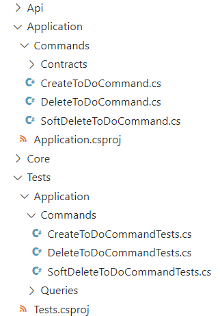
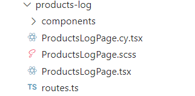
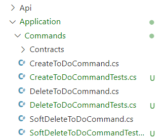

# Как сделать Unit-тестирование в .NET проще и интереснее?


Писать тесты не всегда самое интересное занятие. Если вы не работаете по TDD, то такие проблемы как отсутствие тестов, их малое количество и их устаревшая версия вам знакомы. Но почему так происходит? Давайте разбираться.

На бэкенде для тестов мы в Tourmaline Core создаем проект xUnit, если пишем на C#. Наши тесты пишутся на все слои приложения: Api, Application, DataAccess и Core (он же Domain), если есть логика, описанная в модели. Чтобы как-то всё структурировать, мы воссоздаем эти слои в проекте с тестами, кидая всё в папки с соответствующими названиями:




Первая проблема, которая появляется при таком подходе — дублирование. Нам нужно полностью повторить структуру папок проекта. Это неудобно, и делать так в каждом проекте слишком долго и трудозатратно. 

Вторая проблема — эти тесты просто не видно. Проект лежит внизу, и когда-то написанные тесты забываются и не обновляются при необходимости. Например, после рефакторинга класс, у которого есть тесты, переименовался или даже переместился в иерархии папок на новое место. Если вы забыли сделать аналогичные изменения в именовании и иерархии в проекте с тестами, то этот код останется устаревшим. 

И как тогда улучшить процесс добавления новых тестов и обновления старых?

На фронтенде эти проблемы уже решены:
- структура не дублируется (повторяется только название тестируемого компонента);
- файлы с тестами всегда на виду — они лежат прямо рядом с компонентом, который тестируется.




Выше показан пример, где тесты для `ProductsLogPage.tsx` лежат в той же папке и названы также, но с другим тестовым расширением, в данном случае  — `cy.tsx`.
Мы подумали — может такой подход можно реализовать и на бэкенде? Давайте попробуем.

Первое, что мы заметили: отдельный проект с тестами на xUnit необязателен для запуска тестов. Вполне достаточно установить библиотеки для тестирования в проект с функционалом и запускать тесты командой `dotnet test`. Эта команда запустит все тесты, найденные в солюшене (а значит, во всех слоях приложения). Это нам и сыграет на руку. 

Мы скопировали тесты из отдельного проекта и положили их рядом с тестируемыми классами, прямо как на фронтенде:




Для любителей чистоты сборок при таком решении ещё есть над чем поработать… Приложение когда-нибудь, да задеплоится на прод. Но у нас там и библиотеки для тестов, и сами тесты. Кажется, что в продакшн-сборке они не нужны, так как тесты мы запускаем только вручную или в пайплайне перед билдом образа для деплоя. И с этой мыслью мы пошли искать способ удалить всё лишнее из продовской сборки, чтобы её не нагромождать.

## Docker Ignore
Самое очевидное решение — использовать `.dockerignore` файл, чтобы исключить файлы с тестами из сборки:

```yaml
# другие игнорируемые папки и файлы
*Tests.cs
# другие игнорируемые папки и файлы
```
Но и тут ждет подводный камень — библиотеки для тестирования останутся и будут занимать какое-то место. 

Мы посчитали, насколько тяжелой станет сборка с дополнительными пакетами: 
- вес библиотеки xUnit - 30.91 KB;
- вес библиотеки Moq - 815.29 KB;
- вес библиотеки Microsoft.NET.Test.Sdk - 33.5 KB.

Библиотеки мы можем и оставить, они сильно не перегружают образ. 
Этот вариант для вас, если вы не хотите усложнять себе работу.

## ItemGroup и Condition
Но мы решили пойти дальше и обнаружили интересную фичу, которая скрывается в файле проекта `.csproj`. И это параметр `Condition`, который нужно указать в блоке `ItemGroup`. Так мы создадим некое правило, по которому в проект будут или не будут включаться указанные внутри `ItemGroup` библиотеки. Кстати, таким образом можно исключить из билда ещё и файлы с тестами, не используя `.dockerignore`.

Чтобы реализовать такое решение, мы создали переменную `EXCLUDE_UNIT_TESTS_FROM_BUILD`, и указали её как `ARG` в Dockerfile.

```xml
<!-- Условие для исключения пакетов для тестирования -->
<ItemGroup Condition="'$(EXCLUDE_UNIT_TESTS_FROM_BUILD)' != 'false'">
	<PackageReference Include="xunit" Version="2.4.1" />
	<PackageReference Include="Moq" Version="4.16.1" />
	<PackageReference Include="Microsoft.NET.Test.Sdk" Version="17.10.0" />
</ItemGroup>
<!-- Условие для исключения тестовых файлов -->
<ItemGroup Condition="'$(EXCLUDE_UNIT_TESTS_FROM_BUILD)' == 'true'">
	<Compile Remove="**/*Tests.cs" />
</ItemGroup>
```

Почему мы используем именно **ARG, а не ENV**? Мы исключаем пакеты и/или файлы из **сборки**, следовательно, переменная должна работать именно как аргумент для сборки (`docker build`), а её значение мы можем брать из переменных среды, установленных на хост-машине. **ENV** применимо только тогда, когда нам нужно значение в момент выполнения приложения (`docker run`).

```bash
FROM mcr.microsoft.com/dotnet/aspnet:8.0 AS base
WORKDIR /app

FROM mcr.microsoft.com/dotnet/sdk:8.0 AS build
ARG EXCLUDE_UNIT_TESTS_FROM_BUILD=${EXCLUDE_UNIT_TESTS_FROM_BUILD}
# other Dockerfile lines…
RUN dotnet build "./example.csproj" \
-o /app/build /p:EXCLUDE_UNIT_TESTS_FROM_BUILD=$EXCLUDE_UNIT_TESTS_FROM_BUILD

FROM build AS publish
ARG BUILD_CONFIGURATION=Release
ARG ASPNETCORE_ENVIRONMENT=Production
RUN dotnet publish "./example.csproj" \
-o /app/publish /p:UseAppHost=false \
/p:EXCLUDE_UNIT_TESTS_FROM_BUILD=$EXCLUDE_UNIT_TESTS_FROM_BUILD
# other Dockerfile lines…
```

## Удаляем файлы с тестами внутри Dockerfile
Исключить пакеты для тестирования из билда получится только через `Condition` в `.csproj` файле, а вот файлы с тестами не включать в продовский образ можно ещё и третьим способом — мы таким же образом будем использовать переменную `EXCLUDE_UNIT_TESTS_FROM_BUILD` для сборки. Но все файлы с тестами изначально скопируем в контейнер. После этого мы сможем найти файлы с тестами в папке `/src` и удалить их. Это можно сделать в Dockerfile, используя блок `RUN`, который умеет обрабатывать условный оператор:

```bash
# Удаление файлов тестов, если аргумент установлен в true
RUN if [ "$EXCLUDE_UNIT_TESTS_FROM_BUILD" = "true" ]; then \
        find /src -type f -name '*Tests.cs' -exec rm -f {} +; \
    else \
        echo "Skipping unit test removal"; \
    fi
```

## Итоги
В итоге мы нашли три способа удалить лишние пакеты и файлы из продовской сборки (кстати, эта фича может быть полезна не только для описанного нами кейса). А еще мы изменили архитектуру папок и теперь файлы с тестами будут лежать рядом с тестируемыми классами. Такой подход поможет не забыть обновить тест после обновления функционала или напомнит о том, что на какой-то класс тестов всё ещё нет. А ещё так удобнее!

На наш взгляд, самым аккуратным, удобным и лаконичным решением будет исключить пакеты для тестирования и сами файлы с тестами с помощью параметра `Condition` в файле `.csproj`, чтобы управлять содержимым сборки с помощью всего одной переменной.

А как вы тестируете свой продукт? Какие методы используете для того, чтобы не терять тесты и держать их всегда в актуальном состоянии? Давайте обсудим это в комментариях :)

Авторы: Колесникова Анна, Шинкарев Александр</br>
Вычитка и фидбек: Ядрышникова Мария, Шинкарев Александр</br>
Оформление: Шур Маргарита</br>
