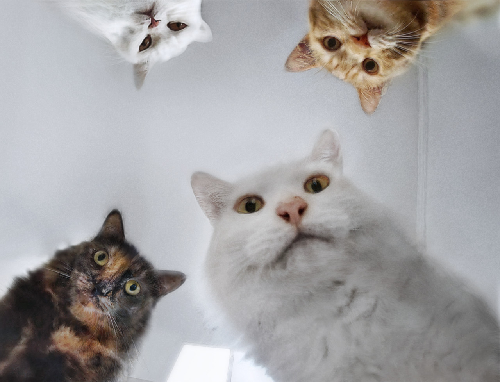
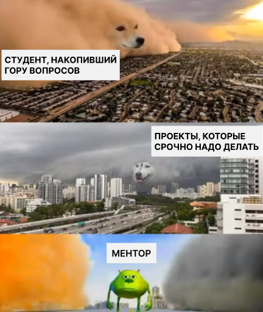
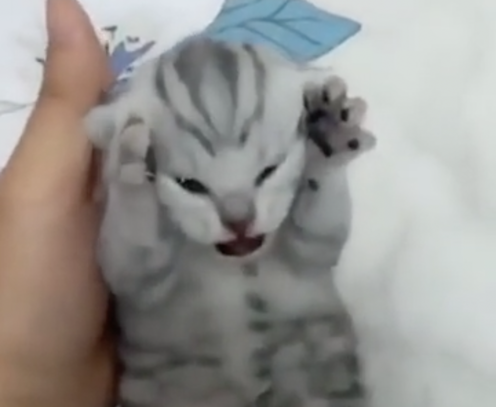
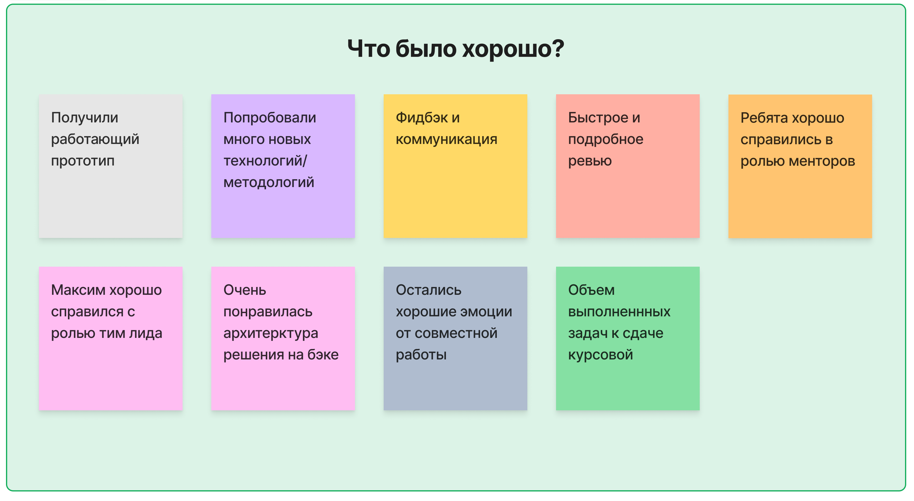
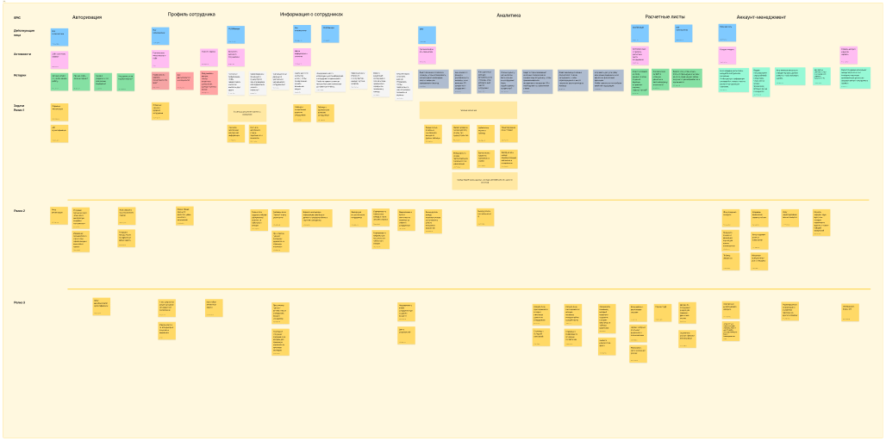
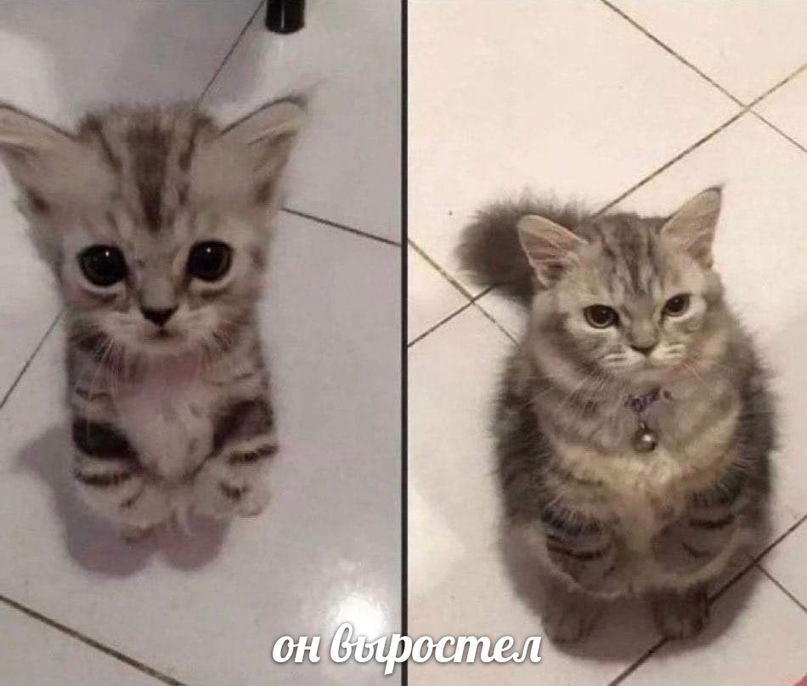
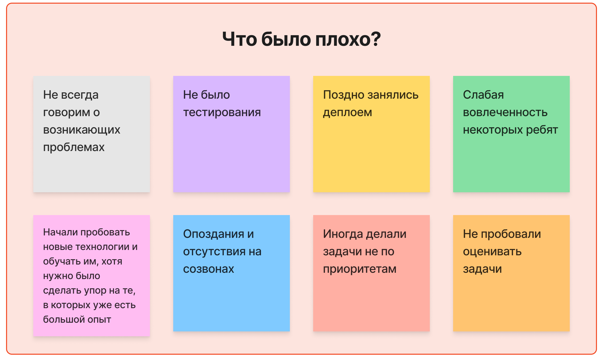
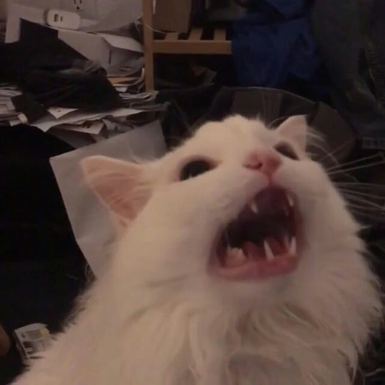
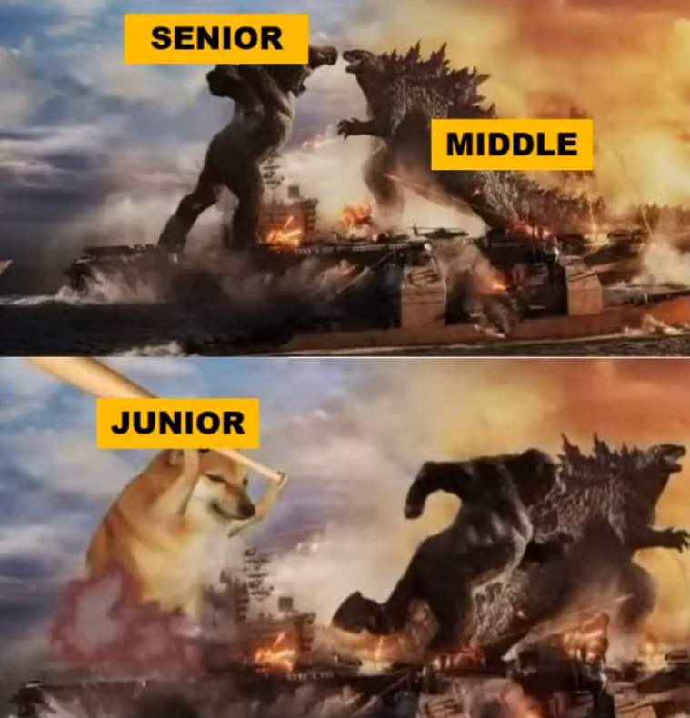

# Как стажировать студентов в IT

Наша компания занимается разработкой по разным IT направлениям. Осенью 2022 года нам написали студенты третьего курса из ЧелГУ, выразив желание поработать в нашей компании и выполнить задание для курсовой работы под нашим началом. Мы с воодушевлением поддержали эту идею и решили дать им возможность поработать над одним из наших внутренних проектов.

В этой статье мы поделимся нашим опытом взаимодействия и выстраивания процесса работы с новичками в сфере IT. Мы честно расскажем о достижениях и неудачах, с которыми столкнулись. Надеемся, что наш опыт вдохновит других не бояться брать новичков в свою команду.

## Задача

Первым делом нужно было решить, какую задачу мы можем поставить перед ребятами, учитывая, что на реализацию давалось всего лишь 3 месяца, у них не было опыта работы, а наша команда не могла выделить на проект полный рабочий день.

У нашего босса была идея разработать небольшой сервис для компании, который будет хранить информацию о сотрудниках и позволит строить финансовые прогнозы. Мы могли бы разработать сервис самостоятельно, но из-за клиентских проектов руки никак до него не доходили, и ноги тоже. Поэтому мы решили дать возможность студентам воплотить этот проект в жизнь и познакомиться с особенностями продуктовой разработки.

Нам также было интересно, есть ли среди них трудолюбивые и близкие нам по духу ребята, с которыми мы могли бы продолжить сотрудничество, предложив стажировку или работу после прохождения практики.

## Как строилась работа?

### Менторство и ревью

У каждого студента был ментор - сотрудник нашей компании, который делился своим опытом, отвечал на возникающие вопросы, давал советы и проверял работу. В начале проекта студенты выбирали направление, в котором они хотели себя попробовать, и к ним “прикреплялся” ментор по соответствующему направлению работы (девопс, фронтенд, бэкенд, дизайн). 

  

### Парное программирование
Иногда мы договаривались о встречах в офисе для того, чтобы разобрать поставленную задачу и вместе писать код. Такие встречи помогали нам погрузить ребят в рабочую атмосферу, а работа в паре облегчала процесс поиска и исправления ошибок, а также обмена идеями и знаниями. Также на таких встречах было проще объяснить, как работают (или не работают) те или иные технологии.

Благодаря такому подходу студенты быстрее обучались и выполняли задачи, а мы совершенствовали навыки наставничества. И, конечно же, обсуждение особенностей проекта за чашкой чая, печеньками и рисунками на доске, существенно укрепляло командный дух.

### Спринты
Мы работали в формате недельных спринтов. У ребят было всего 3 месяца на выполнение работы, а нам (менторам) нужно было следить за ними, не выпадая из рабочего процесса. Короткие спринты позволили нам чаще обмениваться обратной связью со студентами, корректировать направление работы и быстро реагировать на возникающие проблемы, не растягивая их решение.

Мы построили наш спринт таким образом:

  

* **Планирование.** В понедельник мы планировали и согласовывали цели на спринт, а также описывали задачи, необходимые для их достижения.

* **Sync созвон.** В среду проводили синхронизационный созвон, где обсуждали, на каком этапе находятся задачи, и нужно ли корректировать их приоритетность. Этот созвон помогал скоординироваться между направлениями и вовремя выявить проблемы.

* **Демо.** В пятницу проводили демонстрацию результатов недели заказчику (руководителю компании). На этой встрече мы согласовывали новый функционал, слушали пожелания и замечания, а также намечали план действий на следующую неделю.

* **Ретроспектива.** После демо мы проводили ретроспективу, где обсуждали со всеми участниками команды, что было хорошо, а что не очень на прошедшей неделе, и думали над тем, что можно улучшить в рабочем процессе.

## В чем заключался челлендж?

### Для менторов

Менторами были мы (сотрудники компании Tourmaline Core), однако опыта менторства студентов у нас еще не было.

В основном на работе мы менторили джуниоров в каких-то технических вещах, а на этом проекте нужно было обучить сразу 5 человек навыкам коммуникации, менеджмента, оценки задач и соблюдения сроков, помочь им не утонуть в тоннах материалов о неизвестных для них технологиях. 

Правильно выполнять роль ментора для нас было челленджем. Порой хотелось сделать все самостоятельно, чтобы закрыть задачи по-быстрее. Но мы напоминали себе, что наша задача заключается именно в том, чтобы показать ребятам реальный рабочий процесс, передать им свой опыт работы над проектами и знания, которые в будущем помогут им испытывать меньше стресса на работе.

    

### Для студентов

Для ребят этот проект тоже был сложной, но интересной практикой. Для них обыденные, с нашей точки зрения, командные процессы были в новинку: регулярные созвоны, изучение новых технологий в короткий срок, общение с заказчиком и подготовка к демонстрации проделанной работы каждую неделю, разбор ошибок на ретроспективе. Все это было непривычно для них, они не понимали, как себя вести, и в первое время боялись. Но об этом расскажем позже.

  

## Какие были трудности и как мы их преодолели?

От босса было наставление дать студентам возможность работать самостоятельно, но мы понимали, что это может привести к плачевным результатам и курсовую они не сдадут, ведь у ребят совсем не было опыта работы. 

Поэтому мы помогали им по мере возможностей, а иногда даже сверх возможностей. Казалось бы, хорошее отношение к ребятам и помощь в изучении новой информации, а также рабочий процесс, основанный на наших лучших практиках, должны были создать идеальные условия для максимально эффективной работы. 

Однако за эти три месяца мы столкнулись с проблемами, которые не смогли предвидеть на этапе планирования.

### Стеснение и коммуникация

<table>
    <thead>
        <tr>
            <th>Проблема</th>
            <th>Решение</th>
        </tr>
    </thead>
    <tbody>
        <tr>
            <td colspan="2" align="center">СТЕСНЕНИЕ</td>
        </tr>
        <tr>
            <td valign="top">В самом начале проекта студенты мало общались с нами, потому что стеснялись говорить о том, что что-то не получается, задавать вопросы лишний раз. Им было трудно общаться, потому что они боялись неправильно выразить свои мысли и чувствовали напряжение.</td>
            <td valign="top">Ментор должен проявлять понимание и помогать, если замечает, что человек  “зажат”. Важно не просто дать совет по задаче и уйти, а сесть рядом и объяснить, что не нужно бояться говорить о своих проблемах, если что-то не получается, не надо молчать о проблеме 4 дня - ничего страшного не случится, если попросить о помощи. Главное помнить, что любое неаккуратное слово может стать источником стресса для ребят.</td>
        </tr>
        <tr>
            <td colspan="2" align="center">СЛОЖНЫЙ ЯЗЫК</td>
        </tr>
        <tr>
            <td valign="top">Было сложно донести информацию до ребят, так как у них не было достаточного технического и жизненного опыта. Мы строили объяснения на основе вещей, которые казались нам очевидными, но они были совершенно неочевидны для ребят, поэтому им было тяжело воспринимать нас.</td>
            <td valign="top">Нужно говорить более простым языком. Чаще спрашивать ребят, что они не понимают, и приводить максимально простые примеры. Если нет возможности пообщаться лично, можно записать короткое видео или написать хорошо структурированное сообщение, чтобы человек мог пересмотреть и разобраться в интересующих его вопросах самостоятельно.</td>
        </tr>
        <tr>
            <td colspan="2" align="center">ОТСУТСТВИЕ ПОРЯДКА</td>
        </tr>
        <tr>
            <td valign="top">Студенты не очень активно пользовались доской, поэтому было непонятно, что в процессе разработки, что будет готово на этой неделе, а что нет.</td>
            <td valign="top">Ввели чат в Telegram и пинговали участников команды каждый день, чтобы не забывали делиться статусом выполнения задач, даже если ничего за день не поменялось.</td>
        </tr>
    </tbody>
</table>

### Время

Были трудности во взаимодействии друг с другом, так как ребятам нужно было находить время вне учебных занятий, в то время как мы работали полный рабочий день и занимались другими проектами.

<table>
    <thead>
        <tr>
            <th>Проблема</th>
            <th>Решение</th>
        </tr>
    </thead>
    <tbody>
        <tr>
            <td colspan="2" align="center">СТУДЕНТЫ</td>
        </tr>
        <tr>
            <td valign="top">Ребятам нужно было за короткий промежуток времени изучить много новой информации, включая технологии и методологии. Некоторые ребята недостаточно вовлекались, бывало даже, что они пропадали на некоторое время и не отвечали на сообщения, пропускали созвоны.</td>
            <td valign="top">Как правило, это были проблемы с учебой и просто недостаток времени из-за совмещения с университетом. Выяснив причину, мы старались реорганизовать процесс, например, идти им на встречу, меняя время созвонов и перераспределяя задачи.</td>
        </tr>
        <tr>
            <td colspan="2" align="center">МЕНТОРЫ</td>
        </tr>
        <tr>
            <td valign="top">Помимо менторства, у нас была основная работа, на которой держался максимальный фокус внимания. Кроме того, мы привыкли к тому, что коллеги всегда доступны и открыты к общению.</td>
            <td valign="top">Нам приходилось находить время между рабочими задачами, чтобы контролировать процесс разработки. Мы проводили созвоны и ревью в обед (а обедали по выходным), а после работы задерживались на полчаса-час. Одна полезная практика заключалась в том, чтобы накопить вопросы и обсудить их все сразу, вместо того, чтобы рассматривать каждый вопрос по мере его возникновения. Это позволяло нам избежать потери времени на переключение контекста. В общем-то, у нас не было ни одной свободной минуты, но было весело!</td>
        </tr>
    </tbody>
</table>

### Формулирование целей

<table>
    <thead>
        <tr>
            <th>Проблема</th>
            <th>Решение</th>
        </tr>
    </thead>
    <tbody>
        <tr>
            <td valign="top">В начале работы над проектом у студентов не было четкого понимания того, как правильно формулировать цели и достигать их, а мы не сразу заметили, что есть такая проблема. Это приводило к переходу задач из спринта в спринт и, в целом, замедляло разработку.</td>
            <td valign="top">Когда мы поняли, что такая проблема существует, мы стали целенаправленно учить ребят, откуда берутся цели недели, как их правильно формулировать и, самое главное, декомпозировать, чтобы они не давили на разработчика своей масштабностью. Такой подход помог студентам лучше ориентироваться в том, что им предстоит сделать, а менторам стало проще отслеживать прогресс.</td>
        </tr>
    </tbody>
</table>

## Впечатление от проекта

  

В первую очередь, следует отметить, что благодаря ребятам нам все-таки удалось создать прототип сервиса, на который у нас без них не хватало времени. Он мозолит нам глаза и сейчас мы его потихоньку дорабатываем, когда у разработчиков есть свободное время. Кроме рабочего сервиса из этой практики мы извлекли несколько полезных уроков. 

**Аналитика.** Мы потратили месяц на аналитику, но благодаря этому получили хорошее понимание проекта и смогли вникнуть в детали. 

На этапе аналитики мы опробовали методологию User Story Mapping, которая помогла нам разбить сложные задачи на более мелкие, определить основные потребности пользователей, приоритеты и последовательность задач.

Теперь мы используем USM в новых проектах и не просто создаем прототипы по маленьким требованиям, но также составляем карту и пытаемся охватить все, что хочет заказчик.

  

**Открыли нового тимлида в нашей компании.** Мы предоставили возможность нашему талантливому разработчику попробовать себя в роли тимлида, чтобы он мог получить опыт без финансовых рисков для компании, как это могло бы случиться на реальных проектах с заказчиком. 

Разработчик довольно уверенно взял команду в свои руки. Он принимал грамотные технические решения, успевал следить за всеми частями проекта и направлять ребят и менторов, при этом делегируя ответственность, где это было нужно. В общем, он повел себя максимально ответственно и показал, что может успешно выполнять эту роль. Теперь мы можем брать его на другие проекты в качестве тимлида без лишних переживаний о том, что он не справится. 

**Опыт менторства.** Мы были рады попробовать себя в роли менторов и обучать других. Положительный отклик от студентов показал, что мы делаем это не просто так. Ребята вникали в проект и набирались опыта на наших ошибках и рассказах, и это здорово. Было интересно взаимодействовать между собой и наблюдать, как растут ребята и сами менторы, а также как развивается наш свежий тимлид. 

  

**Делегирование.** Часто людям хочется сделать все самостоятельно, чтобы не тратить время на объяснения другому человеку. Однако, на этом проекте было важно, чтобы студенты делали все сами. Поэтому нам приходилось учиться делегировать. Несмотря на то, что мы могли бы спокойно обойтись без этого сервиса, ответственность за то, какую оценку получат студенты в университете, лежала на нас. Поэтому, когда у ребят возникали длительные трудности с задачами, руки так и тянулись быстро все сделать самим, тем самым спасти проект от провала и студентов от тройки. Благо мы запаслись линейками - это лучшее оружие против тянущихся к проекту рук.

Каждый раз приходилось останавливать себя и возвращаться к мысли, что мы должны дать им не просто отметку в аттестате, а жизненный опыт. Поэтому мы брали себя в руки, подготавливали материалы, объясняли всё, что только могли, и старались просто наблюдать, а затем исправлять ошибки на ревью раз за разом.

Теперь мы можем сказать, что это было правильным решением - ребята очень выросли за 3 месяца во многом благодаря нашему подходу. Ну а мы усвоили урок, что иногда можно пожертвовать сроками для того, чтобы неопытный специалист превратился в опытного. 

**Оптимизация работы.** Даже при значительном объеме работы и сжатых сроках можно создать очень хорошее решение. В начале проекта мы собрали все требования и идеи заказчика, создали User Story Map, но брали оттуда только самые ключевые функции, чтобы успеть в срок.

Оказалось, такой подход очень даже рабочий. Максимально упростив продукт, мы создали достойный прототип за относительно короткий срок, учитывая, что ребята были без опыта. В наших будущих проектах мы планируем пользоваться такой стратегией.

**Не принимать решение сразу.** Во время одного из наших демо мы предложили заказчику идею функционала, который позволит прогнозировать повышение зарплаты сотрудников. Однако он посчитал это решение ненужным, и мы сразу убрали его, не попытавшись отстоять. Чуть позже заказчик сам понял, что это была хорошая фича. 

Мы сделали вывод, что не всегда нужно соглашаться с заказчиком. Во-первых, необходимо защищать свои решения. Во-вторых, следует дать заказчику время на обдумывание вопроса. Это поможет избежать беспорядка (добавить-убрать-добавить) и недосказанности в общении.

## С чем мы не справились?

  

К сожалению, не всё прошло гладко. Не все проблемы, с которыми мы столкнулись, были решены в течение проекта. Что ж, над ними можно порефлексировать и извлечь из них уроки для будущих проектов. 

**Не было тестирования из-за сложностей с распределением ролей.** У нашего тестировщика возникла ситуация, когда фронт и бэк сильно загрузили студентов, и он не знал, с какой стороны к ним подойти. Он обещал, что будет тестирование и что будет интересно, но в итоге этого не произошло, потому что ребята были слишком заняты, и он не хотел добавлять им еще работы.

Позже ему дали студента, которого можно было менторить и погружать в процесс тестирования. Но студент сам не знал, чем хочет заниматься: то фронт, то бэк, то тестирование. Они встретились всего 1-2 раза, и в итоге тестирование на проекте было заброшено. Из-за того, что мы не обратили внимания на эту проблему, в конце проекта баги выскакивали во всех частях - это совсем не круто.  

Нам точно не хватило менеджерских скиллов, чтобы вовремя выявить проблему с распределении ролей. К слову, менеджер на проекте был, но об этом позднее.

**Выгнали одного студента из проекта.** Один студент, несмотря на наш контроль, совсем не вовлекался в проект: на созвонах говорил, что ему нечего сказать (или просто мог сказать, что ему неудобно говорить), его задачи почти не продвигались, а в конце концов перекладывались на другого студента. Мы сразу обратили на это внимание, но очень долго не предпринимали никаких действий, надеясь, что ситуация разрешится сама собой. 

Через два месяца (из трех) на одном из ретро мы поняли, что ситуация зашла слишком далеко, когда один из студентов от усталости признался, что уже давно делает задачи за двоих. С невовлеченным студентом мы провели отдельный созвон, на котором аккуратно поговорили и объяснили, что не можем продолжать работу с ним, потому что он тянет проект вниз. Наша ошибка была в том, что мы не поговорили с ним, когда проблема только-только появилась. Мы могли бы дать ему шанс исправиться, но довели до того, что пришлось его выгнать. Было неприятно как нам, так и ему.

  

**Работали без dev-окружения до конца проекта.** По идее, dev-окружение должно создаваться в самом начале проекта. Однако, мы задумались об этом только через месяц после начала практики (после того как сделали аналитику) и потеряли еще один месяц из-за того, что ответственный за эту задачу студент пропал на несколько недель из-за проблем по учебе. Мы вовремя не среагировали, и последний месяц ушел на то, чтобы разработчик с небольшими знаниями девопса объяснил студенту с нулевыми знаниями, как разворачивать окружение. 

В результате мы не смогли вовремя протестировать систему и увидели результат только в самый последний момент. На проект было потрачено много сил, но из-за отсутствия dev-окружения казалось, что мы работаем впустую.

**Некоторые из нас не ощущали себя менторами.** C нашей стороны не все справились с ролью менторов.

* Один из разработчиков просто показывал и рассказывал, что нужно делать, а затем давал возможность ребятам самим пробовать, не особо помогая разобраться в задаче.

* Тестировщик не справился с хаосом, который творился при распределении ролей, и не нашел себе заинтересованных подопечных, поэтому в итоге никого не менторил.

* У нас была новенькая менеджер, без опыта работы в сфере IT. На первых этапах она вовлекалась в аналитику проекта, сбор требований, но затем только наблюдала за происходящим, не понимая, как может повлиять на него. Отсюда проблема с распределением ролей и контролем происходящего.

  

## Вывод

Опыт работы с студентами показал нам, что в процессе совместной работы могут возникать различные сложности, однако они все решаемы. Теперь мы не боимся работать с новыми людьми, обучать их и помогать им.

После завершения курсовой мы взяли к себе дизайнера и бэкендера. Благодаря пройденному проекту, ребята были готовы к работе и уже знали, на что следует обратить внимание. Они устроились к нам не стажерами, а сразу в качестве джуниоров. 

Через пару месяцев к нам пришел студент, который выполнял на проекте обязанности менеджера и девопсера, но показал себя не с самой лучшей стороны из-за проблем с учебой. Тем не менее, он вернулся к нам на весеннюю практику в качестве тестировщика и сейчас справляется с задачами на отлично. 

Прототип сервиса разработали, ребят научили (кстати говоря, они получили 4 за курсовую), набрали джунов. Кажется, эксперимент удался!

____

Автор: Ковыляева Анастасия

Вычитка и фидбек: Шур Маргарита, Магденко Юлия