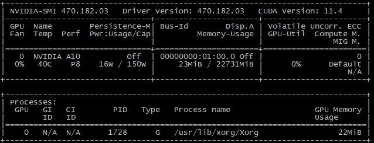
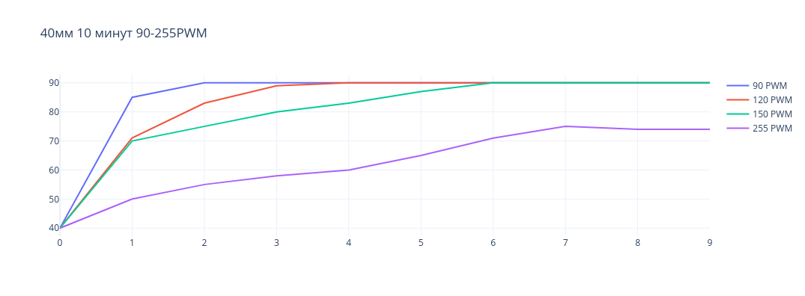
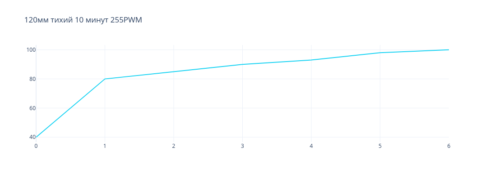
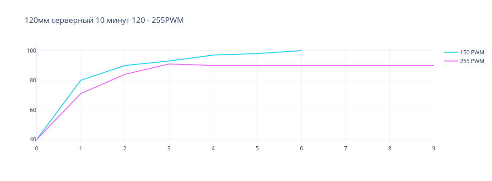

# История о том, как использовать Nvidia Tesla A10 на небольшом рабочем сервере

Я Сипатов Максим - DevOps в компании Tourmaline Core. У нас есть небольшая ML-команда, и назревал для этой команды проект, на котором неплохо было бы использовать мощности какой-нибудь видеокарты. Наш выбор пал на Nvidia Tesla a10, и как оказалось, использование таких видеокарт может вызвать некоторые проблемы, если ваш сервер - это просто открытый стенд. В этой статье я расскажу с какими проблемами столкнулся, пытаясь настроить эту видеокарту на сервере, как их решил, и каким образом мы утилизировали ресурсы видеокарты.

Nvidia Tesla a10 – отличное решение для проведения экспериментов небольшой командой, специализирующейся на машинном обучении, если вы не работаете с огромными массивами данных. И в целом иметь свое устройство для задач по искусственному интеллекту (и не только), всегда интереснее, чем арендовать чужое. 

Хотя эта видеокарта отлично справляется со своими задачами, но все же имеет 2 проблемы:

* подключение требует некоторой настройки в BIOS вашей материнской платы;

* нет активного охлаждения. Связано это, в первую очередь, с тем, что она предназначена для серверов с хорошим кондиционированным воздухом. Поэтому придется решить проблему охлаждения, иначе видеокарта будет быстро достигать значения температуры, при которой она начнет тротлить.

## Настройка системы для видеокарты

У видеокарты Tesla A10 24 гб оперативной памяти. Для видеокарт, чья память превышает 16 гб, необходимо в BIOS материнской платы установить флаг `“enabled”` у опции `“memory mapped I/O above 4GB”`, `“above 4G decoding”` или `“PCI 64 bit resource handling above 4G”`. Примерно одно из таких названий будет у вас около этой опции.

Далее остается только установить драйвера для видеокарты. Сделать на Ubuntu 20.04 это можно так:

```
apt install libnvidia-common-470
apt install libnvidia-gl-470 
apt install nvidia-driver-470
```
Возможно, необходимо будет перезагрузить сервер.

Далее при вводе команды `nvidia-smi`, вы должны увидеть окно с описанием ресурсов видеокарты.

<p align="center">
  
</p>

<h6 align="center">nvidia-smi</h6>

Первоначальная настройка видеокарты завершена.

## Охлаждение видеокарты

TDP видеокарты составляет 150W. Не так уж много, но без активного охлаждения не обойтись. В первую очередь, нужно понять, как прикрепить кулер к видеокарте. На одной из боковых граней есть крепления для винтов, к которым можно будет прикрепить что-то, что будет являться переходником между видеокартой и кулером.

Мы решили протестировать два решения:

* [адаптер крепления для кулеров размером 40мм;](https://www.thingiverse.com/thing:6144051)

* [адаптер крепления для кулеров размером 120мм.](https://www.thingiverse.com/thing:6144052)

У nvidia нет точной спецификации о том, какое количество воздуха и с каким давлением должно проходить сквозь радиатор этой видеокарты, поэтому мы решили рассмотреть варианты от самых обычных кулеров до серверных.

В решении, где размер кулера составляет 40мм, мы попробовали сначала простой кулер - **DEXP DX40N** на 6000 RPM и 5 CFM. Но давления, с которым он пропускает воздух, не хватает на то, чтобы выталкивать горячий воздух из радиатора видеокарты. Затем проверили кулер **ARCTIC S4028-15K**, у него 15 000 RPM и поток воздуха 19 CFM. Его давления достаточно, чтобы хорошо охлаждать видеокарту при нагрузке. Однако, это серверный кулер, и шум, с которым он работает на максимальных оборотах, может сильно мешать окружающим людям. На рисунке ниже представлен график изменения температуры от времени у видеокарты в нагрузке при различных значениях PWM кулера.

<p align="center">
  
</p>

<h6 align="center">ARCTIC S4028 40мм</h6>

По графику видно, что кулер способен стабильно поддерживать температуру видеокарты в пределах 90 градусов. Причем, если использовать значение PWM в 255, кулер работает на максимальных оборотах, это позволяет держать температуру видеокарты в пределах 70-80 градусов.

Нагружали видеокарту с помощью утилиты [gpu-burn](https://github.com/wilicc/gpu-burn).

Мы решили проблему с охлаждением видеокарты, но возникла проблема с шумом, издаваемым кулером. Поэтому перешли к экспериментам с вариантом, где размер кулера составляет 120мм. Сначала, как и в предыдущем эксперименте, мы попробовали тихий кулер, на этот раз это **be quiet Pure Wings 2** 120мм 1500 RPM. Поток воздуха составляет 51 CFM. Но этого все же оказалось недостаточно для того, чтобы выталкивать горячий воздух из радиатора. Несмотря на количество потока воздуха, который он способен пропускать через себя, ему все еще не хватает давления, с которым этот воздух проталкивается. На рисунке ниже представлен график изменения температуры видеокарты в зависимости от времени при нагрузке.

<p align="center">
  
</p>

<h6 align="center">be quiet Pure Wings 2 120мм</h6>

По графику видно, что кулер показал плохой результат. Видеокарта достигла температуры в 100 градусов за 6 минут.

Следующим кандидатом на проверку был кулер **Thermal IceGALE Xtra** 120mm. Его максимальная скорость вращения лопастей составляет 3000 RPM и поток воздуха 127 CFM. Ниже график изменения температуры в зависимости от времени.

<p align="center">
  
</p>

<h6 align="center">Thermal IceGALE Xtra 120мм</h6>

Как видно из графика, температура видеокарты способна держаться в районе 90 градусов только при максимальной скорости вращения лопастей этого кулера.

Этот кулер не так хорошо справляется с охлаждением, но все же может при полной нагрузке поддерживать температуру в рамках 90 градусов. Также он производит меньше шума, но его достаточно, чтобы мешать людям работать с кулером в одном помещении.

С охлаждением в нашей выборке справляются 2 кулера:

* ARCTIC S4028 40мм с 15 000 RPM, 20 CFM;

* Thermal IceGALE Xtra 120мм с 3 000 RPM, 127 CFM.

Маленький кулер (1 из списка выше) лучше справляется с охлаждением, поэтому останавливаемся на этом варианте.

### Автоматическое включение/выключение кулера видеокарты

Раз наш выбор пал на маленький шумный кулер, то нужно разработать решение, которое будет включать кулер только тогда, когда на видеокарте производятся какие-либо расчеты, чтобы слишком сильно не мешать шумом разработчикам в офисе. Так как видеокарта установлена на сервер с ОС Ubuntu 20.04, напишем простого демона, который будет следить за температурой видеокарты, и если оно превышает какое-то пороговое значение, то будет включаться кулер на максимальных оборотах. Для начала нужно определить, какие файлы отвечают за контроль оборотов кулера. С этим помогут две утилиты: `lm-sensors` и `fancontrol`.

Командами ниже представлен способ скачивания этих утилит:

```
apt-get install lm-sensors
apt-get install fancontrol
```

Утилита `lm-sensors` определит все доступные сенсоры системы и создаст необходимые файлы для вывода информации по ним. Стоит отметить, что эта утилита не сможет найти сенсоры, отвечающие за вывод температуры видеокарты. Команда, представленная ниже, выполняет описанные функции:

```
sensors-detect
```

Следующая команда прочитает все изменения, произведенные в */etc/modules* и добавит новые модули в ядро.

```
service kmod start
```

Утилита `fancontrol` выключает все подключенные кулеры поочередно на 5 секунд, чтобы определить для вас, какие файлы отвечают за контроль оборотов кулеров. Затем генерируется файл */etc/fancontrol*, в котором описаны команды для сервиса fancontrol, чтобы контролировать обороты кулеров в зависимости от температуры датчиков. Команда ниже выполняет описанные действия.

```
pwmconfig
```

С помощью файла */etc/fancontrol* мы можем определить, какие файлы отвечают за наш кулер. Вот пример одного из файлов сценария для утилиты fancontrol.

```
INTERVAL=10
DEVPATH=hwmon0=devices/virtual/thermal/thermal_zone0 hwmon2=devices/platform/nct6775.2592
DEVNAME=hwmon0=acpitz hwmon2=nct6797
FCTEMPS=hwmon2/pwm6=/opt/gpu_temp 
FCFANS=hwmon2/pwm6=hwmon2/fan6_input 
MINTEMP=hwmon2/pwm6=52 
MAXTEMP=hwmon2/pwm6=70 
MINSTART=hwmon2/pwm6=45
MINSTOP=hwmon2/pwm6=30 
MINPWM=hwmon2/pwm6=30
MAXPWM=hwmon2/pwm6=150 
```

Здесь мы можем понять, что есть файл *hwmon2/pwm6*, в котором хранится значение PWM для кулера. По абсолютному пути его можно найти так - */sys/class/hwmon/hwmon2/pwm6*. Само значение количества оборотов в минуту находится в */sys/class/hwmon/hwmon2/fan6_input*.

Мы могли бы использовать сервис fancontrol для контроля скорости вращения кулера от температуры, однако fancontrol не знает сенсора, который может получать информацию с видеокарты. Эту проблему можно решить подсунув в конфигурационный файл сервиса какой-либо промежуточный файл, в который мы будем записывать температуру с помощью демона и утилиты `nvidia-smi`. Вот пример, как это можно сделать в конфигурационном файле сервиса fancontrol.

```
FCTEMPS=hwmon2/pwm6=/opt/gpu_temp 
```

Но мы хотим решить проблему включения и выключения кулера, так как с какой бы скоростью вращения оборотов он ни работал, шум в любом случае будет мешать.

Теперь приступим к написанию демона. Для этого напишем простой скрипт, который меняет значение скорости вращения лопастей кулера в зависимости от температуры видеокарты. Вот пример скрипта.

```
#!/bin/bash
while true; do
	gpu_temperature=$((`nvidia-smi --query-gpu=temperature.gpu --format=csv,noheader`))
	if [ $gpu_temperature -gt 60 ]
	then
    	echo "255" > /sys/class/hwmon/hwmon2/pwm6
	fi
	if [ $gpu_temperature -lt 60 ]
	then
    	echo "0" > /sys/class/hwmon/hwmon2/pwm6
	fi
	cat /sys/class/hwmon/hwmon2/fan6_input
	sleep 5
done
```

Команда ниже делает скрипт исполняемым.

```
chmod +x /opt/start_stop_gpu_fan.sh
```

Далее, нам нужно создать сервис для systemmd, чтобы он мог контролировать выполнение скрипта. В папке  */etc/systemd/system* нужно создать файл *start_stop_gpu_fan.service*.

```
[Unit]
Description=Start stop gpu fan
 
[Service]
ExecStart=/opt/start_stop_gpu_fan.sh
Restart=always
 
[Install]
WantedBy=multi-user.target
```

Теперь с помощью команды ниже стартуем сервис.

```
systemctl start start_stop_gpu_fan.service
```

И следующей командой указываем системе запускать демона при перезагрузке.

```
systemctl enable start_stop_gpu_fan.service
```

Таким образом, мы создали демона, который будет включать или выключать кулер в зависимости от температуры видеокарты.

## Утилизация GPU для ML

Теперь рассмотрим, как использовать GPU в задачах ML. Самое простое решение – развернуть контейнер с JupyterLab и проводить эксперименты в ноутбуках. Это может быть довольно удобно для быстрых экспериментов, когда хочется проверить какую-то гипотезу, не затрагивая основной репозиторий проекта. Следующим вариантом может стать использование собственных раннеров, например, для Gitlab, и запуск обучения моделей или даже грид-серча в CI.

### Настройка Docker

Сперва необходимо настроить установленный на вашем сервере docker. Сделать это можно с помощью установки некоторых пакетов. 

Добавляем эти пакеты следующей командой:

```
distribution=$(. /etc/os-release;echo $ID$VERSION_ID) 
   && curl -s -L https://nvidia.github.io/nvidia-docker/gpgkey | sudo apt-key add - 
   && curl -s -L https://nvidia.github.io/nvidia-docker/$distribution/nvidia-docker.list | sudo tee /etc/apt/sources.list.d/nvidia-docker.list
```

Далее устанавливаем `nvidia-docker2`:

```
apt-get update
apt-get install nvidia-docker2
nvidia-ctk runtime configure --runtime=docker --set-as-default
```

Теперь необходимо перезапустить docker-daemon:

```
systemctl restart docker
```

Чтобы проверить, что у вас появилась заветная опция для утилизации ресурсов видеокарты, можете ввести такую команду:

```
docker run -it --gpus all nvidia/cuda:11.4.0-base-ubuntu20.04 nvidia-smi
```

### Jupyter Container

Ниже представлен `docker-compose.yml` файл для поднятия jupyter контейнера с утилизацией GPU.

```
version: '3'
services:
  datascience-notebook:
      image: jupyter/datascience-notebook
      volumes:
        - /home/notebooks:/home/work
      ports:
        - 8888:8888
      container_name: jupyter_notebook
      environment:
        JUPYTER_TOKEN: test
      deploy:
        resources:
          reservations:
            devices:
              - driver: nvidia
                count: 1
                capabilities: [gpu]
```

Вводим команду

```
docker compose up -d
```

И поднимется jupyter-контейнер, который позволит создавать в себе ноутбуки и использовать GPU для экспериментов. Обратиться к нему можно по адресу - <u>http://<ip сервера в сети>:8888</u>, предварительно пробросив порт 8888 на контейнер с паролем, указанным в переменной JUPYTER_TOKEN.

### Gitlab Runner

Еще одним простым вариантом утилизации GPU для ML экспериментов может стать создание раннера, который будет выполнять задачи, принадлежащие определенному проекту. Таким образом можно настроить задачу обучения. Сначала необходимо создать `volume` для раннера.

```
docker volume create gitlab-test
```

Теперь создаем контейнер раннера:

```
docker run -d --name gitlab-test --gpus all --restart always \
	-v gitlab-test:/etc/gitlab-runner \
	-v /var/run/docker.sock:/var/run/docker.sock \
gitlab/gitlab-runner:latest

docker run --rm -it --gpus all \
	-v gitlab-test:/etc/gitlab-runner \
	gitlab/gitlab-runner register --non-interactive \
	--url https://gitlab.com/ \
	--registration-token <Gitlab registration token for runner> \
	--executor docker \
	--description "Test runner" \
	--docker-image "docker:20.10.6-dind" \
	--docker-privileged \
--docker-volumes "/certs/client"
```

Также необходима небольшая настройка для созданного контейнера. Нужно зайти в среду контейнера, перейти в файл */etc/gitlab-runner/config.toml* и в секции [[ runners ]] в подсекции [ runners.docker ] нужно добавить переменную `gpus = “all”`.

```
[[ runners ]]
…
    [ runners.docker ]
         …
         gpus = “all”
```

Затем перезагрузить контейнер. Так для раннера, созданного в этом контейнере, выделяются ресурсы GPU.

В командах присутствует флаг `--gpus`, который позволяет утилизировать ресурсы видеокарты. В нашем случае видеокарта одна, поэтому значение для этого флага задано как “all”. Если у вас несколько видеокарт, то значения для флага указывают на id видеокарты в вашей системе, начиная с 0. Также для регистрации раннера в Gitlab ему необходимо при создании указать токен для группы репозиториев или одного репозитория.

Мы создали раннеры, и теперь, когда в определенной группе репозиториев будет запускаться пайплайн, он может привязаться к этому раннеру. 

Если вы хотите, чтобы определенные пайплайны привязывались к определенным раннерам, то при созданнии раннера можно указать флаг `--tag-list "test-runner"`. Тогда в вашем CI файле нужно будет указать тег раннера, и пайплайны будут использовать раннеры с этим тегом.

## Итог

Можем заключить, что использовать серверные видеокарты, установленные на небольших стендах, можно, но придется решать проблемы с охлаждением и искать компромисс между шумом кулера и его эффективностью.

Мы рассмотрели 2 простых варианта использования видеокарты для разработчиков, надеемся, они вам помогут.

____

Автор: Сипатов Максим
