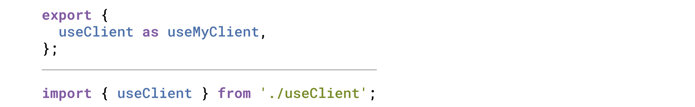
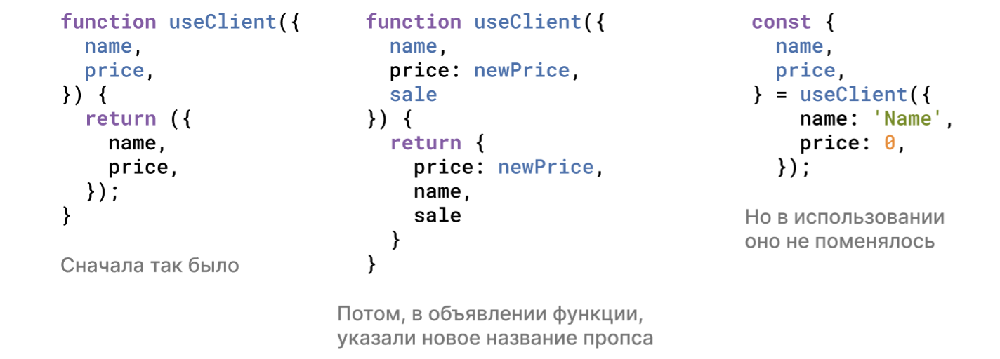
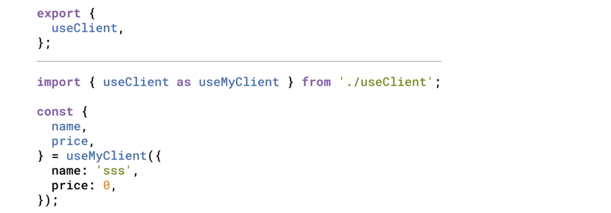

# React: революция использования фигурных скобочек

Хорошо, **react**. Как много мы используем всего, потому что так исторически сложилось: пишем функции задом наперед (сначала объяви, потом вызывай). Оборачиваем все в стрелочные функции и константы с ними, когда достаточно именованной функции. Этот список можно хорошенько продолжить.

В этой статье хотелось бы обсудить несколько привычек, которые есть у нас всех и которые, возможно, пора переосмыслить.

Начнем с кастомных хуков, которым надо вернуть результат, в частности пару значений. Классическим примером может быть хук для запроса данных по сети и отслеживания в процессе ли этот запрос сейчас, чтобы добавить на страницу лоадер.

```javascript
function useClient(clientId) {
  const [loadedClient, setLoadedClient] = useState(null)
  const [isLoading, setIsLoading] = useState(false)

  useEffect(() => {
    const loadClient = async () => {
      try {
        setIsLoading(true)
        const clientData = {} // actual data loading call goes here
        setLoadedClient(clientData)
      }
      finally {
        setIsLoading(false)
      }
    }

    loadClient()
  }, [clientId])

  return [loadedClient, isLoading]
}
```

В итоге вызываем его вот как-то так:

```javascript
const [loadedClient, isLoading] = useClient(clientId)
```

А может вот так:

```javascript
const [client, isClientLoading] = useClient(clientId)
```

<p>
  
</p>


Или совершаем ошибку и пишем вот такое:

```javascript
const [isLoading, loadedClient] = useClient(clientId)
```

Кажется, что тут мы руководствуемся паттерном от useState, когда он возвращает нам массив из значения и функции для его обновления, а мы потом деструктурируем массив и получаем все по индексу, даем этому любые имена, круто.

**Почему для useState пришлось сделать именно так?**

Потому, что это библиотечная универсальная функция. Клиенты вызывают её в своих конкретных случаях и хотят давать разные, полезные, говорящие имена.

**Что же выходит с нашим кастомных хуком useClient?**

Мы следуем чьей-то конвенции, потому что все так делают, а значит это react way и все в таком духе.

Но нужна ли нам эта гибкость в плане именования результатов работы этой функции? А если у нас нет TypeScript, то кто поможет заподозрить неладное? А если искать все использования полным поиском по проекту без использования полезных фишек IDE, то много ли мы найдем, если каждый называет как хочет?

Есть простое предложение. Давайте будем возвращать объект, а не массив. В таком случае последняя строчка в хуке будет такой:

```javascript
return { loadedClient, isLoading }
```

<p>
  
</p>
А использовать будем уже так:

```javascript
const { loadedClient, isLoading } = useClient(clientId)
```

Или так:

```javascript
const { isLoading, loadedClient } = useClient(clientId)
```

А вот так уже нельзя, а может даже линтер или ещё какой зверь нам подскажет, что тут ошибка:

```javascript
const { loading, c } = useClient(clientId)
```

### Какие основные выводы по этому примеру:

1. Изменение в коде минимальное и никак не влияет на сложность решения.

2. Относительно большая типобезопасность нашего кода.

3. Все те же плюшки деструктуризации, только не на массивах, а на объектах.

4. Можно безопасно рефакторить код: переставлять местами возвращаемые проперти внутри хука и в местах использования. Ведь порядок больше не важен, в отличии от деструктуризации массивов.

Двинемся дальше к более-менее **незыблемому правилу**: если из модуля экспортируется только что-то одно, нужно использовать дефолтовый экспорт.


<p>

</p>

Как это может выглядеть в плане самого модуля:

```javascript
export default function myFancyFunction() {}
```

или:

```javascript
function myFancyFunction() {}
export default myFancyFunction
```

или же:

```javascript
const myFancyFunction = () => {}
export default myFancyFunction
```

И если мы такой модуль попробуем где-то использовать, то скорее всего напишем это так:

```javascript
import myFancyFunction from './my-fancy-function'
```

А если нас невзлюбили, то будут импортировать так:

```javascript
import myFancy from './my-fancy-function'
```

<p><p align="right">
  
</p>

В целом уже должно вырисовываться, к чему мы идём. А именно к тому же, что и в первом примере: мы возвращаем что-то, что может называться клиентом как угодно. И если мы не разрабатываем npm-пакет, а работаем в рамках одного репозитория над проектом, то то ли этого, чего мы хотим? Этакой гибкости?

Возможно, пора попрать постулат, гласящий, что использование дефолтового экспорта для единофункцевого модуля это маст.

**Именованный экспорт, настало твоё время!** Давайте использовать тебя всегда.

В таком случае получаем:

```javascript
export {
  myFancyFunction,
}

function myFancyFunction() {}
```

<p align="right">
  
</p>

И тогда импортируем так:

```javascript
import {
  myFancyFunction,
} from './my-fancy-function'
```

**Интересный момент:** если всегда использовать именованный экспорт, то добавление новой экспортируемой из модуля функции обходится, по сути, бесплатно.

<p>
  
</p>

А ещё мы постепенно начинаем переходить к многострочной деструктуризации. Когда одна штука идёт на своей собственной строке и **обязательно** кончается запятой. Но зачем? Ведь запятая для последнего элемента не обязательна. В целом, при многострочной деструктуризации получается больше строк кода.

<p align="right">
  
</p>

**Note:** в VSCode есть странное поведение - не всегда дефолтовый экспорт нормально переименовывается силами IDE. Может у нас что-то не так, а может что-то просто сложнее сделать для дефолтовых экспортов. С именованными проблем пока не замечено.

<p>
  
</p>

Есть несколько причин делать именно так везде, где есть деструктуризация объекта или ее подобие, как в случае с именованными импортами:

1. Чистая история комитов в гите, когда надо добавить новое проперти или экспортировать новую функцию.

.картинка.

2. Можно создавать новый код на основе старого быстрее чем когда-либо. Копируешь предыдущую строчку, хоп, и вот у тебя такая же новая, её переименовываешь.

<p align="right">
  
</p>

**Какую ещё интересную штуку можно попробовать добавить к этому пиршеству фигурных скобок?** А вот добавим-ка сюда [RORO](https://www.tinyblog.dev/blog/2020-07-13-javascript-roro-pattern/) паттерн (Request Object Response Object). Иными словами, передаем аргументы всегда в виде объекта, даже для одного параметра. Всегда возвращаем результат в виде объекта.

<p>
  
</p>

____

### Попробуем объединить все, что у нас было в нашем кастомном хуке и посмотреть, что вышло

```javascript
export {
  useClient,
}

function useClient({
  clientId,
}) {
  const [loadedClient, setLoadedClient] = useState(null)
  const [isLoading, setIsLoading] = useState(false)

  useEffect(() => {
    const loadClient = async () => {
      try {
        setIsLoading(true)
        const clientData = {} // actual data loading call goes here
        setLoadedClient(clientData)
      }
      finally {
        setIsLoading(false)
      }
    }

    loadClient()
  }, [clientId])

  return {
    loadedClient, 
    isLoading,
  }
}
```

И использование:

```javascript
import {
  useClient,
} from './useClient'

const {
  loadedClient,
  isLoading,
} = useClient({
  clientId,
})
```

____

### Выводы

В целом, как оказалось, статья вовсе и не про React. Этот подход применим к любому ES6+ коду, написанному на JavaScript. Просто на примере кастомных хуков реакта проще проиллюстрировать ценность.

Сами мы повсеместно применяем такой подход (ну ладно, вот-вот начнем). Есть одно разумное исключение насчет Response Object из RORO паттерна. Кажется, не всегда имеет смысл все оборачивать в объект - например, стоит ли делать такое для функций, которые возвращают флаги true/false? Возможно это перебор:

```javascript
const {
  areTheyNuts,
} = areTheyNuts()
```

<p align="right">
  
</p>

Что касается повсеместного возвращения объектов в качестве результатов функций, мы не определились окончательно. Возможно, стоит практиковать экстремальный вариант на небольшом проекте, когда возвращаем объект всегда, и уже потом командой решать, подходит лично вам такой вариант или нет.

Если делать так и никак иначе:

1. Люди могут не понять. Кажется, это сильно расходится с тем, что люди повторяют в коде как мантру.

<p align="center">
  
</p>


2. Вы не боитесь расширять сигнатуру функций, добавляя новый аргумент. Вам не нужно перелопачивать весь код. И даже новый аргумент со значением по умолчанию не будет проблемой, в отличии от передачи аргументов по одному, когда все аргументы со значением по умолчанию должны идти в конце.

Раньше:

<p align="center">
  
</p>

Теперь:

Здесь мы сможем подставить новый аргумент в середину и не придется ничего менять. Куда захотим, туда и добавим - и нет никаких требований к фиксированному порядку, как с передачей нескольких аргументов.

```javascript
function welcomeClient({
  name,
  phoneNumber = '',
  email,
  company,
  trialVersion = true,
})
```

И вызываем вот так:

```javascript
welcomeClient({
  name: 'Tom',
  phoneNumber: '+79876543210',
  email: 'tom@tourmalinecore.com',
  company: 'Tourmaline Core',
})
```

3. Расширение экспорта модуля опять-таки делается легко, ни один его клиент не будет нуждаться в обновлении. Как импортировали, так и продолжат. 

4. История в Git будет выглядеть чисто и опрятно. Подсвечиваться будет только та строка, которая была действительно изменена, то есть строка с новым проперти результата/проперти объекта входных параметров или новой функцией для экспорта/функцией для импорта.

5. Кажется (это не точно), IDE лучше работают с переименованием свойств объектов и экспортируемых функций модуля, при использовании такого подхода. Хотя VSCode иногда останавливается на полпути и это не то, что вам нужно.

<p align="center">
  
</p>

<h6> <b>Случай 1.</b> Если переименовываем функцию в самом модуле, из которого она экспортируется, то это никак не влияет на использования, там по-прежнему то же имя, что и до переименования.</h6>


<p align="center">
  

<h6> <b>Случай 2.</b> Если переименовываем проперти объекта во время деструктуризации.</h6> 


<p align="center">
  
</p>

<h6> <b>Случай 3.</b> Если переименовываем функцию в том месте, где она импортируется, то это никак не влияет на ее имя в модуле, из которого она экспортируется.</h6>

Получается обратно совместимое изменение, но обычно нам нужно переименовать во всех местах сразу, что неудобно.

**P.S.**: Кстати, если вы используете ESLint или Prettier, то чуда не произойдет, предлагаемое многострочное форматирование до сих пор не реализовано. Отличный кандидат на контрибьюшен, на момент публикации прошло всего лет 6 
https://github.com/prettier/prettier/issues/2550.

<p align="center">
  
</p>
____

Автор: Шинкарев Александр

Вычитка и фидбек: Чекина Екатерина, Ясновский Андрей, Ядрышникова Мария

Оформление статьи: Ковыляева Анастасия, Тупикина Анастасия