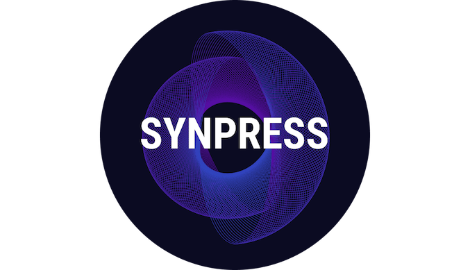
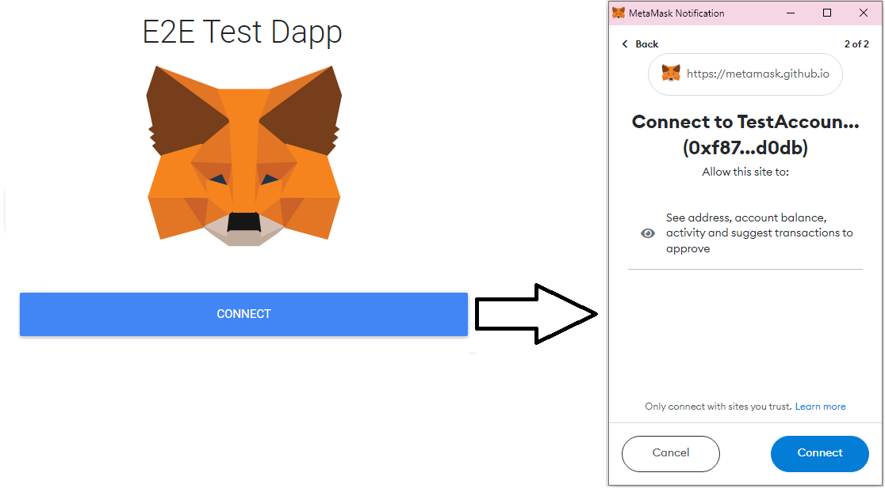
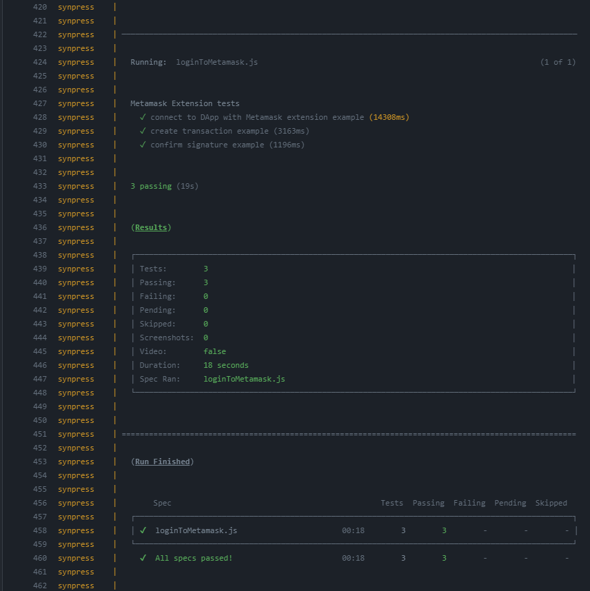

# Сквозное тестирование DApp в связке с расширением Metamask

Всем привет! На связи снова QA Engineer Илья из компании Tourmaline Core и это вторая часть статьи про тестирование DApp. 

В прошлый раз я рассказывал о том, как [можно тестировать](https://www.tourmalinecore.com/ru/articles/react-native-detox-e2e) подключение и работоспособность блокчейн-приложения через WalletConnect с использованием мобильного эмулятора и библиотеки Detox. На этот раз я хочу рассмотреть процесс тестирования с другой стороны, а именно через расширение браузера при помощи инструмента Synpress. Я расскажу, как работает этот инструмент, как его настроить и запускать тесты.

<p align="center">
  
</p>

## Предисловие

Сейчас децентрализованные приложения (DApp’s) активно развиваются, конкуренция растет и поэтому разработчики всё больше концентрируются на качестве выпускаемого продукта. С недавнего времени начали появляться различные инструменты для тестирования таких приложений, в частности для E2E тестов, которые, согласно пирамиде тестирования, являются максимально ценными для бизнеса. На данный момент выбор инструментов для комфортного написания работающих тестов не большой, но всё же понемногу расширяется. Далее я расскажу об одном из таких инструментов.

## Немного контекста

На нашем проекте есть длинный пользовательский флоу, который не покрыт тестами. На ручное тестирование уходило много времени и в связи с этим появилась задача это дело упростить. 

Кратко расскажу о составных нашего тестируемого субъекта. Первое — это популярный кошелек для хранения криптовалюты MetaMask. Работать с ним можно через мобильное приложение или через браузерное расширение (работает со всеми популярными браузерами). Второе — наше web-приложение (оно же далее — DApp). Чтобы получить доступ к действиям в приложении, нужно авторизоваться в MetaMask с помощью одного из двух представленных методов. После подтверждения своей принадлежности к аккаунту кошелька, вы можете работать с сервисом. Каждый шаг в DApp, тем или иным образом завязан с вашим кошельком. Например, создание транзакции, будет сопровождаться всплывающим уведомлением, которое необходимо подписать/подтвердить.

Теперь, когда понятно взаимодействие, углубимся в детали и разработаем план тестирования.

### MetaMask

Хоть и MetaMask просто кошелек с криптоактивами, он разработан как инструмент, позволяющий всем разработчикам легко интегрировать его в свои приложения. Это дает возможность пользователю работать со своими активами через различные сторонние сервисы. Для блокчейна такое развитие DeFi (децентрализованные финансовые сервисы) по сути альтернатива банковскому сектору. Когда вы делаете покупку в обычном интернет-магазине, вас линкует к окну оплаты именно вашего банка. Таким же образом взаимодействуют блокчейн-сервисы с MetaMask.

Для начала тестирования нужно выяснить шаги авторизации в браузерном расширении MetaMask, чтобы повторить это в автотестах. После установки расширения из [chrome web store](https://chrome.google.com/webstore/detail/metamask/nkbihfbeogaeaoehlefnkodbefgpgknn), в браузере открывается отдельная вкладка с регистрацией/авторизацией. Авторизация нестандартна — нужен ввод 12 специальных секретных слов, которые вы получили при регистрации. Также необходимо придумать и написать новый пароль. Когда мы авторизовались, нужно выбрать тестовую сеть goerli, не забыв перед этим включить отображение тестовых сетей в настройках своего профиля. Тестовые сети используются для отладки и дебага ваших DApp, имитируя основную сеть (mainnet) и позволяя использовать ненастоящие эфиры. Все это мы сделали потому что наш dev работает на этой тестовой сети.

Теперь представим ситуацию, что есть кнопка, нажатием на которую мы можем связать между собой учетную запись в MetaMask и DApp. При этом, при нажатии на нее должна будет вызываться нотификация от MetaMask, которую нужно одобрить для подключения к приложению. Но как решить такую нетривиальную для тестирования задачу?

<p align="center">
  
</p>

<h6 align="center">Подключение к DApp через расширение MetaMask для браузера</h6>

Моей целью было найти инструмент, позволяющий работать с браузерным расширением и несколькими вкладками. На первый взгляд, идеальным вариантом была библиотека Playwright. Она позволяет делать и [то](https://playwright.dev/docs/chrome-extensions), и [другое](https://playwright.dev/docs/pages#multiple-pages), а значит вариант подходящий.  Но такое решение потребовало бы много времени, поэтому я стал искать дальше, и нашел уже готовые решения, использующие Playwright как основу для работы с Metamask  — [Dappeteer](https://github.com/decentraland/dappeteer) и [Synpress](https://github.com/Synthetixio/synpress). Я попробовал оба варианта и хочу кратко выделить минусы и плюсы каждого.

### Dappeteer

Является надстройкой над Puppeteer.

Минусы:

1. Много настраивать, чтобы тесты не выглядели как каша

2. Самостоятельный менеджмент асинхронности в тестах, что всегда приводило к неработающим тестам.

Плюсы:

1. Быстрый запуск и выполнение тестов

2. Небольшой вес пакета

3. Можно писать тесты на Puppeteer или Playwright

### Synpress

Является надстройкой над Cypress. Cypress контролирует интеракции с DApp, а Playwright — интеракции с MetaMask и работу с несколькими вкладками. Так и получился Synpress.

Минусы:

1. Вес всех зависимостей, с которыми устанавливается Synpress ≈ 500мб

2. Долгий запуск

Плюсы:

1. Удобно конфигурировать

2. Понятная документация с примерами и статьями по ней 

3. Понятные тесты

По итогу, более близким мне оказался Synpress, так как ранее имелся опыт с Cypress, поэтому я выбрал его.

## Настраиваем Synpress

Далее опишу необходимые шаги для запуска первого теста

> Так как Synpress это обертка под Cypress, то вся конфигурация и структура построения будет очень похожа на него

**Шаг 1:** Инициализация проекта и добавление зависимостей

Инициализируем проект `yarn init` и добавляем в зависимости Cypress и Synpress:

`yarn add —D cypress @synthetixio/synpress`

**Шаг 2:** Создание папок и файлов

Делаем базовый сетап также как под Cypress: 

Создаем папку *tests* в корне, а в ней еще две — *support* и *e2e*. 

В папке support создаем 2 файла — *index.js* и *commands.js*. В *index.js* нужно импортировать команды Synpress:

```javascript
import '@synthetixio/synpress/support/index';
```

Если этого не сделать, то они не будут работать в тестах и появится ошибка, что такой функции не найдено. Именно этот файл позволяет Cypress использовать функции имплементированные в Synpress.

Файл *commands.js* нужен для [кастомных команд](https://docs.cypress.io/api/cypress-api/custom-commands), поэтому необязателен. Но если вы будете его использовать, то в *index.js* также нужно импортировать вот этот файл:

```javascript
import './commands';
```

Теперь добавляем папку *specs* в папку *e2e*. В ней будем создавать и писать тесты.

**Шаг 3:** Создание конфигурации Synpress

В корневой папке создаем файл конфигурации synpress.config.js. Вид внутренностей зависит от версии Cypress, так что далее все примеры будут на версии выше 10.0. Данный файл должен содержать настройки для Cypress. Так выглядит стандартный бойлерплейт с добавленными туда параметрами:

```javascript
const { defineConfig } = require('cypress');
const synpressPlugins = require('@synthetixio/synpress/plugins');
 
module.exports = defineConfig({
  e2e: {
    specPattern: 'tests/e2e/specs',
    supportFile: 'tests/support/index.js',
    setupNodeEvents(on, config) {
      synpressPlugins(on, config);
      return config
    },
  },
});
```

Важно заполнить следующие параметры:

*specPattern* — Путь до папки с тестами

*supportFile* — Путь до файла с плагинами

Также необходимо добавить плагин *synpressPlugins(on, config)* через функцию *setupNodeEvents(on, config)*.

**Шаг 4:** Добавление .env файла

Для правильной работы Synpress, требуется создать файл конфигурации переменных окружения .env с необходимыми переменными, а именно *NETWORK_NAME* и *PRIVATE_KEY* или *SECRET_WORDS*. Их также можно задать явно в специальном методе, но это лишний код. Пример .env файла:

```
NETWORK_NAME=goerli
PRIVATE_KEY=04e3efb6e8c6b**********443df6c40803224b96e829f01df05985806f42
SECRET_WORDS='test test test test test test test test test test test test'
```

В *NETWORK_NAME* указываем название тестовой сети, которую будем использовать. Для авторизации нужно указать приватный ключ аккаунта MetaMask (*PRIVATE_KEY*), или 12 слов, которые сохранили после регистрации (*SECRET_WORDS*). Они нужны, чтобы Synpress мог авторизоваться под вашим аккаунтом и совершать работу через него.

Наш минимальный джентльменский набор готов, а значит можно приступать к написанию первого теста.

**Шаг 5:** Написание теста

Создаем новый файл в папке *tests/e2e/specs*. В файле будет лежать сам тест, который мы назовем *loginToMetamask.js*. В нем напишем тест на вход в DApp через MetaMask.

В примере будем пользоваться тестовым DApp’ом, который задеплоен на [гитхабе](https://metamask.github.io/test-dapp/).

Чтобы связать свой аккаунт кошелька с DApp, нужно выполнить следующую последовательность действий: 

1. зайти на сайт 

2. нажать на кнопку "Connect" 

3. подтвердить коннект в появившейся нотификации от браузерного расширения MetaMask.

Теперь повторяем эти действия, но в тестах. Код теста будет таким:

```javascript
it('connect to DApp with Metamask extension', () => {
    // посещаем сайт
    cy.visit('https://metamask.github.io/test-dapp/');
    // кликаем на кнопку Connect
    cy.get('#connectButton').click();
    // после клика должна появиться нотификация
    cy.acceptMetamaskAccess().should('be.true');
    // подключаемся к DApp
    cy.get('#connectButton').should('have.text', 'Connected');
    // убеждаемся, что UI изменился
  });
  ```

Проверим, как работает тест. Переходим в package.json и добавляем следующий скрипт для запуска тестов Synpress:

```JSON
"test": "synpress run —-configFile synpress.config.js"
```

Обязательно указываем в скрипте путь к конфиг файлу *--configFile synpress.config.js*

Запускаем скрипт через `yarn test`. Тест успешно выполнился, но как это выглядит под капотом?

Если после установки Synpress зайти в пакет, то можно увидеть папку *metamask-chrome*. Это и есть уже предустановленное браузерное расширение. Работает оно за счет того, что мы добавили в конфиг файле плагин *synpressPlugins(on, config)*. При запуске теста происходит вызов глобального эвента beforeAll, который перед началом тестов открывает **metamask-chrome** в новой вкладке, где происходит авторизация в аккаунт и выбор тестовой сети. Всё это автоматически считывается из переменных, указанных в .env.

Тест всегда работает с 2 вкладками — основное окно с тестами (Cypress UI) и MetaMask. Теперь, после выполнения всех предусловий, активная вкладка меняется с кошелька на основную и запускается наш тест. Заходим на сайт, нажимаем на кнопку “*Connect*” . Это действие влечет за собой появления нотификации MetaMask. Чтобы принять подключение, используем один из методов Synpress *cy.acceptMetamaskAccess*, которые до этого мы подключили в файле *index.js*. Когда произошло подключение, нам важно удостовериться, что UI изменился. В данном случае у кнопки должен измениться текст на “Connected”, что значит успешное подключение.

Для Synpress есть множество [методов](https://github.com/synthetixio/synpress/blob/dev/support/index.d.ts) работы со всеми нотификациями, будь то создание транзакции или подписание сигнатуры. Этих возможностей хватает, чтобы покрыть тестами любой DApp.

Стоит отметить, что если вы покрываете кейс с созданием транзакции, то на вашем тестовом кошельке должно быть достаточное количество валюты, так как за запись транзакции в blockchain взимается небольшая комиссия. Для тестовых эфиров существует множество faucet (кранов), которые раздают ограниченное количество валюты раз в день, например, [этот](https://goerlifaucet.com/).

## Настройка тестов в CI/докере

Если перед вами стоит задача настроить запуск тестов в CI, то разработчики Synpress советуют использовать их настроенный [докер образ](https://github.com/Synthetixio/synpress#-using-with-docker) со всеми предустановленными для этого зависимостями. Он особенно хорош, если у вас большая система (и, соответственно, много больших и тяжеловесных тестов) и вы хотите тонко настроить запуск тестов и изолировать их. Собранный контейнер поддерживает ngrok, записывает и сохраняет видео и прочие фишки.

Для запуска тестов в контейнере нам сперва нужно скопировать из репозитория 2 файла — [Dockerfile](https://github.com/Synthetixio/synpress/blob/dev/Dockerfile) и [docker-compose.yml](https://github.com/Synthetixio/synpress/blob/dev/docker-compose.yml). Dockerfile берет готовый образ для работы тестов Synpress, затем копирует туда все зависимости из нашего проекта. Отсюда получается новый образ, из которого уже docker-compose собирает контейнер с сервисами и запускает в нем тесты. 

На нашем проекте я тестирую на dev, а не локально. Соответственно я могу укоротить docker-compose файл, убрав лишние для меня сервисы. Получилось так, и дальше я объясню почему:

```YAML
version: '3.9'
 
services:
  synpress:
    container_name: synpress
    build: .
    environment:
      — DISPLAY=display:0.0
      — PRIVATE_KEY=${PRIVATE_KEY}
      — GITHUB_TOKEN=${GITHUB_TOKEN}
      — DEBUG=${DEBUG}
      — GH_PAT=${GH_PAT}
      — GH_USERNAME=${GH_USERNAME}
    depends_on:
      — display
    entrypoint: []
    working_dir: /app
    command: >
      bash —c 'echo —n "======> local noVNC URL:
      http://localhost:8080/vnc.html?autoconnect=true " && npx wait-on
      http://display:8080 && yarn test'
    networks:
      — x11
 
  display:
    container_name: display
    image: synthetixio/display:b2643097e891906524e52e7ee956260b20fa01fb-base
    environment:
      — RUN_XTERM=no
      — DISPLAY_WIDTH=${DISPLAY_WIDTH}
      — DISPLAY_HEIGHT=${DISPLAY_HEIGHT}
    ports:
      — '8080:8080'
    networks:
      — x11
 
networks:
  x11:
```

Собрать контейнер можно командой:

`docker-compose --env-file ./{YOUR_ENV_FILE_NAME} --build --exit-code-from synpress`

В флаге *--env-file* нужно указать название файла с конфигом для докера. Он нужен для работы сервиса display, т.к. из него берутся переменные *DISPLAY_WIDTH* и *DISPLAY_HEIGHT*.

Поэтому создадим конфиг файл с названием *docker.config* и поместим туда эти переменные.

```
DISPLAY_WIDTH=1366
DISPLAY_HEIGHT=768
```

Они обозначают разрешение экрана отображаемой системы внутри докера — высоту и ширину соответственно. Synpress работает на всех разрешениях, начиная с 800x600.

Но зачем отображать виртуальный экран, если мы точно не будем смотреть на него (по крайней мере в CI)? Основная цель сервиса display чуть глубже. Так, в документации по запуску Cypress в CI указано, что для работы приложения должен быть запущен x11 сервер. Все дело в том, что Cypress требует возможности запуска своего графического интерфейса, а эмулятор Xvfb (X virtual framebuffer, он же X11, он же просто X) как раз и нужен для его отображения и взаимодействия с ним в докеровской подсистеме Linux. В нашем случае, отображение идет на 8080 порту, к которому при помощи noVNC мы подключаемся удаленно и можем отслеживать ход тестов. Без этого сервиса Cypress будет выдавать ошибку. Обо всем этом описано в документации по [запуску Cypress тестов в CI](https://docs.cypress.io/guides/continuous-integration/introduction#Xvfb).

Чтобы запустить докер в CI (опять же, на примере GH Actions) можно использовать уже готовые контейнер-образы. Для работы докера нужно подключить два образа в workflow файле, а конкретно: 

1. docker/setup-qemu-action 

2. docker/setup-buildx-action

Qemu нужен для эмуляции системы внутри докера, а buildx предоставляет комплект для билда докерфайла.

Конечный вид workflow файла для запуска тестов:

```YAML
on:
  push:
    branches:
      — master
 
jobs:
  e2e:
    name: E2E with docker
    runs-on: ubuntu-18.04
    steps:
        # Изменяет владельца всех файлов на нас внутри системы
        # Нужно для работы докера
      — name: Chown workspace
        run: chown —R $(whoami) .
 
      # Делает pull репозитория и ветки, в котором запущен. Нужно для доступа к коду
      — name: Checkout
        uses: actions/checkout@93ea575cb5d8a053eaa0ac8fa3b40d7e05a33cc8
 
      # Нужен для эмуляции системы внутри докера
      — name: Set up QEMU
        uses: docker/setup-qemu-action@8b122486cedac8393e77aa9734c3528886e4a1a8
 
      # Предоставляет комплект для билда докерфайла
      — name: Set up Docker Buildx
        uses: docker/setup-buildx-action@dc7b9719a96d48369863986a06765841d7ea23f6
 
      — name: Run e2e-test
        run: |
          docker-compose —-env-file ./.env up --build --exit-code-from synpress
        env:
          COMPOSE_DOCKER_CLI_BUILD: 1
          DOCKER_BUILDKIT: 1
          DOCKER_DEFAULT_PLATFORM: linux/amd64
          PRIVATE_KEY: ${{ env.PRIVATE_KEY }}
          GITHUB_TOKEN: ${{ secrets.GITHUB_TOKEN }}
          GH_PAT: ${{ secrets.GH_PAT }}
          GH_USERNAME: ${{ secrets.GH_USERNAME }}
```

Таким же образом описана джоба у разработчиков, поэтому я не менял тэги у actions, чтобы все работало одинаково.

На последнем шаге вызываем docker-compose команду, которая, собственно, собирает контейнер и запускает тесты. 

Результат должен получиться примерно такой:

<p align="center">
  
</p>

## Подытожим

Synpress на данный момент самый удобный инструмент для сквозного тестирования DApp, особенно если вы уже имели дело с Cypress. С ним легко работать: конфигурировать, писать тесты, запускать в CI и делать репорты. Также, он активно развивается и разработчики часто выкатывают новые релизы.

Работающий пример с инструкцией я залил в [репу](https://github.com/TourmalineCore/Metamask.SynpressTests). Надеюсь, эта статья была вам полезна.